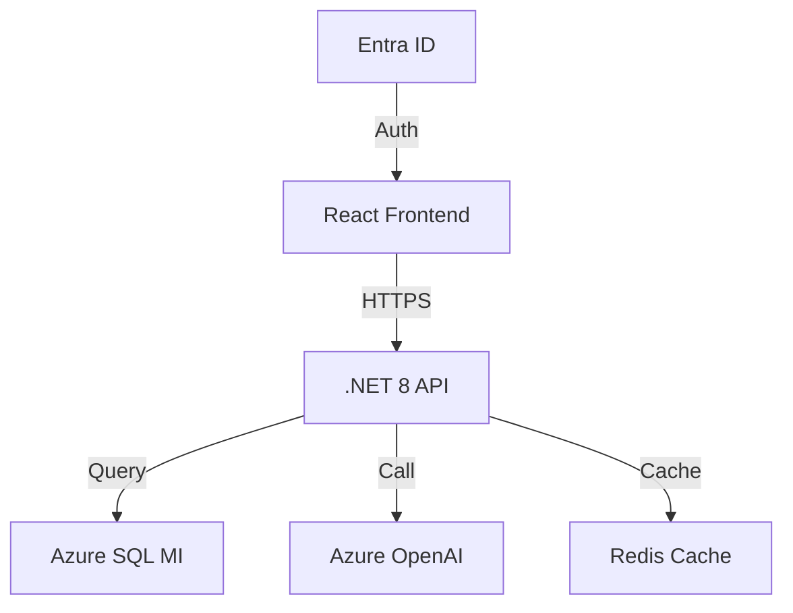

# MAP MVP Documentation Standards

| Field      | Value                              |
|------------|------------------------------------|
| Document   | MAP MVP Documentation Standards    |
| Version    | 1.0                                |
| Date       | July 2026                          |
| Status     | Official                           |

---

## 1. Markdown Rules

### CommonMark and GFM

- All documentation uses GitHub Flavored Markdown (GFM)
- Compatible with CommonMark specification
- Rendered on GitHub, Azure DevOps, and internal wiki

### Formatting Rules

| Rule                    | Standard                                  |
|------------------------|-------------------------------------------|
| Heading levels          | H1 for title only; H2 for sections; H3 for subsections |
| Line length             | 120 characters max (code blocks exempt)   |
| Lists                   | Use `-` for unordered; numbered for sequential |
| Code blocks             | Always specify language identifier        |
| Links                   | Descriptive text, never raw URLs          |
| Images                  | Alt text required, stored in `docs/images/` |
| Tables                  | GFM pipe syntax, aligned columns          |

### Example

```markdown
## Section Title

Brief description of the section.

### Subsection

- Item one with **bold** emphasis
- Item two with `inline code`
- Item three with [descriptive link](./relative-path.md)

```csharp
// Code block with language identifier
var example = "hello";
```
```

---

## 2. Architecture Documents

### ADR Format (Architecture Decision Records)

Store ADRs in `docs/adr/` with sequential numbering.

```markdown
# ADR-001: Use Azure SQL MI for Primary Data Store

## Status
Accepted

## Date
2026-07-01

## Context
MAP requires a managed relational database for migration validation data...

## Decision
We will use Azure SQL Managed Instance as the primary data store.

## Consequences
### Positive
- Managed infrastructure reduces operational burden
- Built-in HA and disaster recovery

### Negative
- Higher cost than Azure SQL Database
- Less flexibility than self-hosted SQL Server
```

### C4 Model

Document architecture at four levels:

| Level    | Diagram Type       | Tool     | Purpose                         |
|---------|-------------------|----------|----------------------------------|
| Context | System Context     | Mermaid  | System boundary and actors       |
| Container| Container         | Mermaid  | Runtime containers and data flows|
| Component| Component         | Mermaid  | Internal component structure     |
| Code    | Class/Sequence     | Mermaid  | Detailed implementation design   |

### Diagrams with Mermaid

All architecture diagrams use Mermaid syntax for version control and rendering.



---

## 3. Code Documentation

### .NET (XML Documentation)

```csharp
/// <summary>
/// Validates a migration source server connectivity and permissions.
/// </summary>
/// <param name="request">The connection validation request containing server details.</param>
/// <param name="cancellationToken">Cancellation token for async operation.</param>
/// <returns>
/// A <see cref="ValidationResult"/> indicating success or specific failure reasons.
/// </returns>
/// <exception cref="ArgumentNullException">
/// Thrown when <paramref name="request"/> is null.
/// </exception>
public async Task<ValidationResult> ValidateConnectionAsync(
    ConnectionValidationRequest request,
    CancellationToken cancellationToken = default)
{
    // Implementation
}
```

### Python (Docstrings)

```python
def validate_connection(request: ConnectionValidationRequest) -> ValidationResult:
    """Validate a migration source server connectivity and permissions.

    Args:
        request: The connection validation request containing server details.

    Returns:
        ValidationResult indicating success or specific failure reasons.

    Raises:
        ValueError: When request is None or contains invalid data.
    """
    pass
```

### TypeScript (JSDoc)

```typescript
/**
 * Validates a migration source server connectivity and permissions.
 *
 * @param request - The connection validation request containing server details.
 * @returns A promise resolving to the validation result.
 * @throws {ValidationError} When the request is invalid.
 */
async function validateConnection(
  request: ConnectionValidationRequest
): Promise<ValidationResult> {
  // Implementation
}
```

### Documentation Requirements

| Element              | Required | Notes                            |
|---------------------|----------|----------------------------------|
| Public classes       | Yes      | Summary and usage examples       |
| Public methods       | Yes      | Summary, params, returns, exceptions |
| Internal classes     | Optional | Summary recommended              |
| Private methods      | No       | Only if complex logic            |
| Type definitions     | Yes      | Purpose and valid values         |

---

## 4. README Structure

Every repository root must contain `README.md` with this structure:

```markdown
# MAP [Component Name]

One-sentence description of the component.

## Overview

2-3 paragraph description of purpose, scope, and architecture.

## Prerequisites

- .NET 8 SDK
- Node.js 18+
- Docker Desktop
- [Other requirements]

## Quick Start

1. Clone the repository
2. Run `docker-compose up`
3. Navigate to `http://localhost:3000`

## Development

### Setup

Detailed local development setup instructions.

### Running Tests

```bash
dotnet test
npm test
```

### Code Structure

Brief explanation of key directories and files.

## API Reference

Link to OpenAPI spec or API documentation.

## Contributing

Link to contributing guidelines.

## License

License type and copyright notice.
```

---

## 5. Decision Records

### ADR Template

| Field                    | Required | Description                          |
|------------------------|----------|--------------------------------------|
| Title                   | Yes      | Short imperative verb phrase          |
| Status                  | Yes      | Proposed / Accepted / Deprecated / Superseded |
| Date                    | Yes      | Decision date                        |
| Context                 | Yes      | Forces and constraints driving decision |
| Decision                | Yes      | What was decided                     |
| Consequences            | Yes      | Positive and negative outcomes       |
| Alternatives Considered | Yes      | Other options evaluated              |
| superseded-by           | No       | Link to replacement ADR if deprecated|

### Storage Location

```
docs/
  adr/
    001-use-azure-sql-mi.md
    002-adopt-react-for-frontend.md
    003-implement-rbac.md
```

### Naming Convention

- Sequential numeric prefix: `001-`, `002-`, etc.
- Lowercase kebab-case title
- Never rename or reorder; append only

---

## 6. API Documentation

### OpenAPI/Swagger

- All API endpoints documented with OpenAPI 3.1 spec
- Spec stored at `docs/api/openapi.yaml`
- Auto-generated from code annotations where possible
- Published to API management portal

### Required Documentation per Endpoint

| Element              | Required | Notes                            |
|---------------------|----------|----------------------------------|
| Summary              | Yes      | One-line description              |
| Description          | Yes      | Detailed behavior and constraints|
| Request body         | Yes      | Schema with examples              |
| Response codes       | Yes      | All possible status codes         |
| Error responses      | Yes      | Standard error format             |
| Authentication       | Yes      | Required scopes/roles             |
| Rate limiting        | Yes      | Limits per endpoint               |
| Deprecation notice   | If applicable | Sunset date and migration path |

### Error Response Format

```json
{
  "error": {
    "code": "MIGRATION_SOURCE_UNREACHABLE",
    "message": "Unable to connect to source server",
    "details": {
      "server": "sql-prod-01",
      "timeout": 30000
    },
    "traceId": "00-abc123def456-789012-01"
  }
}
```

---

## 7. Developer Guides

### Required Guides

| Guide                    | Location                    | Contents                              |
|-------------------------|----------------------------|---------------------------------------|
| Local Development Setup | `docs/guides/development.md` | Environment setup, prerequisites     |
| Configuration           | `docs/guides/configuration.md` | App settings, environment variables |
| Debugging               | `docs/guides/debugging.md`   | Debug techniques, breakpoints, logging|
| Common Tasks            | `docs/guides/tasks.md`       | Frequently performed operations      |
| Troubleshooting         | `docs/guides/troubleshooting.md` | Known issues, fixes, FAQ          |

### Setup Guide Structure

1. Prerequisites and versions
2. Repository setup (clone, submodules)
3. Environment configuration (env vars, secrets)
4. Database setup (migrations, seed data)
5. Running locally (debug, docker-compose)
6. Running tests
7. IDE configuration recommendations

---

## 8. Release Notes

### Format

```markdown
# Release Notes - MAP v1.4.0

**Release Date:** July 15, 2026

## Added
- Real-time migration validation dashboard
- Azure OpenAI-powered risk assessment
- Bulk migration job scheduling

## Changed
- Upgraded React from 17 to 18
- Improved API response times by 40%

## Fixed
- Fixed timeout error when validating large SQL Server instances
- Resolved race condition in concurrent migration jobs

## Removed
- Deprecated legacy REST API v1 endpoints

## Breaking Changes
- API v1 endpoints removed; migrate to v2 (`/api/v2/`)
- `MigrationConfig.Timeout` replaced with `MigrationConfig.ConnectionTimeout` and `MigrationConfig.ExecutionTimeout`

## Upgrade Instructions
1. Update connection strings to use Azure SQL MI format
2. Replace v1 API calls with v2 equivalents
3. Run database migrations: `dotnet ef database update`
```

### Versioning Convention

| Change Type     | Version Bump | Example        |
|----------------|-------------|----------------|
| Breaking        | Major       | 1.0.0 → 2.0.0 |
| New feature     | Minor       | 1.0.0 → 1.1.0 |
| Bug fix         | Patch       | 1.0.0 → 1.0.1 |

### Release Checklist

- [ ] All tests passing in CI
- [ ] Security scans clean
- [ ] Documentation updated
- [ ] CHANGELOG.md updated
- [ ] Version bumped in all relevant files
- [ ] Release notes reviewed
- [ ] Deployment approved
