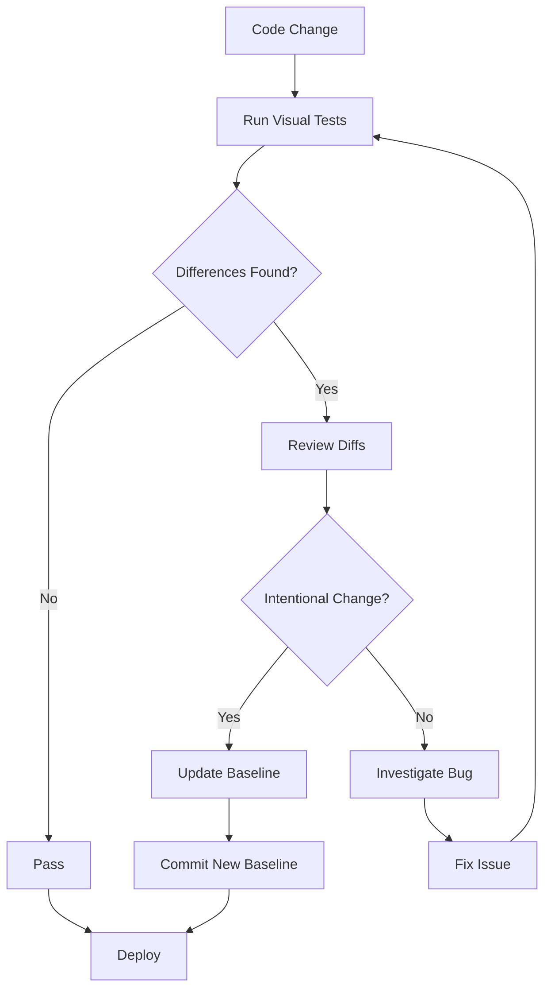
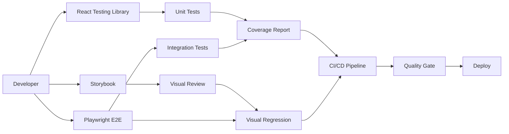
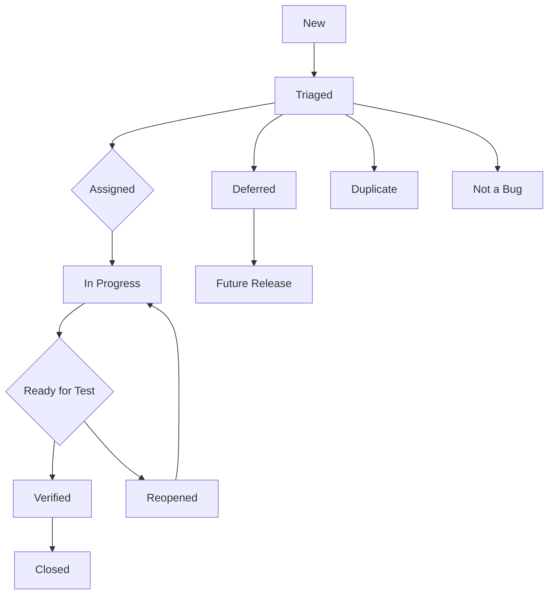

# UI Testing Standards and Framework

## Migration Assurance Platform (MAP)

---

| Field | Value |
|---|---|
| **Document Title** | UI Testing Standards and Framework |
| **Version** | 1.0 |
| **Date** | July 2026 |
| **Status** | Official |
| **Owner** | Quality Engineering Team |
| **Classification** | Internal / Confidential |

---

## Table of Contents

1. [Purpose and Scope](#1-purpose-and-scope)
2. [Definitions and Acronyms](#2-definitions-and-acronyms)
3. [React Testing Standards](#3-react-testing-standards)
4. [Visual Regression Testing](#4-visual-regression-testing)
5. [Responsive Design Validation](#5-responsive-design-validation)
6. [Browser Compatibility Testing](#6-browser-compatibility-testing)
7. [Cross-Platform Testing](#7-cross-platform-testing)
8. [Usability Testing](#8-usability-testing)
9. [Test Environment Configuration](#9-test-environment-configuration)
10. [Recommended Tools and Libraries](#10-recommended-tools-and-libraries)
11. [Best Practices and Patterns](#11-best-practices-and-patterns)
12. [Test Data Management](#12-test-data-management)
13. [Defect Management Workflow](#13-defect-management-workflow)
14. [Reporting and Metrics](#14-reporting-and-metrics)
15. [Dependencies](#15-dependencies)
16. [Revision History](#16-revision-history)
17. [Approval and Sign-Off](#17-approval-and-sign-off)

---

## 1. Purpose and Scope

### 1.1 Purpose

This document defines the UI testing standards, frameworks, and best practices for the Migration Assurance Platform (MAP). It establishes consistent approaches to ensure user interfaces are functional, accessible, visually consistent, and performant across all supported browsers, devices, and platforms.

### 1.2 Scope

This standard applies to all UI components, pages, and user-facing features within the MAP application, including but not limited to:

- Dashboard and reporting interfaces
- Migration workflow screens
- Batch management and configuration panels
- User administration and role management views
- Data validation result displays
- Audit trail and compliance reporting screens
- Notification and alert interfaces
- Settings and configuration pages

### 1.3 Objectives

| Objective | Description |
|---|---|
| Consistency | Ensure uniform UI behavior across all MAP modules |
| Quality | Maintain defect density below 0.5 defects per KLOC for UI |
| Accessibility | Meet WCAG 2.1 AA compliance for all interfaces |
| Performance | Achieve Largest Contentful Paint (LCP) under 2.5 seconds |
| Coverage | Maintain minimum 85% code coverage for React components |

### 1.4 Applicable Standards

- WCAG 2.1 Level AA Accessibility Guidelines
- IEEE 829 Test Documentation Standard
- ISO/IEC/IEEE 29119 Software Testing Standards
- React Testing Library Guiding Principles

---

## 2. Definitions and Acronyms

| Term | Definition |
|---|---|
| MAP | Migration Assurance Platform |
| UI | User Interface |
| UT | Unit Testing |
| IT | Integration Testing |
| E2E | End-to-End Testing |
| SUT | System Under Test |
| POM | Page Object Model |
| DOM | Document Object Model |
| CSS | Cascading Style Sheets |
| LCP | Largest Contentful Paint |
| FID | First Input Delay |
| CLS | Cumulative Layout Shift |
| RTL | React Testing Library |
| VRT | Visual Regression Testing |
| ARIA | Accessible Rich Internet Applications |
| AXE | Accessibility Engine |

---

## 3. React Testing Standards

### 3.1 Component Testing

#### 3.1.1 Component Test Classification

| Category | Scope | Tool | Coverage Target |
|---|---|---|---|
| Smoke Tests | Renders without error | React Testing Library | 100% of components |
| Rendering Tests | Correct output given props | React Testing Library | 95% of components |
| Interaction Tests | User event handling | React Testing Library + Jest | 90% of interactive components |
| State Tests | State transitions | React Testing Library | 85% of stateful components |
| Error Boundary Tests | Error handling | React Testing Library | 100% of error boundaries |

#### 3.1.2 Component Test Structure

```typescript
// MigrationBatchCard.test.tsx
import { render, screen, fireEvent, waitFor } from '@testing-library/react';
import userEvent from '@testing-library/user-event';
import { MigrationBatchCard } from './MigrationBatchCard';
import { QueryClient, QueryClientProvider } from '@tanstack/react-query';

const createTestQueryClient = () =>
  new QueryClient({
    defaultOptions: {
      queries: { retry: false, cacheTime: 0 },
    },
  });

const renderWithProviders = (ui: React.ReactElement) => {
  const queryClient = createTestQueryClient();
  return render(
    <QueryClientProvider client={queryClient}>{ui}</QueryClientProvider>
  );
};

describe('MigrationBatchCard', () => {
  const defaultProps = {
    batchId: 'BATCH-001',
    name: 'Q2 Payroll Migration',
    status: 'in-progress',
    recordCount: 15420,
    completedCount: 8230,
    createdAt: '2026-06-15T10:30:00Z',
    onClick: jest.fn(),
    onRetry: jest.fn(),
  };

  beforeEach(() => {
    jest.clearAllMocks();
  });

  it('renders batch information correctly', () => {
    renderWithProviders(<MigrationBatchCard {...defaultProps} />);

    expect(screen.getByText('Q2 Payroll Migration')).toBeInTheDocument();
    expect(screen.getByText('BATCH-001')).toBeInTheDocument();
    expect(screen.getByText('8,230 / 15,420 records')).toBeInTheDocument();
  });

  it('displays correct status badge', () => {
    renderWithProviders(<MigrationBatchCard {...defaultProps} />);

    const badge = screen.getByTestId('status-badge');
    expect(badge).toHaveTextContent('In Progress');
    expect(badge).toHaveClass('status-in-progress');
  });

  it('calls onClick when card is clicked', async () => {
    const user = userEvent.setup();
    renderWithProviders(<MigrationBatchCard {...defaultProps} />);

    await user.click(screen.getByTestId('batch-card'));

    expect(defaultProps.onClick).toHaveBeenCalledWith('BATCH-001');
  });

  it('shows retry button when status is failed', () => {
    renderWithProviders(
      <MigrationBatchCard {...defaultProps} status="failed" />
    );

    expect(screen.getByRole('button', { name: /retry/i })).toBeInTheDocument();
  });

  it('displays progress bar with correct percentage', () => {
    renderWithProviders(<MigrationBatchCard {...defaultProps} />);

    const progressBar = screen.getByRole('progressbar');
    expect(progressBar).toHaveAttribute('aria-valuenow', '53');
  });

  it('handles missing optional props gracefully', () => {
    renderWithProviders(
      <MigrationBatchCard
        batchId="BATCH-002"
        name="Test Batch"
        status="pending"
        recordCount={0}
        completedCount={0}
        createdAt="2026-06-15T10:30:00Z"
      />
    );

    expect(screen.getByText('Test Batch')).toBeInTheDocument();
    expect(screen.getByText('0 / 0 records')).toBeInTheDocument();
  });

  it('is accessible with proper ARIA attributes', () => {
    renderWithProviders(<MigrationBatchCard {...defaultProps} />);

    const card = screen.getByRole('article');
    expect(card).toHaveAttribute('aria-label', 'Migration batch: Q2 Payroll Migration');
  });
});
```

#### 3.1.3 Component Testing Rules

1. **Test behavior, not implementation** - Use `getByRole`, `getByText`, `getByLabelText` over `getByTestId`
2. **One assertion per behavior** - Each `it` block tests one specific behavior
3. **Mock external dependencies** - API calls, routing, analytics, and third-party services
4. **Use userEvent over fireEvent** - Simulates real user interactions more accurately
5. **Test accessibility by default** - Verify ARIA attributes and keyboard navigation

### 3.2 Hook Testing

#### 3.2.1 Custom Hook Test Structure

```typescript
// useMigrationStatus.test.ts
import { renderHook, waitFor, act } from '@testing-library/react';
import { QueryClient, QueryClientProvider } from '@tanstack/react-query';
import { ReactNode } from 'react';
import { useMigrationStatus } from './useMigrationStatus';
import { server } from '../mocks/server';
import { http, HttpResponse } from 'msw';

const createWrapper = () => {
  const queryClient = new QueryClient({
    defaultOptions: { queries: { retry: false } },
  });
  return ({ children }: { children: ReactNode }) => (
    <QueryClientProvider client={queryClient}>
      {children}
    </QueryClientProvider>
  );
};

describe('useMigrationStatus', () => {
  it('fetches migration status successfully', async () => {
    const { result } = renderHook(() => useMigrationStatus('BATCH-001'), {
      wrapper: createWrapper(),
    });

    expect(result.current.isLoading).toBe(true);

    await waitFor(() => {
      expect(result.current.isLoading).toBe(false);
    });

    expect(result.current.data).toBeDefined();
    expect(result.current.data?.status).toBe('in-progress');
    expect(result.current.error).toBeNull();
  });

  it('handles polling for real-time updates', async () => {
    const { result } = renderHook(
      () => useMigrationStatus('BATCH-001', { pollInterval: 5000 }),
      { wrapper: createWrapper() }
    );

    await waitFor(() => {
      expect(result.current.data).toBeDefined();
    });

    // Verify polling is active
    expect(result.current.isFetching).toBe(false);
  });

  it('returns error state on API failure', async () => {
    server.use(
      http.get('/api/migration/status/:batchId', () => {
        return new HttpResponse(null, { status: 500 });
      })
    );

    const { result } = renderHook(() => useMigrationStatus('BATCH-ERR'), {
      wrapper: createWrapper(),
    });

    await waitFor(() => {
      expect(result.current.isError).toBe(true);
    });

    expect(result.current.error).toBeDefined();
  });

  it('provides retry functionality', async () => {
    const { result } = renderHook(() => useMigrationStatus('BATCH-001'), {
      wrapper: createWrapper(),
    });

    await waitFor(() => {
      expect(result.current.data).toBeDefined();
    });

    await act(async () => {
      await result.current.refetch();
    });

    expect(result.current.isFetching).toBe(false);
  });
});
```

#### 3.2.2 Hook Testing Patterns

| Pattern | Description | Example |
|---|---|---|
| Wrapper Provider | Wrap hooks in required context providers | QueryClientProvider, ThemeProvider |
| Stateful Setup | Use `renderHook` with initial parameters | `renderHook(() => useHook(initialValue))` |
| Async Handling | Use `waitFor` for async state changes | `await waitFor(() => expect(result.current.data))` |
| Mock Server | Use MSW to mock API responses | `server.use(http.get(...))` |
| Cleanup | Ensure proper cleanup between tests | Handled by `renderHook` automatically |

### 3.3 Context Testing

#### 3.3.1 Context Provider Test Structure

```typescript
// MigrationContext.test.tsx
import { render, screen, act, waitFor } from '@testing-library/react';
import userEvent from '@testing-library/user-event';
import {
  MigrationProvider,
  useMigrationContext,
} from './MigrationContext';

const TestConsumer = () => {
  const {
    batches,
    selectedBatch,
    selectBatch,
    clearSelection,
    isLoading,
    error,
  } = useMigrationContext();

  return (
    <div>
      <span data-testid="batch-count">{batches.length}</span>
      <span data-testid="loading-state">{String(isLoading)}</span>
      {error && <span data-testid="error-message">{error.message}</span>}
      {selectedBatch && (
        <span data-testid="selected-batch">{selectedBatch.name}</span>
      )}
      <button onClick={() => selectBatch('BATCH-001')}>Select</button>
      <button onClick={clearSelection}>Clear</button>
    </div>
  );
};

describe('MigrationContext', () => {
  it('provides default context values', () => {
    render(
      <MigrationProvider>
        <TestConsumer />
      </MigrationProvider>
    );

    expect(screen.getByTestId('batch-count')).toHaveTextContent('0');
    expect(screen.getByTestId('loading-state')).toHaveTextContent('false');
  });

  it('allows batch selection', async () => {
    const user = userEvent.setup();

    render(
      <MigrationProvider>
        <TestConsumer />
      </MigrationProvider>
    );

    await user.click(screen.getByRole('button', { name: /select/i }));

    await waitFor(() => {
      expect(screen.getByTestId('selected-batch')).toHaveTextContent(
        'BATCH-001'
      );
    });
  });

  it('allows clearing selection', async () => {
    const user = userEvent.setup();

    render(
      <MigrationProvider>
        <TestConsumer />
      </MigrationProvider>
    );

    await user.click(screen.getByRole('button', { name: /select/i }));
    await waitFor(() => {
      expect(screen.getByTestId('selected-batch')).toBeInTheDocument();
    });

    await user.click(screen.getByRole('button', { name: /clear/i }));

    expect(screen.queryByTestId('selected-batch')).not.toBeInTheDocument();
  });

  it('handles concurrent state updates', async () => {
    const user = userEvent.setup();

    render(
      <MigrationProvider>
        <TestConsumer />
      </MigrationProvider>
    );

    await act(async () => {
      await user.click(screen.getByRole('button', { name: /select/i }));
      await user.click(screen.getByRole('button', { name: /clear/i }));
    });

    expect(screen.queryByTestId('selected-batch')).not.toBeInTheDocument();
  });

  it('throws error when used outside provider', () => {
    const consoleSpy = jest.spyOn(console, 'error').mockImplementation();

    expect(() => {
      render(<TestConsumer />);
    }).toThrow('useMigrationContext must be used within MigrationProvider');

    consoleSpy.mockRestore();
  });
});
```

#### 3.3.2 Context Testing Guidelines

| Guideline | Description |
|---|---|
| Provider Wrapping | Always test context within its required provider tree |
| Default Values | Verify default context values are correct |
| Consumer Updates | Test that state changes propagate to consumers |
| Error Boundaries | Test context error scenarios and fallback UI |
| Performance | Test memoization and re-render optimization |

---

## 4. Visual Regression Testing

### 4.1 Screenshot Comparison Strategy

#### 4.1.1 Baseline Management

| Component Category | Baseline Frequency | Update Process | Approval Required |
|---|---|---|---|
| Layout Components | Per release | Manual approval | Yes |
| UI Components | Per sprint | Automated with review | Yes |
| Data Visualizations | Per release | Manual approval | Yes |
| Interactive States | Per change | Automated with review | Yes |
| Theme Variants | Per theme change | Manual approval | Yes |

#### 4.1.2 Screenshot Test Implementation

```typescript
// visual-regression/MigrationDashboard.spec.ts
import { test, expect } from '@playwright/test';

test.describe('Migration Dashboard - Visual Regression', () => {
  test.beforeEach(async ({ page }) => {
    await page.goto('/dashboard');
    await page.waitForLoadState('networkidle');
    await page.waitForSelector('[data-testid="dashboard-loaded"]');
  });

  test('full dashboard layout - default state', async ({ page }) => {
    await expect(page).toHaveScreenshot('dashboard-full-default.png', {
      fullPage: true,
      maxDiffPixelRatio: 0.01,
      animations: 'disabled',
    });
  });

  test('dashboard layout - dark mode', async ({ page }) => {
    await page.emulateMedia({ colorScheme: 'dark' });
    await expect(page).toHaveScreenshot('dashboard-full-dark-mode.png', {
      fullPage: true,
      maxDiffPixelRatio: 0.01,
      animations: 'disabled',
    });
  });

  test('batch status cards - various states', async ({ page }) => {
    const cards = page.locator('[data-testid="batch-card"]');
    const count = await cards.count();

    for (let i = 0; i < count; i++) {
      await expect(cards.nth(i)).toHaveScreenshot(
        `batch-card-state-${i}.png`,
        {
          maxDiffPixelRatio: 0.01,
          animations: 'disabled',
        }
      );
    }
  });

  test('migration progress chart', async ({ page }) => {
    const chart = page.locator('[data-testid="progress-chart"]');
    await expect(chart).toHaveScreenshot('progress-chart.png', {
      maxDiffPixelRatio: 0.01,
    });
  });

  test('notification panel - expanded', async ({ page }) => {
    await page.click('[data-testid="notification-toggle"]');
    await page.waitForSelector('[data-testid="notification-panel"][data-state="open"]');
    await expect(page.locator('[data-testid="notification-panel"]')).toHaveScreenshot(
      'notification-panel-expanded.png',
      { animations: 'disabled' }
    );
  });
});
```

### 4.2 Visual Diffing Configuration

#### 4.2.1 Threshold Settings

| Element Type | Max Diff Pixels | Max Diff Ratio | Threshold |
|---|---|---|---|
| Static Layout | 0 | 0.01 | 0.2 |
| Dynamic Data | 50 | 0.02 | 0.3 |
| Charts/Graphs | 100 | 0.03 | 0.4 |
| Animations | N/A | N/A | Skip |
| Fonts/Typography | 0 | 0.01 | 0.1 |

#### 4.2.2 Masking Configuration

```typescript
// playwright.config.ts - Visual Regression Settings
import { defineConfig } from '@playwright/test';

export default defineConfig({
  expect: {
    toHaveScreenshot: {
      maxDiffPixelRatio: 0.01,
      threshold: 0.2,
      animations: 'disabled',
    },
  },
  snapshotPathTemplate:
    '{testDir}/__screenshots__/{testFilePath}/{arg}{ext}',
  use: {
    screenshot: 'only-on-failure',
  },
});
```

#### 4.2.3 Dynamic Content Handling

```typescript
// Utility to mask dynamic content for visual regression
async function maskDynamicContent(page: Page) {
  // Mask timestamps
  await page.locator('[data-testid="timestamp"]').evaluate((el) => {
    el.textContent = '2026-01-01 00:00:00';
  });

  // Mask randomly generated IDs
  await page.locator('[data-testid="dynamic-id"]').evaluate((el) => {
    el.textContent = 'ID-000000';
  });

  // Mask animated elements
  await page.locator('[data-testid="loading-spinner"]').evaluate((el) => {
    (el as HTMLElement).style.animationPlayState = 'paused';
  });
}
```

### 4.3 Visual Regression Workflow



---

## 5. Responsive Design Validation

### 5.1 Breakpoint Definitions

| Breakpoint Name | Min Width | Max Width | Device Target | Viewport Size |
|---|---|---|---|---|
| Mobile Small | 0px | 374px | Small phones | 320x568 |
| Mobile | 375px | 767px | Standard phones | 375x812 |
| Tablet Portrait | 768px | 1023px | iPads, tablets | 768x1024 |
| Tablet Landscape | 1024px | 1279px | iPads landscape | 1024x768 |
| Desktop Small | 1280px | 1439px | Small laptops | 1280x720 |
| Desktop | 1440px | 1919px | Standard desktops | 1440x900 |
| Desktop Large | 1920px | 2559px | Large monitors | 1920x1080 |
| Desktop Ultra | 2560px | ∞ | Ultra-wide displays | 2560x1440 |

### 5.2 Responsive Test Implementation

```typescript
// responsive/MigrationTable.spec.ts
import { test, expect } from '@playwright/test';

const viewports = [
  { name: 'Mobile', width: 375, height: 812 },
  { name: 'Tablet', width: 768, height: 1024 },
  { name: 'Desktop', width: 1440, height: 900 },
  { name: 'Ultra-wide', width: 2560, height: 1440 },
];

test.describe('Migration Table - Responsive Design', () => {
  for (const viewport of viewports) {
    test.describe(`${viewport.name} (${viewport.width}x${viewport.height})`, () => {
      test.use({ viewport: { width: viewport.width, height: viewport.height } });

      test.beforeEach(async ({ page }) => {
        await page.goto('/migration/batches');
        await page.waitForLoadState('networkidle');
      });

      test('renders table correctly', async ({ page }) => {
        const table = page.locator('[data-testid="migration-table"]');
        await expect(table).toBeVisible();

        // Verify table columns adapt to viewport
        if (viewport.width < 768) {
          // Mobile: card view or horizontal scroll
          const mobileView = page.locator('[data-testid="mobile-card-view"]');
          const horizontalScroll = page.locator('[data-testid="table-wrapper"]');
          const isCardView = await mobileView.isVisible().catch(() => false);
          const isScrollable = await horizontalScroll.evaluate(
            (el) => el.scrollWidth > el.clientWidth
          );

          expect(isCardView || isScrollable).toBe(true);
        } else {
          // Tablet+: full table view
          const headers = page.locator('[data-testid="table-header"] th');
          await expect(headers).toHaveCount(
            viewport.width >= 1280 ? 8 : 6
          );
        }
      });

      test('navigation menu adapts to viewport', async ({ page }) => {
        if (viewport.width < 768) {
          // Mobile: hamburger menu
          const hamburger = page.locator('[data-testid="mobile-menu-toggle"]');
          await expect(hamburger).toBeVisible();

          await hamburger.click();
          const menu = page.locator('[data-testid="mobile-menu"]');
          await expect(menu).toBeVisible();
        } else {
          // Desktop: full navigation
          const nav = page.locator('[data-testid="desktop-navigation"]');
          await expect(nav).toBeVisible();
        }
      });

      test('form inputs are appropriately sized', async ({ page }) => {
        await page.goto('/migration/configuration');

        const input = page.locator('[data-testid="batch-name-input"]');
        const box = await input.boundingBox();

        if (box) {
          // Minimum touch target size for mobile
          if (viewport.width < 768) {
            expect(box.height).toBeGreaterThanOrEqual(44);
          }
          // Input should not overflow viewport
          expect(box.x + box.width).toBeLessThanOrEqual(viewport.width);
        }
      });
    });
  }
});
```

### 5.3 Layout Integrity Checks

| Check | Mobile | Tablet | Desktop | Ultra-wide |
|---|---|---|---|---|
| Content reflow | Required | Required | Required | Required |
| Sidebar collapse | Collapsed | Collapsible | Always visible | Always visible |
| Table columns | Card view / scroll | 6 columns | 8 columns | 8 columns |
| Font size minimum | 14px | 14px | 14px | 14px |
| Touch target size | 44x44px | 44x44px | 32x32px | 32x32px |
| Horizontal scroll | Permitted | Avoid | Prohibited | Prohibited |
| Image scaling | Responsive | Responsive | Fixed/max-width | Fixed/max-width |

### 5.4 Orientation Testing

```typescript
test.describe('Orientation Handling', () => {
  test.use({ viewport: { width: 375, height: 812 } });

  test('adapts layout on orientation change', async ({ page }) => {
    await page.goto('/dashboard');

    // Portrait mode
    await expect(page.locator('[data-testid="dashboard-grid"]')).toHaveScreenshot(
      'dashboard-portrait.png'
    );

    // Rotate to landscape
    await page.setViewportSize({ width: 812, height: 375 });
    await page.waitForTimeout(300); // Allow reflow

    await expect(page.locator('[data-testid="dashboard-grid"]')).toHaveScreenshot(
      'dashboard-landscape.png'
    );
  });
});
```

---

## 6. Browser Compatibility Testing

### 6.1 Supported Browser Matrix

| Browser | Version | OS Support | Priority | EOL Date |
|---|---|---|---|---|
| Google Chrome | Latest 3 versions | Windows, macOS, Linux | Critical | N/A (auto-update) |
| Mozilla Firefox | Latest 3 versions | Windows, macOS, Linux | Critical | N/A (auto-update) |
| Microsoft Edge | Latest 3 versions | Windows, macOS | High | N/A (auto-update) |
| Apple Safari | Latest 2 versions | macOS, iOS | High | Tied to OS release |
| Chrome Mobile | Latest 3 versions | Android | High | N/A (auto-update) |
| Safari Mobile | Latest 2 versions | iOS | High | Tied to OS release |

### 6.2 Browser-Specific Test Implementation

```typescript
// cross-browser/BrowserCompatibility.spec.ts
import { test, expect, chromium, firefox, webkit } from '@playwright/test';

test.describe('Browser Compatibility - Migration Dashboard', () => {
  test('Chrome - Full functionality', async ({ browserName, page }) => {
    test.skip(browserName !== 'chromium', 'Chrome-specific test');

    await page.goto('/dashboard');

    // Chrome-specific features (e.g., window.showDirectoryPicker)
    const hasFileSystemAccess = await page.evaluate(
      () => 'showDirectoryPicker' in window
    );
    // Test file upload feature only if supported
  });

  test('Firefox - Layout rendering', async ({ browserName, page }) => {
    test.skip(browserName !== 'firefox', 'Firefox-specific test');

    await page.goto('/dashboard');

    // Firefox sometimes renders fonts differently
    const fontFamily = await page.locator('body').evaluate((el) =>
      getComputedStyle(el).fontFamily
    );
    expect(fontFamily).toContain('Inter');
  });

  test('Safari - Touch interactions', async ({ browserName, page }) => {
    test.skip(browserName !== 'webkit', 'Safari-specific test');

    await page.goto('/dashboard');

    // Test Safari-specific touch behavior
    await page.setViewportSize({ width: 375, height: 812 });

    const swipeable = page.locator('[data-testid="swipeable-panel"]');
    if (await swipeable.isVisible()) {
      // Simulate touch gestures
      await swipeable.dispatchEvent('touchstart', {
        touches: [{ clientX: 100, clientY: 100 }],
      });
    }
  });

  test('Edge - Enterprise features', async ({ browserName, page }) => {
    test.skip(browserName !== 'chromium', 'Edge-specific test');

    await page.goto('/dashboard');

    // Test with Edge user agent
    await page.setExtraHTTPHeaders({
      'User-Agent':
        'Mozilla/5.0 (Windows NT 10.0; Win64; x64) AppleWebKit/537.36 (KHTML, like Gecko) Chrome/120.0.0.0 Safari/537.36 Edg/120.0.0.0',
    });

    await page.reload();
    await expect(page.locator('[data-testid="dashboard"]')).toBeVisible();
  });
});
```

### 6.3 Browser Feature Support Matrix

| Feature | Chrome | Firefox | Safari | Edge |
|---|---|---|---|---|
| CSS Grid | Yes | Yes | Yes | Yes |
| CSS Flexbox | Yes | Yes | Yes | Yes |
| Web Workers | Yes | Yes | Yes | Yes |
| Intersection Observer | Yes | Yes | Yes | Yes |
| CSS Container Queries | Yes | Yes (v110+) | Yes (v16+) | Yes |
| View Transitions | Yes | Yes (v122+) | No | Yes |
| Popover API | Yes | Yes (v125+) | Yes (v17+) | Yes |
| CSS has() selector | Yes | Yes (v121+) | Yes (v15.4+) | Yes |
| Array.at() | Yes | Yes (v103+) | Yes (v15.4+) | Yes |
| structuredClone | Yes | Yes (v94+) | Yes (v15.4+) | Yes |

### 6.4 Polyfill Requirements

```typescript
// polyfills/browser-compat.ts
// Required polyfills for MAP browser support

// IntersectionObserver (for lazy loading)
if (typeof IntersectionObserver === 'undefined') {
  const script = document.createElement('script');
  script.src = 'https://polyfill.io/v3/polyfill.min.js?features=IntersectionObserver';
  document.head.appendChild(script);
}

// structuredClone (for deep cloning)
if (typeof structuredClone === 'undefined') {
  (window as any).structuredClone = (obj: any) => JSON.parse(JSON.stringify(obj));
}

// Array.at (for negative indexing)
if (!Array.prototype.at) {
  Array.prototype.at = function (index: number) {
    const realIndex = index < 0 ? this.length + index : index;
    return this[realIndex];
  };
}
```

---

## 7. Cross-Platform Testing

### 7.1 Platform Matrix

| Platform | Version | Browser Combinations | Priority |
|---|---|---|---|
| Windows | 10, 11 | Chrome, Firefox, Edge | Critical |
| macOS | Ventura (13), Sonoma (14), Sequoia (15) | Chrome, Firefox, Safari | Critical |
| Linux | Ubuntu 22.04+, Fedora 38+ | Chrome, Firefox | High |
| iOS | 16+ | Safari Mobile | High |
| Android | 12+ | Chrome Mobile | High |

### 7.2 Platform-Specific Test Considerations

| Consideration | Windows | macOS | Linux |
|---|---|---|---|
| Font rendering | ClearType | Core Text | FreeType |
| Scroll behavior | Smooth scroll | Momentum scroll | Variable |
| File dialogs | Native Windows | Native macOS | GTK/Qt |
| Window management | Snap layouts | Full-screen modes | Tiling WMs |
| Right-click context menu | Standard | Standard | May differ |
| Touchpad gestures | Precision drivers | Force Touch | libinput |
| Display scaling | 100%, 125%, 150%, 200% | Retina scaling | Xrandr |

### 7.3 Cross-Platform Test Implementation

```typescript
// cross-platform/PlatformSpecific.spec.ts
import { test, expect } from '@playwright/test';

test.describe('Cross-Platform Compatibility', () => {
  test('renders consistently across platforms', async ({ page, browserName }) => {
    await page.goto('/dashboard');

    // Verify core layout is identical
    const dashboard = page.locator('[data-testid="dashboard"]');
    await expect(dashboard).toBeVisible();

    // Check font rendering consistency
    const heading = page.locator('h1');
    const fontSize = await heading.evaluate((el) => getComputedStyle(el).fontSize);
    expect(parseInt(fontSize)).toBeGreaterThanOrEqual(24);

    // Verify color contrast (accessibility)
    const contrast = await heading.evaluate((el) => {
      const style = getComputedStyle(el);
      return { color: style.color, bg: style.backgroundColor };
    });
    // Contrast ratio check
  });

  test('handles OS-level scrolling', async ({ page }) => {
    await page.goto('/migration/batches');

    const table = page.locator('[data-testid="migration-table-wrapper"]');

    // Test scroll behavior
    await page.evaluate(() => {
      window.scrollTo({ top: 500, behavior: 'smooth' });
    });

    await page.waitForTimeout(500);
    const scrollY = await page.evaluate(() => window.scrollY);
    expect(scrollY).toBeGreaterThan(0);
  });

  test('clipboard operations work cross-platform', async ({ page }) => {
    await page.goto('/migration/batches');

    // Grant clipboard permissions
    const context = page.context();
    await context.grantPermissions(['clipboard-read', 'clipboard-write']);

    // Test copy functionality
    await page.click('[data-testid="batch-row-0"] [data-testid="copy-id-btn"]');

    const clipboardText = await page.evaluate(() => navigator.clipboard.readText());
    expect(clipboardText).toBeTruthy();
  });

  test('handles file download on platform', async ({ page }) => {
    await page.goto('/migration/reports');

    const downloadPromise = page.waitForEvent('download');
    await page.click('[data-testid="download-report-btn"]');
    const download = await downloadPromise;

    expect(download.suggestedFilename()).toMatch(/migration-report.*\.xlsx/);
  });
});
```

### 7.4 Display Scaling Test Matrix

| Scaling Factor | Windows DPI | macOS Retina | Test Coverage |
|---|---|---|---|
| 100% (1x) | 96 DPI | Non-Retina | Required |
| 125% (1.25x) | 120 DPI | - | Required |
| 150% (1.5x) | 144 DPI | - | Required |
| 200% (2x) | 192 DPI | Retina | Required |
| 300% (3x) | 288 DPI | Super Retina | Recommended |

---

## 8. Usability Testing

### 8.1 Heuristic Evaluation Framework

#### 8.1.1 Nielsen's 10 Usability Heuristics for MAP

| Heuristic | Description | Evaluation Criteria | Severity Scale |
|---|---|---|---|
| Visibility of system status | System provides timely feedback | Loading states, progress indicators | 0-4 |
| Match between system and real world | Language and concepts match user expectations | Domain terminology, iconography | 0-4 |
| User control and freedom | Undo/redo, back navigation | Action reversibility, escape routes | 0-4 |
| Consistency and standards | Consistent UI patterns across MAP | Component reuse, interaction patterns | 0-4 |
| Error prevention | Prevent errors before they occur | Validation, confirmations | 0-4 |
| Recognition over recall | Minimize memory load | Contextual help, recent items | 0-4 |
| Flexibility and efficiency | Accelerators for expert users | Keyboard shortcuts, bulk actions | 0-4 |
| Aesthetic and minimalist design | No irrelevant information | Clean layouts, focused content | 0-4 |
| Help users recognize/recover from errors | Clear error messages | Error states, recovery actions | 0-4 |
| Help and documentation | Accessible help system | Contextual help, tooltips | 0-4 |

#### 8.1.2 Severity Rating Scale

| Rating | Level | Description | Action Required |
|---|---|---|---|
| 0 | N/A | Not applicable to usability | None |
| 1 | Cosmetic | Minor issue, low priority | Fix if time permits |
| 2 | Minor | Minor usability problem | Schedule for next sprint |
| 3 | Major | Major usability problem | Fix before release |
| 4 | Catastrophic | Usability emergency | Fix immediately |

#### 8.1.3 Heuristic Evaluation Report Template

```markdown
## Heuristic Evaluation Report - [Module Name]

### Evaluator Information
- Evaluator: [Name]
- Date: [Date]
- Module: [Module/Feature]
- Expertise Level: Novice / Intermediate / Expert

### Findings Summary
| ID | Heuristic | Description | Severity | Recommendation |
|----|-----------|-------------|----------|----------------|
| H01 | Error Prevention | No confirmation for destructive batch deletion | 3 | Add confirmation dialog |
| H02 | Consistency | Different button styles for same action type | 2 | Standardize button components |
| H03 | Visibility | No loading indicator during export | 3 | Add progress spinner |

### Overall Usability Score: [1-10]
### Recommendation: [Proceed / Fix Issues First / Major Rework]
```

### 8.2 User Testing Protocol

#### 8.2.1 User Test Plan Template

```markdown
## User Test Plan - [Feature Name]

### Test Objectives
- Primary: [Main goal of this user test]
- Secondary: [Secondary goals]

### Participant Criteria
- Role: Migration Specialist, Administrator, Auditor
- Experience: 6+ months with migration tools
- Technical Level: Basic to intermediate computer skills
- Group Size: 5-8 participants per round

### Test Scenarios
1. **Scenario 1**: Create a new migration batch
   - Start: Dashboard
   - End: Batch created successfully
   - Time limit: 5 minutes
   - Success criteria: Batch created with correct parameters

2. **Scenario 2**: Review validation errors
   - Start: Batch results page
   - End: Errors identified and categorized
   - Time limit: 3 minutes
   - Success criteria: Correctly identifies top 3 error categories

3. **Scenario 3**: Export migration report
   - Start: Any page
   - End: Report downloaded
   - Time limit: 2 minutes
   - Success criteria: Correct report format and data

### Metrics to Collect
- Task completion rate
- Time on task
- Error rate
- System Usability Scale (SUS) score
- Net Promoter Score (NPS)
- Qualitative feedback (think-aloud protocol)
```

#### 8.2.2 SUS (System Usability Scale) Questionnaire

| Question | 1 (Strongly Disagree) | 2 | 3 | 4 | 5 (Strongly Agree) |
|---|---|---|---|---|---|
| Q1: I think I would like to use this system frequently | | | | | |
| Q2: I found the system unnecessarily complex | | | | | |
| Q3: I thought the system was easy to use | | | | | |
| Q4: I think I would need technical support to use this system | | | | | |
| Q5: I found the various functions were well integrated | | | | | |
| Q6: I thought there was too much inconsistency in this system | | | | | |
| Q7: I would imagine most people would learn to use this system quickly | | | | | |
| Q8: I found the system very cumbersome to use | | | | | |
| Q9: I felt very confident using the system | | | | | |
| Q10: I needed to learn a lot of things before I could get going | | | | | |

**Scoring**: Sum of (5 minus score for Q1,2,4,6,10) + (score minus 1 for Q3,5,7,8,9), multiplied by 2.5. Target: 68+ (above average).

### 8.3 Accessibility Testing (a11y)

#### 8.3.1 Accessibility Requirements

| Requirement | Standard | Tool | Priority |
|---|---|---|---|
| Screen reader support | WCAG 2.1 AA | axe-core, VoiceOver | Critical |
| Keyboard navigation | WCAG 2.1 AA | Manual + automated | Critical |
| Color contrast | WCAG 2.1 AA (4.5:1) | axe-core, Lighthouse | Critical |
| ARIA attributes | WCAG 2.1 AA | axe-core | High |
| Focus management | WCAG 2.1 AA | Manual testing | High |
| Alternative text | WCAG 2.1 A | axe-core | High |
| Form labels | WCAG 2.1 A | axe-core | High |
| Skip navigation | WCAG 2.1 A | Manual testing | Medium |

#### 8.3.2 Accessibility Test Implementation

```typescript
// accessibility/AccessibilityAudit.spec.ts
import { test, expect } from '@playwright/test';
import AxeBuilder from '@axe-core/playwright';

test.describe('MAP Accessibility Audit', () => {
  test('dashboard meets WCAG 2.1 AA', async ({ page }) => {
    await page.goto('/dashboard');
    await page.waitForLoadState('networkidle');

    const accessibilityScanResults = await new AxeBuilder({ page })
      .withTags(['wcag2a', 'wcag2aa', 'wcag21a', 'wcag21aa'])
      .analyze();

    expect(accessibilityScanResults.violations).toEqual([]);
  });

  test('migration form meets accessibility standards', async ({ page }) => {
    await page.goto('/migration/configuration');

    const results = await new AxeBuilder({ page })
      .include('[data-testid="migration-form"]')
      .withTags(['wcag2a', 'wcag2aa', 'wcag21a', 'wcag21aa'])
      .analyze();

    expect(results.violations).toEqual([]);
  });

  test('keyboard navigation works for entire flow', async ({ page }) => {
    await page.goto('/dashboard');

    // Tab through main navigation
    await page.keyboard.press('Tab');
    const firstFocused = await page.evaluate(() =>
      document.activeElement?.getAttribute('data-testid')
    );
    expect(firstFocused).toBeTruthy();

    // Continue tabbing and verify focus order
    const focusOrder: string[] = [];
    for (let i = 0; i < 10; i++) {
      await page.keyboard.press('Tab');
      const testId = await page.evaluate(() =>
        document.activeElement?.getAttribute('data-testid')
      );
      if (testId) focusOrder.push(testId);
    }

    // Verify logical focus order
    expect(focusOrder).toContain('skip-to-content');
    expect(focusOrder).toContain('main-navigation');
  });

  test('color contrast meets minimum ratio', async ({ page }) => {
    await page.goto('/dashboard');

    const results = await new AxeBuilder({ page })
      .withRules(['color-contrast'])
      .analyze();

    expect(results.violations).toEqual([]);
  });

  test('all images have alt text', async ({ page }) => {
    await page.goto('/dashboard');

    const results = await new AxeBuilder({ page })
      .withRules(['image-alt'])
      .analyze();

    expect(results.violations).toEqual([]);
  });

  test('form inputs have associated labels', async ({ page }) => {
    await page.goto('/migration/configuration');

    const results = await new AxeBuilder({ page })
      .include('[data-testid="migration-form"]')
      .withRules(['label'])
      .analyze();

    expect(results.violations).toEqual([]);
  });
});
```

---

## 9. Test Environment Configuration

### 9.1 Browser Setup

#### 9.1.1 Playwright Configuration

```typescript
// playwright.config.ts
import { defineConfig, devices } from '@playwright/test';

export default defineConfig({
  testDir: './tests/ui',
  fullyParallel: true,
  forbidOnly: !!process.env.CI,
  retries: process.env.CI ? 2 : 0,
  workers: process.env.CI ? 1 : undefined,
  reporter: [
    ['html', { outputFolder: 'test-results/ui-report' }],
    ['junit', { outputFile: 'test-results/ui-junit.xml' }],
    ['json', { outputFile: 'test-results/ui-results.json' }],
  ],
  use: {
    baseURL: process.env.BASE_URL || 'http://localhost:3000',
    trace: 'on-first-retry',
    screenshot: 'only-on-failure',
    video: 'retain-on-failure',
    actionTimeout: 10000,
    navigationTimeout: 30000,
  },
  projects: [
    // Desktop Browsers
    {
      name: 'chromium-desktop',
      use: { ...devices['Desktop Chrome'] },
    },
    {
      name: 'firefox-desktop',
      use: { ...devices['Desktop Firefox'] },
    },
    {
      name: 'webkit-desktop',
      use: { ...devices['Desktop Safari'] },
    },
    {
      name: 'edge-desktop',
      use: {
        ...devices['Desktop Chrome'],
        channel: 'msedge',
      },
    },
    // Mobile Devices
    {
      name: 'mobile-chrome',
      use: { ...devices['Pixel 7'] },
    },
    {
      name: 'mobile-safari',
      use: { ...devices['iPhone 14'] },
    },
    // Tablets
    {
      name: 'tablet-chrome',
      use: { ...devices['Pixel Tablet'] },
    },
    {
      name: 'tablet-safari',
      use: { ...devices['iPad Pro 11'] },
    },
  ],
  webServer: {
    command: 'npm run dev',
    url: 'http://localhost:3000',
    reuseExistingServer: !process.env.CI,
    timeout: 120000,
  },
});
```

### 9.2 Viewport Sizes Configuration

```typescript
// config/viewports.ts
export const VIEWPORTS = {
  mobile: {
    small: { width: 320, height: 568, label: 'iPhone SE' },
    standard: { width: 375, height: 812, label: 'iPhone 14' },
    large: { width: 428, height: 926, label: 'iPhone 14 Plus' },
  },
  tablet: {
    portrait: { width: 768, height: 1024, label: 'iPad' },
    landscape: { width: 1024, height: 768, label: 'iPad Landscape' },
    pro: { width: 1024, height: 1366, label: 'iPad Pro 11"' },
  },
  desktop: {
    small: { width: 1280, height: 720, label: 'Small Laptop' },
    standard: { width: 1440, height: 900, label: 'Standard Desktop' },
    large: { width: 1920, height: 1080, label: 'Full HD' },
    ultra: { width: 2560, height: 1440, label: 'QHD' },
  },
} as const;

export type ViewportKey = keyof typeof VIEWPORTS;
export type DeviceKey = keyof (typeof VIEWPORTS)[ViewportKey];
```

### 9.3 Test Data Configuration

```typescript
// config/test-data.ts
export const TEST_USERS = {
  admin: {
    username: 'admin@map.test',
    password: 'SecureP@ss123!',
    role: 'administrator',
    permissions: ['read', 'write', 'delete', 'admin'],
  },
  migrationSpecialist: {
    username: 'specialist@map.test',
    password: 'SpecialistP@ss123!',
    role: 'migration_specialist',
    permissions: ['read', 'write'],
  },
  auditor: {
    username: 'auditor@map.test',
    password: 'AuditorP@ss123!',
    role: 'auditor',
    permissions: ['read'],
  },
  viewer: {
    username: 'viewer@map.test',
    password: 'ViewerP@ss123!',
    role: 'viewer',
    permissions: ['read'],
  },
};

export const TEST_BATCHES = {
  small: {
    batchId: 'TEST-BATCH-001',
    name: 'Small Test Batch',
    recordCount: 100,
    status: 'completed',
  },
  medium: {
    batchId: 'TEST-BATCH-002',
    name: 'Medium Test Batch',
    recordCount: 10000,
    status: 'in-progress',
  },
  large: {
    batchId: 'TEST-BATCH-003',
    name: 'Large Test Batch',
    recordCount: 100000,
    status: 'failed',
  },
};
```

### 9.4 Environment Variables

| Variable | Description | Default | Required |
|---|---|---|---|
| BASE_URL | Application base URL | http://localhost:3000 | Yes |
| API_URL | API endpoint URL | http://localhost:8080 | Yes |
| CI | CI environment flag | false | No |
| HEADLESS | Run headless mode | true | No |
| SLOW_MO | Slow down actions (ms) | 0 | No |
| VIDEO_DIR | Video recording directory | ./test-results/videos | No |
| SCREENSHOT_DIR | Screenshot directory | ./test-results/screenshots | No |
| TEST_TIMEOUT | Global test timeout | 30000 | No |

---

## 10. Recommended Tools and Libraries

### 10.1 Tool Selection Matrix

| Tool | Purpose | License | MAP Usage | Priority |
|---|---|---|---|---|
| Playwright | E2E and visual regression | Apache 2.0 | Primary E2E framework | Critical |
| React Testing Library | Component unit tests | MIT | Component testing | Critical |
| Jest | Test runner and assertions | MIT | Unit test execution | Critical |
| axe-core | Accessibility testing | MPL 2.0 | A11y auditing | High |
| MSW | API mocking | MIT | Mock service worker | High |
| Storybook | Component documentation | MIT | Visual testing | High |
| Percy | Visual regression (cloud) | Commercial | VRT cloud service | Medium |
| Chromatic | Visual testing (cloud) | Commercial | VRT for Storybook | Medium |
| Lighthouse | Performance auditing | Apache 2.0 | Performance metrics | High |
| axe-playwright | A11y with Playwright | MIT | Combined a11y testing | High |

### 10.2 Playwright Setup and Configuration

```typescript
// Package dependencies
// package.json
{
  "devDependencies": {
    "@playwright/test": "^1.42.0",
    "@axe-core/playwright": "^4.8.0",
    "@testing-library/react": "^14.2.0",
    "@testing-library/jest-dom": "^6.4.0",
    "@testing-library/user-event": "^14.5.0",
    "jest": "^29.7.0",
    "jest-environment-jsdom": "^29.7.0",
    "msw": "^2.2.0",
    "ts-jest": "^29.1.0",
    "typescript": "^5.4.0"
  }
}
```

### 10.3 React Testing Library Configuration

```typescript
// jest.config.ts
import type { Config } from 'jest';

const config: Config = {
  testEnvironment: 'jsdom',
  setupFilesAfterSetup: ['<rootDir>/jest.setup.ts'],
  moduleNameMapper: {
    '^@/(.*)$': '<rootDir>/src/$1',
    '\\.(css|less|scss)$': 'identity-obj-proxy',
  },
  testMatch: [
    '<rootDir>/src/**/*.test.{ts,tsx}',
    '<rootDir>/src/**/*.spec.{ts,tsx}',
  ],
  collectCoverageFrom: [
    'src/**/*.{ts,tsx}',
    '!src/**/*.d.ts',
    '!src/**/index.ts',
    '!src/**/*.stories.{ts,tsx}',
    '!src/**/*.test.{ts,tsx}',
    '!src/**/__mocks__/**',
  ],
  coverageThresholds: {
    global: {
      branches: 80,
      functions: 85,
      lines: 85,
      statements: 85,
    },
  },
};

export default config;
```

### 10.4 MSW (Mock Service Worker) Setup

```typescript
// mocks/handlers.ts
import { http, HttpResponse } from 'msw';

export const handlers = [
  http.get('/api/migration/batches', () => {
    return HttpResponse.json({
      data: [
        {
          batchId: 'BATCH-001',
          name: 'Q2 Payroll Migration',
          status: 'in-progress',
          recordCount: 15420,
          completedCount: 8230,
          createdAt: '2026-06-15T10:30:00Z',
        },
      ],
      total: 1,
      page: 1,
      pageSize: 20,
    });
  }),

  http.get('/api/migration/batches/:batchId', ({ params }) => {
    const { batchId } = params;
    return HttpResponse.json({
      batchId,
      name: 'Test Batch',
      status: 'completed',
      recordCount: 100,
      completedCount: 100,
      errors: [],
      createdAt: '2026-06-15T10:30:00Z',
      completedAt: '2026-06-15T11:00:00Z',
    });
  }),

  http.post('/api/migration/batches', async ({ request }) => {
    const body = await request.json();
    return HttpResponse.json(
      {
        batchId: 'BATCH-NEW',
        ...body,
        status: 'pending',
        createdAt: new Date().toISOString(),
      },
      { status: 201 }
    );
  }),

  http.delete('/api/migration/batches/:batchId', () => {
    return HttpResponse.json({ success: true });
  }),
];

// mocks/server.ts
import { setupServer } from 'msw/node';
import { handlers } from './handlers';

export const server = setupServer(...handlers);
```

### 10.5 Tool Integration Workflow



---

## 11. Best Practices and Patterns

### 11.1 Page Object Model (POM)

#### 11.1.1 POM Structure

```
tests/
  pages/
    DashboardPage.ts
    MigrationBatchPage.ts
    ConfigurationPage.ts
    ReportsPage.ts
    LoginPage.ts
  components/
    NavigationComponent.ts
    BatchCardComponent.ts
    PaginationComponent.ts
    ModalComponent.ts
  fixtures/
    test-fixtures.ts
```

#### 11.1.2 Page Object Implementation

```typescript
// pages/DashboardPage.ts
import { Page, Locator, expect } from '@playwright/test';

export class DashboardPage {
  readonly page: Page;
  readonly batchCards: Locator;
  readonly summaryStats: Locator;
  readonly searchInput: Locator;
  readonly filterDropdown: Locator;
  readonly createBatchButton: Locator;
  readonly notificationBell: Locator;
  readonly profileMenu: Locator;
  readonly recentActivity: Locator;

  constructor(page: Page) {
    this.page = page;
    this.batchCards = page.locator('[data-testid="batch-card"]');
    this.summaryStats = page.locator('[data-testid="summary-stats"]');
    this.searchInput = page.locator('[data-testid="search-input"]');
    this.filterDropdown = page.locator('[data-testid="filter-dropdown"]');
    this.createBatchButton = page.locator('[data-testid="create-batch-btn"]');
    this.notificationBell = page.locator('[data-testid="notification-bell"]');
    this.profileMenu = page.locator('[data-testid="profile-menu"]');
    this.recentActivity = page.locator('[data-testid="recent-activity"]');
  }

  async goto() {
    await this.page.goto('/dashboard');
    await this.page.waitForLoadState('networkidle');
  }

  async getBatchCount() {
    return this.batchCards.count();
  }

  async searchBatches(query: string) {
    await this.searchInput.fill(query);
    await this.page.waitForResponse(
      (resp) => resp.url().includes('/api/migration/batches') && resp.status() === 200
    );
  }

  async filterByStatus(status: 'all' | 'in-progress' | 'completed' | 'failed') {
    await this.filterDropdown.click();
    await this.page.getByRole('option', { name: status }).click();
    await this.page.waitForResponse(
      (resp) => resp.url().includes('/api/migration/batches') && resp.status() === 200
    );
  }

  async clickCreateBatch() {
    await this.createBatchButton.click();
  }

  async openNotifications() {
    await this.notificationBell.click();
    await this.page.waitForSelector('[data-testid="notification-panel"][data-state="open"]');
  }

  async getNotificationCount(): Promise<number> {
    const badge = this.page.locator('[data-testid="notification-badge"]');
    const text = await badge.textContent();
    return parseInt(text || '0', 10);
  }

  async verifyDashboardLoaded() {
    await expect(this.summaryStats).toBeVisible();
    await expect(this.batchCards.first()).toBeVisible();
  }
}
```

#### 11.1.3 Component Object Implementation

```typescript
// components/BatchCardComponent.ts
import { Page, Locator, expect } from '@playwright/test';

export class BatchCardComponent {
  readonly root: Locator;
  readonly name: Locator;
  readonly statusBadge: Locator;
  readonly progressBar: Locator;
  readonly recordCount: Locator;
  readonly createdAt: Locator;
  readonly actionMenu: Locator;
  readonly retryButton: Locator;

  constructor(page: Page, testId: string) {
    this.root = page.locator(`[data-testid="${testId}"]`);
    this.name = this.root.locator('[data-testid="batch-name"]');
    this.statusBadge = this.root.locator('[data-testid="status-badge"]');
    this.progressBar = this.root.locator('[role="progressbar"]');
    this.recordCount = this.root.locator('[data-testid="record-count"]');
    this.createdAt = this.root.locator('[data-testid="created-at"]');
    this.actionMenu = this.root.locator('[data-testid="action-menu"]');
    this.retryButton = this.root.locator('[data-testid="retry-button"]');
  }

  async click() {
    await this.root.click();
  }

  async getStatus(): Promise<string> {
    return (await this.statusBadge.textContent()) || '';
  }

  async getProgress(): Promise<number> {
    return parseInt((await this.progressBar.getAttribute('aria-valuenow')) || '0');
  }

  async openActionMenu() {
    await this.actionMenu.click();
  }

  async retry() {
    await this.retryButton.click();
  }

  async expectVisible() {
    await expect(this.root).toBeVisible();
  }

  async expectStatus(expectedStatus: string) {
    await expect(this.statusBadge).toHaveText(expectedStatus);
  }
}
```

### 11.2 Selector Strategy

#### 11.2.1 Selector Priority Order

| Priority | Selector Type | Example | When to Use |
|---|---|---|---|
| 1 | ARIA Role | `getByRole('button', { name: /submit/i })` | Interactive elements |
| 2 | ARIA Label | `getByLabelText(/email address/i)` | Form inputs |
| 3 | ARIA Description | `getByRole('textbox', { description: /required/i })` | Described elements |
| 4 | Text Content | `getByText(/migration batch/i)` | Static text, headings |
| 5 | Test ID | `getByTestId('batch-card')` | Last resort, non-semantic elements |

#### 11.2.2 Selector Anti-Patterns

```typescript
// ❌ BAD SELECTORS - Avoid these
const button = page.locator('.btn-primary');              // CSS class
const input = page.locator('#email-input');               // ID (fragile)
const link = page.locator('a[href="/dashboard"]');        // Attribute
const div = page.locator('div.container > div > span');   // DOM structure
const element = page.locator(':nth-child(2)');            // Position-based

// ✅ GOOD SELECTORS - Prefer these
const button = page.getByRole('button', { name: /submit/i });
const input = page.getByLabel(/email address/i);
const link = page.getByRole('link', { name: /dashboard/i });
const heading = page.getByRole('heading', { name: /migration batches/i });
const alert = page.getByRole('alert');
const status = page.getByText(/in progress/i);
```

#### 11.2.3 Data Test ID Convention

```typescript
// Convention: [component]-[element]-[optional-context]
// Examples:
// batch-card
// batch-card-name
// batch-card-status-badge
// batch-card-progress-bar
// navigation-main
// navigation-item-dashboard
// form-migration-config
// form-input-batch-name
// modal-confirm-delete
// table-migration-batches
// table-header-sort-name
// table-row-batch-001
```

### 11.3 Wait Management

#### 11.3.1 Wait Strategy Hierarchy

| Strategy | Implementation | Use Case |
|---|---|---|
| Auto-waiting | Playwright built-in | Default for most actions |
| Explicit wait for selector | `waitForSelector` | Dynamic content load |
| Network idle | `waitForLoadState('networkidle')` | After navigation |
| Response wait | `waitForResponse` | After triggering API call |
| Custom condition | `waitFor(() => condition)` | Complex state checks |
| Animation wait | `waitForAnimation` | After CSS transitions |

#### 11.3.2 Wait Implementation Examples

```typescript
// ✅ CORRECT WAIT PATTERNS

// 1. Auto-waiting (preferred)
await page.getByRole('button', { name: /save/i }).click();

// 2. Wait for specific state
await page.waitForSelector('[data-testid="batch-card"]');

// 3. Wait for network response
await Promise.all([
  page.waitForResponse(
    (resp) => resp.url().includes('/api/migration/batches') && resp.status() === 200
  ),
  page.getByRole('button', { name: /refresh/i }).click(),
]);

// 4. Wait for multiple conditions
await page.waitForFunction(() => {
  const cards = document.querySelectorAll('[data-testid="batch-card"]');
  return cards.length > 0;
});

// 5. Wait for URL change
await Promise.all([
  page.waitForURL('**/migration/batches/**'),
  page.getByRole('link', { name: /view details/i }).click(),
]);

// ❌ INCORRECT WAIT PATTERNS - Avoid these
await page.waitForTimeout(5000);          // Fixed timeout (flaky)
await page.waitForTimeout(1000);          // Short timeout (still flaky)
await page.locator('...').click({ delay: 1000 }); // Artificial delay
```

### 11.4 Test Isolation and Cleanup

```typescript
// fixtures/test-fixtures.ts
import { test as base, expect } from '@playwright/test';

type TestFixtures = {
  authenticatedPage: any;
  cleanDatabase: void;
};

export const test = base.extend<TestFixtures>({
  authenticatedPage: async ({ page, browserName }, use) => {
    // Setup: login
    await page.goto('/login');
    await page.fill('[data-testid="email-input"]', 'admin@map.test');
    await page.fill('[data-testid="password-input"]', 'SecureP@ss123!');
    await page.click('[data-testid="login-button"]');
    await page.waitForURL('**/dashboard');

    // Use the authenticated page
    await use(page);

    // Teardown: logout
    await page.click('[data-testid="profile-menu"]');
    await page.click('[data-testid="logout-button"]');
  },
});

test.describe('Migration Batch Operations', () => {
  test.afterEach(async ({ page }) => {
    // Cleanup: reset state after each test
    await page.evaluate(() => {
      localStorage.clear();
      sessionStorage.clear();
    });
  });

  test('creates new migration batch', async ({ authenticatedPage }) => {
    // Test implementation
  });
});
```

---

## 12. Test Data Management

### 12.1 Test Data Strategy

| Data Type | Source | Refresh Frequency | Isolation Level |
|---|---|---|---|
| User accounts | Seed scripts | Per environment | Per test suite |
| Migration batches | Fixtures | Per test run | Per test |
| Configuration data | Seed scripts | Per environment | Per test suite |
| Audit logs | Generated | Per test run | Per test |
| Reports | Generated | Per test run | Per test |

### 12.2 Test Data Fixtures

```typescript
// fixtures/migration-data.ts
export const migrationFixtures = {
  validBatch: {
    name: 'Test Migration Batch',
    sourceSystem: 'SAP',
    targetSystem: 'Oracle',
    recordCount: 1000,
    configuration: {
      validationRules: ['required-fields', 'data-type', 'referential-integrity'],
      skipDuplicates: true,
      errorThreshold: 0.05,
    },
  },
  invalidBatch: {
    name: '',  // Missing required name
    sourceSystem: 'INVALID',
    targetSystem: 'INVALID',
    recordCount: -1,  // Invalid count
  },
  largeBatch: {
    name: 'Large Scale Migration',
    sourceSystem: 'SAP',
    targetSystem: 'Oracle',
    recordCount: 1000000,
    configuration: {
      validationRules: ['all'],
      skipDuplicates: false,
      errorThreshold: 0.01,
    },
  },
};
```

### 12.3 API Mock Data Generation

```typescript
// helpers/test-data-generator.ts
import { faker } from '@faker-js/faker';

export function generateBatchData(count: number = 10) {
  return Array.from({ length: count }, (_, i) => ({
    batchId: `BATCH-${String(i + 1).padStart(3, '0')}`,
    name: faker.commerce.productName(),
    status: faker.helpers.arrayElement(['pending', 'in-progress', 'completed', 'failed']),
    recordCount: faker.number.int({ min: 100, max: 100000 }),
    completedCount: faker.number.int({ min: 0, max: 100000 }),
    createdAt: faker.date.recent({ days: 30 }).toISOString(),
    errors: faker.number.int({ min: 0, max: 50 }),
  }));
}

export function generateUserData() {
  return {
    id: faker.string.uuid(),
    email: faker.internet.email(),
    name: faker.person.fullName(),
    role: faker.helpers.arrayElement(['admin', 'specialist', 'auditor', 'viewer']),
    lastLogin: faker.date.recent({ days: 7 }).toISOString(),
  };
}
```

---

## 13. Defect Management Workflow

### 13.1 UI Defect Classification

| Severity | Description | Examples | SLA |
|---|---|---|---|
| S1 - Critical | System unusable, data loss | Broken navigation, form submission fails | 4 hours |
| S2 - Major | Major feature broken | Incorrect data display, broken layout | 24 hours |
| S3 - Minor | Minor UI issue | Misaligned elements, wrong color | 72 hours |
| S4 - Cosmetic | Visual polish needed | Spacing inconsistency, minor animation glitch | Next sprint |

### 13.2 Defect Report Template

```markdown
## UI Defect Report

**Defect ID**: UI-[XXX]
**Date**: [Date]
**Reported by**: [Tester Name]
**Module**: [Module Name]
**Page/Component**: [Specific location]

### Environment
- Browser: [Browser + Version]
- OS: [Operating System + Version]
- Screen Resolution: [Width x Height]
- Device: [Device type]

### Description
[Clear description of the defect]

### Steps to Reproduce
1. [Step 1]
2. [Step 2]
3. [Step 3]

### Expected Result
[What should happen]

### Actual Result
[What actually happens]

### Visual Evidence
- Screenshot: [Attach screenshot]
- Video: [Attach video if applicable]
- Console Errors: [Any console errors]

### Impact
- Affected Users: [Number/percentage]
- Business Impact: [Description]
- Workaround Available: [Yes/No, describe if yes]
```

### 13.3 Defect Lifecycle



---

## 14. Reporting and Metrics

### 14.1 Quality Metrics Dashboard

| Metric | Target | Measurement | Frequency |
|---|---|---|---|
| Test Pass Rate | ≥ 98% | (Passed / Total) × 100 | Per run |
| Code Coverage | ≥ 85% | Lines/branches covered | Per build |
| Defect Density | < 0.5 per KLOC | Defects / (KLOC) | Per sprint |
| Mean Time to Detect | < 24 hours | Time from defect introduction to detection | Per sprint |
| Mean Time to Resolve | < 72 hours | Time from defect report to fix | Per defect |
| Visual Regression Rate | < 2% | False positive visual diffs | Per run |
| Accessibility Score | ≥ 90 | axe-core score | Per release |
| Lighthouse Performance | ≥ 90 | Performance score | Per release |
| LCP (Largest Contentful Paint) | < 2.5s | Core Web Vital | Per release |
| CLS (Cumulative Layout Shift) | < 0.1 | Core Web Vital | Per release |

### 14.2 Test Report Structure

```markdown
# UI Test Report - MAP Release [Version]

## Executive Summary
- Total Tests: [N]
- Passed: [N] ([%])
- Failed: [N] ([%])
- Skipped: [N] ([%])
- Duration: [Time]

## Test Execution Summary
| Suite | Tests | Passed | Failed | Duration |
|-------|-------|--------|--------|----------|
| Component Tests | N | N | N | T |
| Visual Regression | N | N | N | T |
| Responsive Tests | N | N | N | T |
| Cross-Browser | N | N | N | T |
| Accessibility | N | N | N | T |

## Defect Summary
- New Defects: [N]
- Critical: [N]
- Major: [N]
- Minor: [N]
- Resolved: [N]

## Quality Assessment
- Overall Quality Gate: [PASS/FAIL]
- Recommendation: [Ship/Hold/Fix Critical Issues]
- Risk Assessment: [Low/Medium/High]

## Screenshots and Evidence
[Attach relevant screenshots and videos]
```

### 14.3 CI/CD Integration

```yaml
# .github/workflows/ui-tests.yml
name: UI Tests

on:
  push:
    branches: [main, develop]
  pull_request:
    branches: [main, develop]

jobs:
  ui-tests:
    runs-on: ubuntu-latest
    timeout-minutes: 30

    steps:
      - name: Checkout
        uses: actions/checkout@v4

      - name: Setup Node.js
        uses: actions/setup-node@v4
        with:
          node-version: '20'
          cache: 'npm'

      - name: Install dependencies
        run: npm ci

      - name: Install Playwright browsers
        run: npx playwright install --with-deps

      - name: Run unit tests
        run: npm run test:unit -- --coverage

      - name: Run E2E tests
        run: npm run test:e2e

      - name: Run visual regression tests
        run: npm run test:visual

      - name: Run accessibility tests
        run: npm run test:a11y

      - name: Upload test results
        uses: actions/upload-artifact@v4
        if: always()
        with:
          name: ui-test-results
          path: |
            test-results/
            coverage/

      - name: Upload Playwright report
        uses: actions/upload-artifact@v4
        if: always()
        with:
          name: playwright-report
          path: playwright-report/
          retention-days: 14
```

---

## 15. Dependencies

### 15.1 Related Documentation

| Document | Batch | Version | Relationship |
|---|---|---|---|
| UX Design Standards | Batch 10 | 1.0 | UI testing validates UX design implementation |
| Frontend Development Standards | Batch 11 | 1.0 | UI testing ensures frontend standards compliance |
| API Testing Standards | Batch 12 | 1.0 | UI tests depend on API contract testing |
| Performance Testing Standards | Batch 14 | 1.0 | UI performance validated through Lighthouse |
| Accessibility Standards | Batch 15 | 1.0 | UI testing includes a11y compliance |

### 15.2 Dependency on Batch 10 - UX Design

UI testing must validate that:

| UX Requirement | Test Validation | Acceptance Criteria |
|---|---|---|
| Visual hierarchy | Layout tests | Headings, spacing, contrast |
| Color system | Visual regression | Consistent color application |
| Typography | Font rendering tests | Correct fonts, sizes, weights |
| Iconography | Icon rendering tests | Correct icons, sizes, alignment |
| Spacing system | Layout tests | Consistent margins, padding |
| Motion design | Animation tests | Smooth, purposeful animations |
| Responsive breakpoints | Responsive tests | Correct layout at each breakpoint |

### 15.3 Dependency on Batch 11 - Frontend Standards

UI testing must enforce:

| Frontend Standard | Test Validation | Enforcement |
|---|---|---|
| Component architecture | Unit tests | Component isolation, props handling |
| State management | Hook tests | Correct state updates, side effects |
| Performance budgets | Lighthouse tests | Load time, bundle size targets |
| Code quality | ESLint, TypeScript | No type errors, lint violations |
| Accessibility standards | axe-core tests | WCAG 2.1 AA compliance |
| Browser support | Cross-browser tests | Supported browser matrix |
| Security headers | Security tests | CSP, CORS configuration |

### 15.4 External Dependencies

| Dependency | Type | Version | Purpose |
|---|---|---|---|
| React | Framework | 18.x | UI component library |
| TypeScript | Language | 5.x | Type safety |
| Playwright | Test framework | 1.42+ | E2E testing |
| Jest | Test runner | 29.x | Unit testing |
| axe-core | A11y engine | 4.8+ | Accessibility testing |
| MSW | API mocking | 2.x | Mock service worker |
| Storybook | Component docs | 8.x | Visual testing |
| Percy | Visual regression | Cloud | VRT service |
| Lighthouse | Performance | 10.x+ | Performance auditing |

---

## 16. Revision History

| Version | Date | Author | Changes |
|---|---|---|---|
| 0.1 | June 2026 | QA Engineering Team | Initial draft |
| 0.2 | June 2026 | Frontend Engineering Team | Added React testing standards |
| 0.3 | June 2026 | Accessibility Team | Added a11y testing requirements |
| 0.9 | July 2026 | QA Engineering Team | Review incorporated, finalized standards |
| 1.0 | July 2026 | QA Engineering Team | Official release |

---

## 17. Approval and Sign-Off

| Role | Name | Signature | Date |
|---|---|---|---|
| QA Director | _________________ | _________________ | ____/____/2026 |
| Frontend Lead | _________________ | _________________ | ____/____/2026 |
| UX Lead | _________________ | _________________ | ____/____/2026 |
| Engineering Manager | _________________ | _________________ | ____/____/2026 |
| Product Owner | _________________ | _________________ | ____/____/2026 |

---

## Appendix A: Quick Reference Card

### Test Commands

```bash
# Run all UI tests
npm run test:ui

# Run component tests only
npm run test:unit -- --testPathPattern=components

# Run E2E tests
npm run test:e2e

# Run visual regression tests
npm run test:visual

# Run accessibility tests
npm run test:a11y

# Run with coverage
npm run test:unit -- --coverage

# Run specific browser
npx playwright test --project=chromium-desktop
npx playwright test --project=firefox-desktop
npx playwright test --project=webkit-desktop

# Run specific viewport
npx playwright test --grep="@mobile"
npx playwright test --grep="@desktop"

# Update visual baselines
npx playwright test --update-snapshots

# Generate test report
npx playwright show-report
```

### Checklist Before Release

- [ ] All unit tests pass with ≥ 85% coverage
- [ ] All E2E tests pass on Chrome, Firefox, Safari, Edge
- [ ] Visual regression baselines updated and approved
- [ ] Responsive tests pass on Mobile, Tablet, Desktop
- [ ] Accessibility audit passes with score ≥ 90
- [ ] Lighthouse performance score ≥ 90
- [ ] Cross-platform tests pass on Windows, macOS, Linux
- [ ] No S1 or S2 defects open
- [ ] Test report generated and reviewed
- [ ] Sign-off obtained from all required stakeholders

---

*End of Document*
