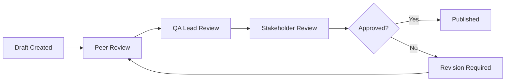
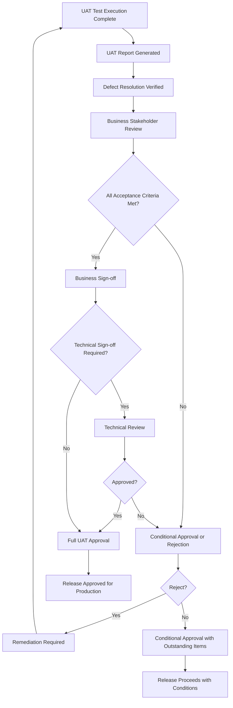
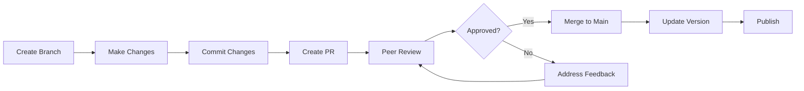
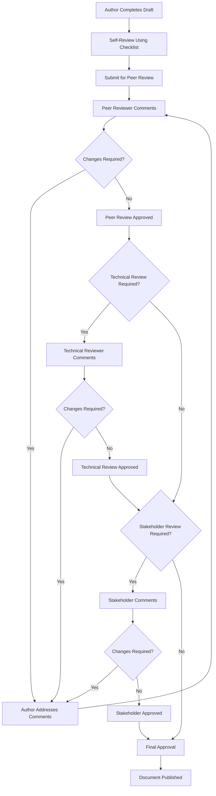

# MAP Test Documentation Standards

| Field | Value |
|-------|-------|
| **Document** | Test Documentation Standards — MAP |
| **Version** | 1.0 |
| **Date** | July 2026 |
| **Status** | Official |
| **Owner** | QA Engineering Lead |
| **Classification** | Internal — Engineering |

---

## Table of Contents

1. [Purpose](#1-purpose)
2. [Scope](#2-scope)
3. [Definitions and Terminology](#3-definitions-and-terminology)
4. [Test Plan Documentation](#4-test-plan-documentation)
5. [Test Case Documentation](#5-test-case-documentation)
6. [Test Script Documentation](#6-test-script-documentation)
7. [Test Report Documentation](#7-test-report-documentation)
8. [Defect Report Documentation](#8-defect-report-documentation)
9. [Release Report Documentation](#9-release-report-documentation)
10. [UAT Sign-off Documentation](#10-uat-sign-off-documentation)
11. [Naming Standards](#11-naming-standards)
12. [Version Control Standards](#12-version-control-standards)
13. [Documentation Review Process](#13-documentation-review-process)
14. [Best Practices](#14-best-practices)
15. [Dependencies](#15-dependencies)
16. [Appendices](#16-appendices)
17. [Revision History](#17-revision-history)
18. [Approval](#18-approval)

---

## 1. Purpose

### 1.1 Purpose Statement

This document establishes the authoritative test documentation standards for the Migration Assurance Platform (MAP). It defines templates, structures, content requirements, naming conventions, version control practices, and review processes for all test-related documentation produced within the MAP programme.

### 1.2 Objectives

| Objective | Description |
|-----------|-------------|
| **Consistency** | Ensure uniform structure, format, and terminology across all test documents |
| **Traceability** | Enable full traceability from requirements through test cases to defects |
| **Auditability** | Support regulatory audit requirements with complete documentation trails |
| **Reusability** | Create templates and standards that reduce documentation effort over time |
| **Quality** | Improve test documentation quality through enforced standards |
| **Efficiency** | Reduce time spent on formatting by providing ready-made templates |

### 1.3 Intended Audience

- QA Engineers and Test Analysts
- Test Automation Engineers
- QA Leads and Test Managers
- Development Engineers contributing to test documentation
- Business Analysts involved in UAT
- Product Owners reviewing test artifacts
- Compliance and Audit personnel

### 1.4 Document Conventions

| Convention | Meaning |
|------------|---------|
| **SHALL** | Mandatory requirement that must be satisfied |
| **SHOULD** | Recommended practice that may be adapted with documented justification |
| **MAY** | Optional practice at the team's discretion |
| `[Placeholder]` | Text in square brackets indicates required content to be filled in |
| `│ │` | Table cell delimiters for template structures |

---

## 2. Scope

### 2.1 In Scope

This document covers documentation standards for the following test artifacts:

| Artifact | Description |
|----------|-------------|
| Test Plans | Master, Release, Sprint, and专项 test plans |
| Test Cases | Manual and automated test case specifications |
| Test Scripts | Automation scripts, data-driven scripts, keyword-driven scripts |
| Test Reports | Execution reports, coverage reports, summary reports |
| Defect Reports | Bug reports, regression reports, defect summaries |
| Release Reports | Release readiness reports, release notes, go/no-go reports |
| UAT Sign-off | Acceptance certificates, sign-off forms, business approval |

### 2.2 Out of Scope

- Infrastructure documentation (covered by Batch 11 Documentation Standards)
- Architecture decision records (covered by Development Standards)
- API specifications and OpenAPI documentation
- User manuals and end-user help documentation
- Training materials and onboarding guides

---

## 3. Definitions and Terminology

| Term | Definition |
|------|------------|
| **Test Plan** | A document describing the scope, approach, resources, and schedule of intended test activities |
| **Test Case** | A set of preconditions, inputs, actions, expected results, and postconditions developed for a particular test objective |
| **Test Script** | A set of instructions for performing a test, often in an automated format |
| **Test Report** | A document summarizing test execution results, metrics, and quality assessment |
| **Defect Report** | A document describing a failure or flaw found during testing |
| **Release Report** | A document summarizing release readiness, changes, and deployment details |
| **UAT Sign-off** | Formal acceptance by stakeholders that the system meets business requirements |
| **Traceability Matrix** | A document showing the relationship between requirements and test artifacts |
| **Test Coverage** | The degree to which test cases cover the specified requirements |
| **Entry Criteria** | Conditions that must be met before testing can begin |
| **Exit Criteria** | Conditions that must be met before testing can be concluded |
| **Test Artifact** | Any document or deliverable produced during the testing process |

### 3.1 Acronyms

| Acronym | Full Form |
|---------|-----------|
| MAP | Migration Assurance Platform |
| QA | Quality Assurance |
| UAT | User Acceptance Testing |
| MTP | Master Test Plan |
| RTP | Release Test Plan |
| STP | Sprint Test Plan |
| TCM | Test Case Management |
| SLA | Service Level Agreement |
| RA | Requirements Traceability Matrix |
| BDD | Behavior-Driven Development |
| TDD | Test-Driven Development |
| E2E | End-to-End |
| SIT | System Integration Testing |

---

## 4. Test Plan Documentation

### 4.1 Test Plan Types

| Type | Scope | Audience | Review Cycle |
|------|-------|----------|-------------|
| Master Test Plan (MTP) | Programme-wide, all releases | Senior Management, QA Leads | Quarterly |
| Release Test Plan (RTP) | Single release batch | Delivery Team, QA Team | Per Release |
| Sprint Test Plan (STP) | Single sprint iteration | Scrum Team | Per Sprint |
| Regression Test Plan | Regression scope and schedule | QA Team, Automation Team | Per Release |
| UAT Test Plan | Business acceptance testing | Business Stakeholders, PO | Per Release |
| Performance Test Plan | Performance and load testing | QA Team, SRE | Per Release |
| Security Test Plan | Security and compliance testing | QA Team, Security Team | Per Release |

### 4.2 Test Plan Template Structure

Every test plan SHALL contain the following sections in the specified order:

```markdown
# [Plan Type] — [Project Name] [Version/Release]

| Field | Value |
|-------|-------|
| Document ID | MAP-QA-[TYPE]-[YYYYMMDD]-[NNN] |
| Version | [Major].[Minor] |
| Date | [YYYY-MM-DD] |
| Status | [Draft / In Review / Approved / Superseded] |
| Author | [Name] |
| Owner | [Name/Role] |

---

## Table of Contents
[Auto-generated or manual TOC]

---

## 1. Introduction
### 1.1 Purpose
### 1.2 Scope
### 1.3 References
### 1.4 Definitions and Abbreviations

## 2. Test Strategy
### 2.1 Testing Levels
### 2.2 Test Types
### 2.3 Test Approach
### 2.4 Tools and Frameworks

## 3. Test Environment
### 3.1 Environment Requirements
### 3.2 Configuration
### 3.3 Access Requirements
### 3.4 Environment Schedule

## 4. Test Data
### 4.1 Data Requirements
### 4.2 Data Management Approach
### 4.3 Data Privacy and Security

## 5. Test Schedule
### 5.1 Milestones
### 5.2 Timeline
### 5.3 Dependencies

## 6. Resource Plan
### 6.1 Roles and Responsibilities
### 6.2 Team Allocation
### 6.3 Training Requirements

## 7. Risk Management
### 7.1 Test Risks
### 7.2 Mitigations
### 7.3 Contingencies

## 8. Entry and Exit Criteria
### 8.1 Entry Criteria
### 8.2 Exit Criteria
### 8.3 Suspension and Resumption Criteria

## 9. Deliverables
### 9.1 Test Deliverables
### 9.2 Reporting Requirements

## 10. Approval
```

### 4.3 Content Requirements

#### 4.3.1 Introduction Section

| Element | Required | Description |
|---------|----------|-------------|
| Purpose | Yes | Clear statement of the plan's purpose and objectives |
| Scope | Yes | In-scope and out-of-scope items with rationale |
| References | Yes | Links to related documents (requirements, architecture, standards) |
| Definitions | Yes | Project-specific terms and acronyms |

#### 4.3.2 Test Strategy Section

| Element | Required | Description |
|---------|----------|-------------|
| Testing Levels | Yes | Unit, Integration, System, UAT with scope boundaries |
| Test Types | Yes | Functional, Performance, Security, Regression, Accessibility |
| Test Approach | Yes | Risk-based, requirements-based, exploratory, automation strategy |
| Tools | Yes | Test management, automation, performance, defect tracking tools |

#### 4.3.3 Test Environment Section

| Element | Required | Description |
|---------|----------|-------------|
| Requirements | Yes | Hardware, software, network, and configuration requirements |
| Configuration | Yes | Environment specifications, connection strings, API endpoints |
| Access | Yes | User accounts, permissions, VPN/access requirements |
| Schedule | Yes | When environments are available and who manages them |

#### 4.3.4 Test Data Section

| Element | Required | Description |
|---------|----------|-------------|
| Requirements | Yes | Types and volumes of test data needed |
| Management | Yes | Data creation, seeding, cleanup, and refresh procedures |
| Privacy | Yes | PII handling, masking, compliance requirements |

#### 4.3.5 Test Schedule Section

| Element | Required | Description |
|---------|----------|-------------|
| Milestones | Yes | Key dates, phase gates, deadlines |
| Timeline | Yes | Gantt chart or timeline representation |
| Dependencies | Yes | External dependencies and blocking factors |

#### 4.3.6 Resource Plan Section

| Element | Required | Description |
|---------|----------|-------------|
| Roles | Yes | Team structure, responsibilities, RACI matrix |
| Allocation | Yes | Percentage allocation per team member per activity |
| Training | Yes | Required training and certification gaps |

#### 4.3.7 Risk Management Section

| Element | Required | Description |
|---------|----------|-------------|
| Risks | Yes | Identified risks with probability and impact |
| Mitigations | Yes | Actions to reduce risk likelihood or impact |
| Contingencies | Yes | Backup plans if risks materialize |

#### 4.3.8 Entry and Exit Criteria Section

| Element | Required | Description |
|---------|----------|-------------|
| Entry Criteria | Yes | Conditions that must be met before testing begins |
| Exit Criteria | Yes | Conditions that must be met before testing concludes |
| Suspension | Yes | Conditions under which testing is paused |
| Resumption | Yes | Conditions under which testing resumes after suspension |

### 4.4 Test Plan Approval Workflow



### 4.5 Test Plan Example

```markdown
# Release Test Plan — MAP v1.4 Batch 12

| Field | Value |
|-------|-------|
| Document ID | MAP-QA-RTP-20260701-001 |
| Version | 1.0 |
| Date | 2026-07-01 |
| Status | Approved |
| Author | QA Lead |
| Owner | QA Engineering Lead |

---

## 1. Introduction

### 1.1 Purpose
This Release Test Plan defines the test strategy, scope, and approach for MAP Batch 12.
Batch 12 delivers the Migration Validation Dashboard, enhanced reconciliation engine,
and batch job orchestration improvements.

### 1.2 Scope
- In Scope: Dashboard UI, Reconciliation API, Batch Job Scheduler, Data Pipeline v2
- Out of Scope: Security module (tested in parallel), Legacy API v1 (deprecated)

### 1.3 References
- [MAP Requirements Document v1.4](../requirements/map-requirements-v1.4.md)
- [MAP Architecture ADR-001 to ADR-015](../adr/)
- [Batch 12 Sprint Backlog](https://dev.azure.com/map/Backlog)

## 2. Test Strategy
### 2.1 Testing Levels
- Unit Tests: Developer-authored, minimum 80% code coverage
- Integration Tests: API and database integration validation
- System Tests: End-to-end workflow validation
- UAT: Business stakeholder acceptance

### 2.2 Test Types
- Functional Testing
- Regression Testing (automated suite of 245 tests)
- Performance Testing (dashboard load times, batch job throughput)
- Accessibility Testing (WCAG 2.1 AA compliance)

### 2.3 Risk-Based Approach
| Risk | Probability | Impact | Mitigation |
|------|-------------|--------|------------|
| Dashboard data accuracy | High | High | Additional reconciliation cross-checks |
| Batch job timeout under load | Medium | High | Performance test with 2x expected volume |
| API breaking changes | Low | Critical | Contract testing with consumers
```

---

## 5. Test Case Documentation

### 5.1 Test Case Classification

| Type | Purpose | Audience | Automation Potential |
|------|---------|----------|---------------------|
| Functional Test Case | Validate specific functionality | QA Engineers | High |
| Regression Test Case | Verify no unintended side effects | QA Engineers | High |
| Integration Test Case | Validate component interactions | QA Engineers | High |
| Performance Test Case | Validate non-functional requirements | Performance Team | High |
| Security Test Case | Validate security controls | Security Team | Medium |
| UAT Test Case | Validate business requirements | Business Testers | Low |
| Exploratory Test Case | Guide exploratory sessions | QA Engineers | N/A |

### 5.2 Test Case Template

```markdown
# Test Case — [Test Case ID]

| Field | Value |
|-------|-------|
| Test Case ID | MAP-TC-[MODULE]-[NNN] |
| Title | [Concise descriptive title] |
| Module | [MAP Module Name] |
| Priority | [Critical / High / Medium / Low] |
| Type | [Functional / Regression / Integration / Performance / Security / UAT] |
| Automation Status | [Automated / Manual / candidates for automation] |
| Pre-conditions | [Conditions that must be true before execution] |
| Created By | [Author Name] |
| Created Date | [YYYY-MM-DD] |
| Last Modified | [YYYY-MM-DD] |
| Requirements | [Requirement ID(s) traced] |
| Estimated Duration | [Minutes] |
| Environment | [Test environment identifier] |

---

## Test Objective
[Clear statement of what this test case validates]

## Preconditions
1. [Precondition 1]
2. [Precondition 2]
3. [Precondition 3]

## Test Data
| Data Element | Value | Notes |
|-------------|-------|-------|
| [Field 1] | [Value] | [Notes] |
| [Field 2] | [Value] | [Notes] |

## Test Steps

| Step | Action | Test Data | Expected Result | Status |
|------|--------|-----------|-----------------|--------|
| 1 | [Action description] | [Specific data] | [Expected outcome] | [Pass/Fail/Blocked] |
| 2 | [Action description] | [Specific data] | [Expected outcome] | [Pass/Fail/Blocked] |
| 3 | [Action description] | [Specific data] | [Expected outcome] | [Pass/Fail/Blocked] |
| 4 | [Action description] | [Specific data] | [Expected outcome] | [Pass/Fail/Blocked] |

## Post-conditions
1. [State after test execution]
2. [Cleanup required]

## Actual Results
[To be filled during execution]

## Pass/Fail Criteria
- **Pass**: All steps produce expected results
- **Fail**: Any step produces unexpected results
- **Blocked**: Preconditions cannot be satisfied

## Notes and Observations
[Additional observations during execution]

## Attachments
- Screenshots: [List]
- Logs: [List]
- Data files: [List]
```

### 5.3 Test Case Content Standards

#### 5.3.1 Title Standards

| Rule | Example |
|------|---------|
| Start with a verb | "Validate tax adjustment calculation" not "Tax adjustment" |
| Be specific | "Validate batch job timeout when processing 10K records" not "Test batch job" |
| Include module reference | "[Reconciliation] Validate source-to-target hash comparison" |
| Avoid ambiguity | "Validate CSV export contains all columns" not "Test export" |

#### 5.3.2 Step Writing Standards

| Standard | Correct Example | Incorrect Example |
|----------|----------------|-------------------|
| One action per step | "Click the Submit button" | "Fill form and click Submit" |
| Use imperative mood | "Enter 1000 in the Amount field" | "The user enters 1000" |
| Be specific with data | "Enter invoice INV-2026-0042" | "Enter an invoice number" |
| Include screen/page reference | "Navigate to Dashboard > Migration Summary" | "Go to the page" |
| Use consistent terminology | "Click Save" not "Press Save" or "Hit Save" |

#### 5.3.3 Expected Result Standards

| Standard | Correct Example | Incorrect Example |
|----------|----------------|-------------------|
| Observable and measurable | "System displays confirmation message: 'Record saved successfully'" | "System works correctly" |
| Include specific values | "Total shows $12,500.00" | "Total is correct" |
| Reference UI elements | "Status column shows 'Completed' in green text" | "Status updates" |
| Include timing | "Results appear within 3 seconds" | "Results appear quickly" |

### 5.4 Traceability Matrix

Every test case SHALL be traceable to at least one requirement:

| Test Case ID | Requirement ID | Module | Priority | Coverage Status |
|-------------|---------------|--------|----------|----------------|
| MAP-TC-VAL-001 | MAP-REQ-VAL-001 | Validation Engine | Critical | Covered |
| MAP-TC-VAL-002 | MAP-REQ-VAL-002 | Validation Engine | High | Covered |
| MAP-TC-BAT-001 | MAP-REQ-BAT-003 | Batch Processing | High | Covered |
| MAP-TC-REC-001 | MAP-REQ-REC-001 | Reconciliation | Critical | Covered |

### 5.5 Test Case Review Checklist

- [ ] Title follows naming conventions
- [ ] Test objective is clear and specific
- [ ] Preconditions are complete and verifiable
- [ ] Test data is defined with specific values
- [ ] Steps are atomic and unambiguous
- [ ] Expected results are observable and measurable
- [ ] Traceability to requirements is established
- [ ] Priority aligns with risk assessment
- [ ] Environment requirements are specified
- [ ] Post-conditions and cleanup are defined

---

## 6. Test Script Documentation

### 6.1 Script Types

| Type | Framework | Language | Use Case |
|------|-----------|----------|----------|
| Unit Test | xUnit / NUnit / MSTest | C# | Developer-authored component tests |
| Integration Test | xUnit + TestContainers | C# | API and database integration |
| E2E Test | Selenium / Playwright | TypeScript | End-to-end user workflows |
| API Test | RestSharp / HttpClient | C# | RESTful API validation |
| Performance Test | k6 / JMeter | JavaScript / Java | Load and stress testing |
| BDD Spec | SpecFlow / Reqnroll | Gherkin | Behavior-driven acceptance tests |

### 6.2 Test Script Template

```markdown
# Test Script — [Script ID]

| Field | Value |
|-------|-------|
| Script ID | MAP-TS-[MODULE]-[NNN] |
| Title | [Descriptive title] |
| Type | [Unit / Integration / E2E / API / Performance / BDD] |
| Framework | [xUnit / Playwright / k6 / etc.] |
| Language | [C# / TypeScript / JavaScript] |
| Automation File | [Path to script file] |
| Test Case IDs | [Linked test case IDs] |
| Environment | [Required environment] |
| Dependencies | [External dependencies] |
| Execution Time | [Estimated execution time] |
| Last Executed | [YYYY-MM-DD] |
| Last Result | [Pass / Fail / Flaky] |

---

## Script Purpose
[What this script validates]

## Setup Requirements
1. [NuGet packages or npm packages required]
2. [Test data setup]
3. [Environment configuration]
4. [Authentication tokens or credentials]

## Script Structure
```
[Module]/
  [SubModule]/
    [Feature]/
      test_file.test.ts
      fixtures/
      helpers/
```

## Data-Driven Parameters
| Parameter | Values | Source |
|-----------|--------|--------|
| [Param1] | [Value1, Value2] | [Data file or inline] |
| [Param2] | [Value1, Value2] | [Data file or inline] |

## Execution Command
```bash
[Command to execute the script]
```

## Results Interpretation
| Result | Meaning | Action |
|--------|---------|--------|
| Pass | All assertions passed | None |
| Fail | One or more assertions failed | Investigate logs |
| Skip | Prerequisites not met | Verify environment |
| Flaky | Intermittent failure | Re-run and investigate |

## Maintenance Notes
[Known issues, workarounds, maintenance tips]
```

### 6.3 Automation Script Standards

#### 6.3.1 File Organization

```
tests/
├── unit/
│   ├── ValidationEngine/
│   │   ├── RuleEvaluatorTests.cs
│   │   └── DataMappingTests.cs
│   └── BatchProcessing/
│       ├── JobSchedulerTests.cs
│       └── ErrorHandlerTests.cs
├── integration/
│   ├── API/
│   │   ├── ValidationApiTests.cs
│   │   └── ReconciliationApiTests.cs
│   └── Database/
│       └── DataLayerTests.cs
├── e2e/
│   ├── playwright/
│   │   ├── dashboard.spec.ts
│   │   └── migration-workflow.spec.ts
│   └── fixtures/
│       ├── auth.fixture.ts
│       └── test-data.json
├── performance/
│   ├── load-test.js
│   └── stress-test.js
└── bdd/
    ├── features/
    │   └── migration-validation.feature
    └── step-definitions/
        └── migration-steps.ts
```

#### 6.3.2 Naming Conventions for Automation Files

| Element | Convention | Example |
|---------|-----------|---------|
| Test class | `[Feature]Tests` | `ValidationEngineTests.cs` |
| Test method | `[Action]_[Scenario]_[ExpectedResult]` | `ValidateMigration_WhenSourceIsNull_ThrowsException` |
| BDD Feature | `kebab-case.feature` | `migration-validation.feature` |
| BDD Scenario | `Scenario: [Title]` | `Scenario: Validate tax calculation for single record` |
| Page Object | `[PageName]Page` | `DashboardPage.ts` |
| Helper/Utility | `[Purpose]Helper` or `[Purpose]Utils` | `TestDataHelper.cs` |

#### 6.3.3 Code Quality Standards for Test Scripts

| Standard | Requirement |
|----------|------------|
| Naming | Descriptive, follows conventions, no abbreviations |
| Isolation | Each test is independent, no shared mutable state |
| Setup/Teardown | Use fixtures for setup and cleanup |
| Assertions | One logical assertion per test; descriptive assertion messages |
| Comments | Document complex test logic; no redundant comments |
| Magic Numbers | Use named constants; no inline magic values |
| Duplication | Extract common patterns into shared helpers |
| Hardcoding | No hardcoded URLs, credentials, or environment-specific values |

### 6.4 BDD Feature File Template

```gherkin
@module:validation @priority:critical @automation:e2e
Feature: Migration Data Validation

  As a migration analyst
  I want the system to validate source data against target schemas
  So that data integrity is maintained during migration

  Background:
    Given the user is authenticated as "migration.analyst@map.com"
    And the following source data exists:
      | record_id | source_system | target_system | data_type |
      | REC-001   | SQL-PROD-01   | SQL-DR-02     | financial |

  @smoke @happy-path
  Scenario Outline: Validate successful data migration
    Given the migration job "<job_type>" is configured
    When the user initiates migration for record "<record_id>"
    Then the migration status should be "Completed"
    And the target record count should equal the source count
    And the validation report should show "0 errors"

    Examples:
      | job_type       | record_id |
      | full_migration | REC-001   |
      | delta_sync     | REC-001   |

  @regression @negative
  Scenario: Validate error handling for invalid source data
    Given the source data contains invalid characters in field "amount"
    When the user initiates migration for record "REC-001"
    Then the migration status should be "Failed"
    And the error message should contain "Invalid character in amount field"
    And the validation report should show "1 error"
```

---

## 7. Test Report Documentation

### 7.1 Report Types

| Report Type | Frequency | Audience | Content Focus |
|-------------|-----------|----------|--------------|
| Daily Execution Report | Daily | QA Team | Today's execution progress |
| Sprint Test Report | Per Sprint | Scrum Team | Sprint test summary |
| Release Test Report | Per Release | Delivery Team, Management | Release readiness assessment |
| Regression Report | Per Regression Run | QA Team, Dev Team | Regression suite results |
| Performance Test Report | Per Performance Test | QA Team, SRE | Performance metrics and analysis |
| Test Coverage Report | Weekly | QA Lead, Management | Coverage metrics and gaps |
| Defect Summary Report | Weekly | Management | Defect trends and analysis |

### 7.2 Test Report Template

```markdown
# [Report Type] — [Project Name] [Version/Release]

| Field | Value |
|-------|-------|
| Document ID | MAP-QA-RPT-[TYPE]-[YYYYMMDD]-[NNN] |
| Version | [Major].[Minor] |
| Date | [YYYY-MM-DD] |
| Status | [Draft / Final] |
| Author | [Name] |
| Period | [Start Date] to [End Date] |

---

## Executive Summary
[2-3 paragraph high-level summary of test execution, key findings,
and overall quality assessment. Include go/no-go recommendation.]

## Scope
### In Scope
- [Component/feature 1]
- [Component/feature 2]

### Out of Scope
- [Component/feature 3]

## Test Execution Summary

### Overall Status
| Metric | Value |
|--------|-------|
| Total Test Cases | [N] |
| Executed | [N] ([%]) |
| Passed | [N] ([%]) |
| Failed | [N] ([%]) |
| Blocked | [N] ([%]) |
| Skipped | [N] ([%]) |
| Not Run | [N] ([%]) |
| Pass Rate | [%] |
| Execution Rate | [%] |

### Execution by Module
| Module | Total | Passed | Failed | Blocked | Pass Rate |
|--------|-------|--------|--------|---------|-----------|
| Validation Engine | [N] | [N] | [N] | [N] | [%] |
| Batch Processing | [N] | [N] | [N] | [N] | [%] |
| Reconciliation | [N] | [N] | [N] | [N] | [%] |
| Dashboard | [N] | [N] | [N] | [N] | [%] |
| API Layer | [N] | [N] | [N] | [N] | [%] |

### Execution by Priority
| Priority | Total | Passed | Failed | Pass Rate |
|----------|-------|--------|--------|-----------|
| Critical | [N] | [N] | [N] | [%] |
| High | [N] | [N] | [N] | [%] |
| Medium | [N] | [N] | [N] | [%] |
| Low | [N] | [N] | [N] | [%] |

### Execution Trend
[Chart or table showing execution progress over time]

## Defect Summary

### New Defects Found
| Severity | Count | Open | Resolved | Closed |
|----------|-------|------|----------|--------|
| P1 - Critical | [N] | [N] | [N] | [N] |
| P2 - High | [N] | [N] | [N] | [N] |
| P3 - Medium | [N] | [N] | [N] | [N] |
| P4 - Low | [N] | [N] | [N] | [N] |
| **Total** | **[N]** | **[N]** | **[N]** | **[N]** |

### Defect Leakage
| Metric | Value |
|--------|-------|
| Defects found in current phase | [N] |
| Defects leaked from previous phase | [N] |
| Defect leakage rate | [%] |

### Top Defect Categories
| Category | Count | Percentage |
|----------|-------|-----------|
| Data Validation | [N] | [%] |
| UI Rendering | [N] | [%] |
| API Response | [N] | [%] |
| Performance | [N] | [%] |

## Test Coverage Analysis

### Requirements Coverage
| Metric | Value |
|--------|-------|
| Total Requirements | [N] |
| Requirements with Test Cases | [N] ([%]) |
| Requirements Fully Tested | [N] ([%]) |
| Requirements Partially Tested | [N] ([%]) |
| Requirements Not Tested | [N] ([%]) |

### Code Coverage
| Module | Line Coverage | Branch Coverage | Method Coverage |
|--------|--------------|----------------|-----------------|
| Validation Engine | [%] | [%] | [%] |
| Batch Processing | [%] | [%] | [%] |
| Reconciliation | [%] | [%] | [%] |

## Risk Assessment

### Identified Risks
| Risk | Impact | Probability | Mitigation Status |
|------|--------|-------------|-------------------|
| [Risk 1] | High | Medium | Mitigated |
| [Risk 2] | Medium | High | In Progress |
| [Risk 3] | High | Low | Accepted |

### Residual Risks
[List any risks that remain after mitigation]

## Automation Metrics

| Metric | Value |
|--------|-------|
| Total Automated Tests | [N] |
| Automation Pass Rate | [%] |
| New Scripts Added | [N] |
| Scripts Maintained | [N] |
| Average Execution Time | [Minutes] |
| Flaky Tests | [N] |

## Key Findings
### Critical Findings
1. [Finding 1]
2. [Finding 2]

### Positive Findings
1. [Finding 1]
2. [Finding 2]

## Recommendations
1. [Recommendation 1]
2. [Recommendation 2]
3. [Recommendation 3]

## Conclusion and Quality Assessment
[Overall quality assessment statement with recommendation]

### Go/No-Go Recommendation
| Criteria | Status | Notes |
|----------|--------|-------|
| All Critical tests passed | [MET/NOT MET] | |
| All High priority tests passed | [MET/NOT MET] | |
| No open P1 defects | [MET/NOT MET] | |
| No more than [N] open P2 defects | [MET/NOT MET] | |
| Test coverage meets threshold | [MET/NOT MET] | |
| Performance benchmarks met | [MET/NOT MET] | |

**Recommendation:** [GO / CONDITIONAL GO / NO-GO]

## Appendices
### Appendix A: Detailed Test Results
### Appendix B: Defect List
### Appendix C: Test Data Summary
```

### 7.3 Report Quality Standards

| Standard | Requirement |
|----------|------------|
| Timeliness | Reports published within 24 hours of test completion |
| Accuracy | All metrics verified before publication |
| Completeness | All sections populated; no TBD placeholders in final reports |
| Consistency | Same format, terminology, and metrics across all reports |
| Visual | Include charts/graphs for trend data where applicable |
| Confidentiality | Mark classification level on every page |

---

## 8. Defect Report Documentation

### 8.1 Defect Report Template

```markdown
# Defect Report — [Defect ID]

| Field | Value |
|-------|-------|
| Defect ID | MAP-BUG-[YYYYMMDD]-[NNN] |
| Title | [Concise descriptive title] |
| Module | [MAP Module Name] |
| Severity | [P1 / P2 / P3 / P4] |
| Priority | [Critical / High / Medium / Low] |
| State | [New / Active / Resolved / Closed / Deferred] |
| Environment | [DEV / SIT / UAT / STAGING / PROD] |
| Found By | [Tester Name] |
| Assigned To | [Developer Name] |
| Created Date | [YYYY-MM-DD HH:MM] |
| Updated Date | [YYYY-MM-DD HH:MM] |
| Build/Version | [Build number or version] |
| Defect Source | [Code / Configuration / Data / Environment / Design] |
| Root Cause | [Category identified after investigation] |
| Related Test Case | [Test Case ID(s)] |
| Related Requirement | [Requirement ID(s)] |

---

## Description
[Clear, concise description of the defect. Include what was observed,
what was expected, and the impact.]

## Steps to Reproduce
1. [Step 1 — specific action]
2. [Step 2 — specific action]
3. [Step 3 — specific action]
4. [Step N — specific action]

## Preconditions
- [Condition 1]
- [Condition 2]

## Expected Result
[What should have happened]

## Actual Result
[What actually happened]

## Test Data Used
| Data Element | Value |
|-------------|-------|
| [Element 1] | [Value] |
| [Element 2] | [Value] |

## Screenshots / Evidence
| Screenshot | Description |
|-----------|-------------|
| [Screenshot 1] | [What it shows] |
| [Screenshot 2] | [What it shows] |

## Log Excerpts
```
[Relevant log output with timestamps]
```

## Environment Details
| Element | Value |
|---------|-------|
| Browser / Client | [Chrome 126 / .NET Client v1.4] |
| OS | [Windows 11 / Azure Linux] |
| API Endpoint | [https://api.map.internal/v2/validate] |
| Database | [Azure SQL MI - map-uat-01] |

## Impact Analysis
### Affected Users/Roles
- [Role 1]
- [Role 2]

### Affected Workflows
- [Workflow 1]
- [Workflow 2]

### Business Impact
[Description of business impact if not resolved]

### Regulatory Impact
[Any regulatory or compliance implications]

## Suggested Fix / Root Cause
[Developer's analysis and suggested fix approach]

## Resolution
| Field | Value |
|-------|-------|
| Resolution Type | [Fixed / Deferred / Won't Fix / Duplicate / Cannot Reproduce] |
| Fix Description | [Description of the fix applied] |
| Files Changed | [List of modified files] |
| Fix Version | [Version where fix is applied] |

## Verification
| Field | Value |
|-------|-------|
| Verified By | [Tester Name] |
| Verified Date | [YYYY-MM-DD] |
| Verified Build | [Build number] |
| Regression Risk | [None / Low / Medium / High] |
| Regression Tests | [Test case IDs for regression verification] |

## Related Defects
| Defect ID | Relationship | Notes |
|-----------|-------------|-------|
| [ID] | [Blocks / Blocked by / Related to] | [Notes] |
```

### 8.2 Defect Report Quality Standards

| Standard | Requirement |
|----------|------------|
| Reproducibility | Steps MUST be reproducible by another tester |
| Specificity | Include specific data, timestamps, and values |
| Evidence | Attach screenshots, logs, and video recordings where applicable |
| Independence | Each defect is a single issue; do not combine multiple defects |
| Impact | Clearly state business and user impact |
| Language | Professional, factual, non-blaming language |

### 8.3 Severity Classification Reference

| Severity | Definition | Response SLA | Resolution SLA |
|----------|-----------|-------------|----------------|
| **P1 - Critical** | System down, data loss, regulatory breach, no workaround | 1 hour | 24 hours |
| **P2 - High** | Major feature unavailable, significant impact, workaround exists | 4 hours | 72 hours |
| **P3 - Medium** | Feature partially working, moderate impact, acceptable workaround | 24 hours | 1 sprint |
| **P4 - Low** | Cosmetic issue, minimal impact, enhancement request | 72 hours | Backlog |

---

## 9. Release Report Documentation

### 9.1 Release Report Template

```markdown
# Release Report — MAP v[Version] Batch [N]

| Field | Value |
|-------|-------|
| Document ID | MAP-QA-REL-[YYYYMMDD]-[NNN] |
| Version | 1.0 |
| Date | [YYYY-MM-DD] |
| Status | [Draft / Final] |
| Author | [QA Lead Name] |
| Release Manager | [Name] |

---

## Release Summary

### Overview
[1-2 paragraph summary of what this release delivers]

### Release Details
| Field | Value |
|-------|-------|
| Release Version | MAP v[Version] |
| Batch Number | [Batch N] |
| Planned Release Date | [YYYY-MM-DD] |
| Actual Release Date | [YYYY-MM-DD] |
| Release Type | [Major / Minor / Patch / Hotfix] |
| Deployment Window | [Start Time - End Time] |
| Downtime Required | [Yes/No — Duration] |
| Rollback Plan Available | [Yes/No] |

## Changes Included

### New Features
| Feature ID | Feature Name | Description | Status |
|-----------|-------------|-------------|--------|
| MAP-FEAT-[NNN] | [Name] | [Description] | [Released / Deferred] |

### Enhancements
| Enhancement ID | Description | Impact Area |
|---------------|-------------|-------------|
| MAP-ENH-[NNN] | [Description] | [Module] |

### Bug Fixes
| Defect ID | Severity | Title | Fix Version |
|-----------|----------|-------|-------------|
| MAP-BUG-[NNN] | [Severity] | [Title] | [Version] |

### Removed Features
| Feature | Reason for Removal | Migration Path |
|---------|-------------------|----------------|
| [Feature] | [Reason] | [Migration path] |

## Quality Summary

### Test Execution
| Metric | Value |
|--------|-------|
| Total Test Cases | [N] |
| Executed | [N] ([%]) |
| Passed | [N] ([%]) |
| Failed | [N] ([%]) |
| Blocked | [N] ([%]) |
| Automated Coverage | [%] |

### Defect Summary
| Metric | Value |
|--------|-------|
| Total Defects Found | [N] |
| Defects Fixed | [N] |
| Defects Deferred | [N] |
| Open P1 Defects | [N] |
| Open P2 Defects | [N] |

### Quality Gates
| Gate | Threshold | Actual | Status |
|------|-----------|--------|--------|
| Critical Tests Passed | 100% | [%] | [MET/NOT MET] |
| High Priority Tests Passed | ≥98% | [%] | [MET/NOT MET] |
| Open P1 Defects | 0 | [N] | [MET/NOT MET] |
| Open P2 Defects | ≤2 | [N] | [MET/NOT MET] |
| Code Coverage | ≥80% | [%] | [MET/NOT MET] |
| Performance (P95 Response) | ≤2s | [Xs] | [MET/NOT MET] |

## Deployment Plan

### Pre-Deployment Checklist
- [ ] Release branch created and locked
- [ ] All tests passing on release candidate
- [ ] Database migration scripts reviewed
- [ ] Configuration changes documented
- [ ] Rollback scripts tested
- [ ] Monitoring and alerting configured
- [ ] Stakeholders notified

### Deployment Steps
| Step | Action | Owner | Duration | Status |
|------|--------|-------|----------|--------|
| 1 | [Action] | [Owner] | [Duration] | [Status] |
| 2 | [Action] | [Owner] | [Duration] | [Status] |
| 3 | [Action] | [Owner] | [Duration] | [Status] |

### Post-Deployment Verification
| Verification | Expected Result | Status |
|-------------|-----------------|--------|
| Smoke tests | All pass | [Status] |
| Health check endpoints | All healthy | [Status] |
| Monitoring dashboards | No alerts | [Status] |

## Known Issues and Limitations
| Issue | Impact | Workaround | Planned Fix Version |
|-------|--------|-----------|-------------------|
| [Issue] | [Impact] | [Workaround] | [Version] |

## Rollback Plan
| Step | Action | Owner | Duration |
|------|--------|-------|----------|
| 1 | [Action] | [Owner] | [Duration] |
| 2 | [Action] | [Owner] | [Duration] |

### Rollback Triggers
- [Condition 1]
- [Condition 2]

## Sign-off
| Role | Name | Signature | Date |
|------|------|-----------|------|
| Release Manager | | | |
| QA Lead | | | |
| Development Lead | | | |
| Product Owner | | | |
| Operations Lead | | | |
```

---

## 10. UAT Sign-off Documentation

### 10.1 UAT Sign-off Template

```markdown
# UAT Sign-off — MAP v[Version] Batch [N]

| Field | Value |
|-------|-------|
| Document ID | MAP-QA-UAT-[YYYYMMDD]-[NNN] |
| Version | 1.0 |
| Date | [YYYY-MM-DD] |
| Status | [Draft / Pending Approval / Approved / Rejected] |
| Prepared By | [QA Lead Name] |

---

## UAT Summary

### Overview
[Summary of UAT scope, duration, and overall outcome]

### UAT Details
| Field | Value |
|-------|-------|
| MAP Version | v[Version] |
| Batch | [Batch N] |
| UAT Start Date | [YYYY-MM-DD] |
| UAT End Date | [YYYY-MM-DD] |
| Total UAT Duration | [N business days] |
| Test Environment | [UAT1 / UAT2] |
| Build Tested | [Build number] |

### UAT Scope
| Module | In Scope | Tested | Status |
|--------|----------|--------|--------|
| Validation Engine | Yes | Yes | [PASS/FAIL] |
| Batch Processing | Yes | Yes | [PASS/FAIL] |
| Reconciliation | Yes | Yes | [PASS/FAIL] |
| Dashboard | Yes | Yes | [PASS/FAIL] |
| API Layer | Yes | Yes | [PASS/FAIL] |

## UAT Execution Results

### Overall Results
| Metric | Value |
|--------|-------|
| Total UAT Test Cases | [N] |
| Executed | [N] ([%]) |
| Passed | [N] ([%]) |
| Failed | [N] ([%]) |
| Blocked | [N] ([%]) |
| Pass Rate | [%] |

### Results by Business Process
| Business Process | Cases | Passed | Failed | Status |
|-----------------|-------|--------|--------|--------|
| Migration Validation | [N] | [N] | [N] | [PASS/FAIL] |
| Data Reconciliation | [N] | [N] | [N] | [PASS/FAIL] |
| Reporting & Analytics | [N] | [N] | [N] | [PASS/FAIL] |
| User Management | [N] | [N] | [N] | [PASS/FAIL] |
| Compliance Checks | [N] | [N] | [N] | [PASS/FAIL] |

### Business Validation Summary
| Requirement | Business Rule | Validated | Status |
|------------|--------------|-----------|--------|
| [REQ-001] | [Rule description] | Yes | [PASS/FAIL] |
| [REQ-002] | [Rule description] | Yes | [PASS/FAIL] |
| [REQ-003] | [Rule description] | Yes | [PASS/FAIL] |

## UAT Defects

### Defects Found During UAT
| Defect ID | Severity | Title | Status | Fixed In |
|-----------|----------|-------|--------|----------|
| MAP-BUG-[NNN] | [Sev] | [Title] | [Status] | [Version] |

### Defect Resolution Summary
| Metric | Value |
|--------|-------|
| Total Defects Found | [N] |
| Defects Fixed | [N] |
| Defects Deferred (with approval) | [N] |
| Defects Rejected | [N] |
| Open Defects | [N] |
| P1 Open | [N] |
| P2 Open | [N] |

## Regulatory Compliance

### Compliance Checklist
| Regulation | Requirement | Validated | Status |
|-----------|------------|-----------|--------|
| SOX | Financial data integrity | Yes | [PASS/FAIL] |
| GDPR | Data protection controls | Yes | [PASS/FAIL] |
| Basel III | Risk reporting accuracy | Yes | [PASS/FAIL] |
| [Regulation] | [Requirement] | [Yes/No] | [PASS/FAIL] |

### Audit Trail
| Test Activity | Date | Performed By | Evidence |
|--------------|------|-------------|----------|
| UAT Planning | [Date] | [Name] | [Document link] |
| Test Execution | [Date-Range] | [Names] | [Test results] |
| Defect Resolution | [Date-Range] | [Names] | [Defect logs] |
| Final Review | [Date] | [Name] | [This document] |

## Acceptance Criteria

### Pre-defined Acceptance Criteria
| Criteria | Threshold | Actual | Met |
|----------|-----------|--------|-----|
| All critical business scenarios pass | 100% | [%] | [Yes/No] |
| No open P1/P2 defects | 0 | [N] | [Yes/No] |
| UAT pass rate | ≥95% | [%] | [Yes/No] |
| Business stakeholder approval | 100% | [%] | [Yes/No] |
| Regulatory requirements validated | 100% | [%] | [Yes/No] |
| Data integrity verified | 100% | [%] | [Yes/No] |

### Outstanding Items
| Item | Owner | Due Date | Status |
|------|-------|----------|--------|
| [Item] | [Owner] | [Date] | [Status] |

## Sign-off

### Business Sign-off
| Role | Name | Decision | Signature | Date |
|------|------|----------|-----------|------|
| Product Owner | | [APPROVED / REJECTED] | | |
| Business Owner | | [APPROVED / REJECTED] | | |
| Compliance Officer | | [APPROVED / REJECTED] | | |
| Business Analyst | | [APPROVED / REJECTED] | | |

### Technical Sign-off
| Role | Name | Decision | Signature | Date |
|------|------|----------|-----------|------|
| QA Lead | | [APPROVED / REJECTED] | | |
| Development Lead | | [APPROVED / REJECTED] | | |
| Release Manager | | [APPROVED / REJECTED] | | |

### Conditions of Approval
[Any conditions that must be met post-approval]

1. [Condition 1]
2. [Condition 2]

## Appendices
### Appendix A: UAT Test Case Results
### Appendix B: UAT Defect Log
### Appendix C: Business Stakeholder Feedback
### Appendix D: Compliance Validation Evidence
```

### 10.2 UAT Approval Workflow



### 10.3 UAT Sign-off Criteria

| Criteria | Minimum Requirement | Approval Authority |
|----------|-------------------|-------------------|
| Critical Tests | 100% pass rate | QA Lead |
| High Priority Tests | ≥98% pass rate | QA Lead |
| Open P1 Defects | Zero | Product Owner |
| Open P2 Defects | Zero or with explicit deferral approval | Product Owner |
| Business Scenarios | All critical scenarios validated | Business Owner |
| Regulatory Requirements | All applicable requirements validated | Compliance Officer |
| Performance | Within defined thresholds | SRE Lead |

---

## 11. Naming Standards

### 11.1 File Naming Conventions

| Document Type | Pattern | Example |
|--------------|---------|---------|
| Test Plan | `MAP-QA-[TYPE]-[VERSION].[ext]` | `MAP-QA-RTP-v1.0.md` |
| Test Case | `MAP-TC-[MODULE]-[NNN].[ext]` | `MAP-TC-VAL-001.md` |
| Test Script | `[Module].[SubModule].[Feature].[framework].[ext]` | `Validation.Engine.RuleEvaluator.xunit.cs` |
| Test Report | `MAP-QA-RPT-[TYPE]-[YYYYMMDD]-[NNN].[ext]` | `MAP-QA-RPT-RELEASE-20260701-001.md` |
| Defect Report | `MAP-BUG-[YYYYMMDD]-[NNN].[ext]` | `MAP-BUG-20260701-001.md` |
| Release Report | `MAP-QA-REL-[YYYYMMDD]-[NNN].[ext]` | `MAP-QA-REL-20260715-001.md` |
| UAT Sign-off | `MAP-QA-UAT-[YYYYMMDD]-[NNN].[ext]` | `MAP-QA-UAT-20260714-001.md` |

### 11.2 Directory Structure

```
docs/
├── testing/
│   ├── plans/
│   │   ├── master-test-plan/
│   │   ├── release-test-plans/
│   │   │   ├── MAP-QA-RTP-Batch12-v1.0.md
│   │   │   └── MAP-QA-RTP-Batch13-v1.0.md
│   │   └── sprint-test-plans/
│   ├── test-cases/
│   │   ├── validation-engine/
│   │   ├── batch-processing/
│   │   ├── reconciliation/
│   │   ├── dashboard/
│   │   └── api-layer/
│   ├── test-scripts/
│   │   ├── unit/
│   │   ├── integration/
│   │   ├── e2e/
│   │   ├── performance/
│   │   └── bdd/
│   ├── reports/
│   │   ├── daily/
│   │   ├── sprint/
│   │   ├── release/
│   │   ├── regression/
│   │   └── performance/
│   ├── defects/
│   │   ├── reports/
│   │   └── summaries/
│   ├── release-reports/
│   └── uat/
│       ├── sign-off/
│       └── evidence/
```

### 11.3 Version Numbering

| Document Type | Format | Example |
|--------------|--------|---------|
| Test Plans | `[Major].[Minor]` | v1.0, v1.1, v2.0 |
| Test Cases | `[Major].[Minor]` | v1.0, v1.1, v2.0 |
| Test Reports | `[Major].[Minor]` or `[Build]` | v1.0 or Build-20260701 |
| Defect Reports | Auto-incrementing ID | MAP-BUG-20260701-001 |

#### Version Bump Rules

| Change Type | Version Bump | Example |
|------------|-------------|---------|
| Initial creation | v0.1 | v0.1 |
| Draft updates | Minor increment | v0.1 → v0.2 |
| First official release | v1.0 | v1.0 |
| Minor corrections after release | Minor increment | v1.0 → v1.1 |
| Major restructuring or scope change | Major increment | v1.0 → v2.0 |

---

## 12. Version Control Standards

### 12.1 Git Practices

| Practice | Standard |
|----------|---------|
| Repository | All test documentation stored in the `fs-migration-validation-engine` repository |
| Branch | Create feature branches for documentation updates |
| Commits | Atomic commits with descriptive messages |
| Pull Requests | All changes require PR review and approval |
| Merge | Squash merge preferred for documentation changes |

### 12.2 Branch Naming for Documentation

| Branch Type | Pattern | Example |
|------------|---------|---------|
| New Document | `docs/add-[document-name]` | `docs/add-release-test-plan-batch12` |
| Document Update | `docs/update-[document-name]` | `docs/update-defect-report-template` |
| Template Creation | `docs/template-[template-name]` | `docs/template-test-case` |
| Standards Update | `docs/standards-[topic]` | `docs/standards-naming-conventions` |

### 12.3 Commit Message Standards

| Format | Example |
|--------|---------|
| `docs: [action] [document name]` | `docs: add release test plan for Batch 12` |
| `docs: update [document name] — [change description]` | `docs: update test case template — add performance section` |
| `docs: fix [document name] — [issue description]` | `docs: fix defect report template — correct severity table` |
| `docs: add [template/artifact] — [description]` | `docs: add UAT sign-off template — regulatory compliance` |

### 12.4 Commit Message Rules

| Rule | Description |
|------|------------|
| Imperative mood | Use "add" not "added" or "adds" |
| Present tense | Use "update" not "updated" |
| No period | Commit messages do not end with a period |
| Subject line | Maximum 72 characters |
| Body | Wrap at 80 characters; explain what and why, not how |
| Reference issues | Include issue ID if applicable (e.g., `Ref: MAP-123`) |

### 12.5 Documentation Change Workflow



---

## 13. Documentation Review Process

### 13.1 Peer Review Standards

| Review Type | When Required | Reviewers | Turnaround |
|------------|--------------|-----------|------------|
| Peer Review | All new documents | At least 1 QA peer | 2 business days |
| Technical Review | Test scripts, automation docs | QA Lead + Dev Lead | 3 business days |
| Stakeholder Review | UAT documents, Release reports | Product Owner, Business Lead | 5 business days |
| Compliance Review | Regulatory-related docs | Compliance Officer | 5 business days |
| Final Approval | All official documents | Document Owner + Approver | 3 business days |

### 13.2 Review Checklist

#### 13.2.1 Content Review

- [ ] Document purpose is clearly stated
- [ ] Scope is well-defined (in-scope and out-of-scope)
- [ ] All sections are complete and populated
- [ ] No TBD or TODO placeholders remain in final versions
- [ ] Content is accurate and up-to-date
- [ ] Technical accuracy verified
- [ ] All references are valid and accessible
- [ ] Terminology is consistent throughout

#### 13.2.2 Formatting Review

- [ ] Follows Markdown standards (GFM)
- [ ] Heading hierarchy is correct (H1 → H2 → H3)
- [ ] Tables are properly formatted
- [ ] Code blocks have language identifiers
- [ ] Links are descriptive and functional
- [ ] Images have alt text
- [ ] Line length within limits (120 characters)
- [ ] Consistent spacing and alignment

#### 13.2.3 Standards Compliance Review

- [ ] Document ID follows naming convention
- [ ] Version numbering follows standards
- [ ] File naming follows conventions
- [ ] Template structure followed
- [ ] Required sections are present
- [ ] Classification marking is present

#### 13.2.4 Traceability Review

- [ ] Requirements traceability established (where applicable)
- [ ] Links to related documents are correct
- [ ] Cross-references are valid
- [ ] Dependencies documented

### 13.3 Review Process Workflow



### 13.4 Approval Authority

| Document Type | Minimum Approver | Additional Approver (if applicable) |
|--------------|-----------------|--------------------------------------|
| Test Plan | QA Lead | Development Lead |
| Test Case | QA Peer Reviewer | QA Lead (for critical test cases) |
| Test Script | QA Lead | Development Lead (for complex scripts) |
| Test Report | QA Lead | Product Owner (for release reports) |
| Defect Report | QA Lead | Development Lead (for P1/P2) |
| Release Report | QA Lead | Release Manager |
| UAT Sign-off | Product Owner | Compliance Officer |

---

## 14. Best Practices

### 14.1 Clarity

| Practice | Description |
|----------|------------|
| Use simple language | Avoid jargon when simpler terms exist |
| Be specific | "Dashboard shows error code E-1042" not "Dashboard shows error" |
| Define acronyms | Spell out acronyms on first use |
| Use consistent terminology | Same term for same concept throughout |
| Avoid ambiguity | Use precise values and measurements |
| Structure logically | Organize from general to specific |

### 14.2 Conciseness

| Practice | Description |
|----------|------------|
| Remove redundancy | State information once, reference elsewhere |
| Use tables | For structured data, tables are more concise than paragraphs |
| Use bullet points | For lists, bullet points are more readable than prose |
| Eliminate filler words | Remove "very", "really", "basically", "actually" |
| Keep sentences short | Target 20 words per sentence maximum |
| Use active voice | "The system validates..." not "Validation is performed..." |

### 14.3 Completeness

| Practice | Description |
|----------|------------|
| Fill all template sections | Every section is populated or marked as N/A |
| Include examples | Illustrate complex concepts with concrete examples |
| Provide context | Explain why, not just what |
| Document assumptions | State all assumptions explicitly |
| Include references | Link to all referenced documents |
| Cover edge cases | Document boundary conditions and exceptions |

### 14.4 Maintainability

| Practice | Description |
|----------|------------|
| Version everything | Every document has a version number |
| Date all changes | Include date in every revision entry |
| Track changes | Revision history captures what changed and why |
| Automate where possible | Generate reports from test management tools |
| Keep templates current | Update templates when standards change |
| Archive old versions | Move superseded versions to archive folder |

### 14.5 Traceability

| Practice | Description |
|----------|------------|
| Link to requirements | Every test case traces to requirements |
| Link to defects | Every defect links to test cases |
| Link to code | Test scripts link to source code files |
| Link to environments | Documents specify required environments |
| Link to data | Documents specify test data dependencies |
| Use unique IDs | Every artifact has a unique, trackable identifier |

---

## 15. Dependencies

### 15.1 Batch 11 Documentation Standards

This document builds upon and references the following standards from Batch 11 Documentation Standards:

| Reference Document | Document ID | Relationship |
|-------------------|------------|-------------|
| MAP MVP Documentation Standards | MAP-DEV-DOC-001 | Parent standard for all MAP documentation |
| Markdown Formatting Rules | (Section 2 of MAP-DEV-DOC-001) | Markdown conventions inherited |
| ADR Format | (Section 5 of MAP-DEV-DOC-001) | Architecture documentation format |
| README Structure | (Section 4 of MAP-DEV-DOC-001) | README format inherited |
| Version Control Standards | (Section 9 of MAP-DEV-DOC-001) | Git practices inherited |
| Release Notes Format | (Section 8 of MAP-DEV-DOC-001) | Release note conventions |

### 15.2 Related MAP Documents

| Document | Document ID | Relationship |
|----------|------------|-------------|
| Quality Assurance Strategy | MAP-QA-QAS-001 | Quality strategy alignment |
| Testing Strategy | MAP-QA-TS-001 | Test strategy alignment |
| Test Planning Framework | MAP-QA-TPF-001 | Test plan template source |
| Unit Testing Standards | MAP-QA-UTS-001 | Unit test documentation requirements |
| Integration Testing Standards | MAP-QA-ITS-001 | Integration test documentation requirements |
| System Testing Framework | MAP-QA-STF-001 | System test documentation requirements |
| UAT Framework | MAP-QA-UAT-001 | UAT documentation and sign-off alignment |
| Test Automation Framework | MAP-QA-TAF-001 | Automation script standards alignment |
| Defect Management Framework | MAP-QA-DM-001 | Defect report template alignment |
| Quality Metrics | MAP-QA-QM-001 | Metrics definitions and reporting alignment |
| Release Readiness | MAP-QA-RR-001 | Release report alignment |

### 15.3 External Standards

| Standard | Version | Relevance |
|----------|---------|-----------|
| IEEE 829 | 1998 | Test documentation standard reference |
| ISTQB Foundation | 4.0 | Test terminology and process alignment |
| ISO/IEC/IEEE 29119 | 2021 | Software testing standards alignment |
| WCAG 2.1 | AA | Accessibility testing documentation |
| SOX Compliance | Current | Financial data testing requirements |

---

## 16. Appendices

### Appendix A: Complete Test Case Example

```markdown
# Test Case — MAP-TC-VAL-012

| Field | Value |
|-------|-------|
| Test Case ID | MAP-TC-VAL-012 |
| Title | Validate tax adjustment calculation for single record with multiple line items |
| Module | Validation Engine |
| Priority | Critical |
| Type | Functional |
| Automation Status | Automated (Playwright) |
| Pre-conditions | 1. User authenticated as migration.analyst@map.com |
| | 2. Source system SQL-PROD-01 connected |
| | 3. Tax rules configuration active |
| Created By | Jane Smith |
| Created Date | 2026-06-15 |
| Last Modified | 2026-06-28 |
| Requirements | MAP-REQ-VAL-003, MAP-REQ-TAX-001 |
| Estimated Duration | 5 minutes |
| Environment | UAT1 |

---

## Test Objective
Validate that the validation engine correctly calculates tax adjustments
for a single migration record containing multiple line items with different
tax rates and exemption categories.

## Preconditions
1. User authenticated with Analyst role
2. Source database contains test record INV-2026-TEST-001 with 3 line items
3. Tax rules configured: Standard (10%), Reduced (5%), Exempt (0%)
4. Target schema supports tax adjustment fields

## Test Data
| Data Element | Value | Notes |
|-------------|-------|-------|
| Record ID | INV-2026-TEST-001 | Test invoice record |
| Line Item 1 | $1000.00 at 10% tax | Standard rate |
| Line Item 2 | $500.00 at 5% tax | Reduced rate |
| Line Item 3 | $250.00 at 0% tax | Exempt |
| Expected Tax Total | $125.00 | Calculated by system |

## Test Steps

| Step | Action | Test Data | Expected Result | Status |
|------|--------|-----------|-----------------|--------|
| 1 | Navigate to Validation Engine dashboard | URL: /validation/dashboard | Dashboard loads within 3 seconds | |
| 2 | Click "New Validation" button | — | Validation form appears | |
| 3 | Enter source system connection | Server: SQL-PROD-01 | Connection established, green indicator | |
| 4 | Enter record identifier | Record ID: INV-2026-TEST-001 | Record found and displayed | |
| 5 | Select "Tax Validation" rule set | Rule set dropdown | Rule set selected | |
| 6 | Click "Run Validation" button | — | Validation progress indicator shown | |
| 7 | Wait for validation completion | — | Status: "Completed" shown | |
| 8 | Review tax adjustment results | — | Tax calculated as $125.00 | |
| 9 | Expand line item details | — | 3 line items displayed with individual tax amounts | |
| 10 | Verify Line Item 1 tax | Amount: $1000.00, Rate: 10% | Tax: $100.00 | |
| 11 | Verify Line Item 2 tax | Amount: $500.00, Rate: 5% | Tax: $25.00 | |
| 12 | Verify Line Item 3 tax | Amount: $250.00, Rate: 0% | Tax: $0.00 | |
| 13 | Verify total tax | Sum of line items | Total: $125.00 | |
| 14 | Export validation report | Click "Export PDF" | PDF downloaded, contains tax details | |

## Post-conditions
1. Validation record created in system
2. No data modified in source database
3. Exported report available in downloads

## Pass/Fail Criteria
- **Pass**: All 14 steps produce expected results, total tax equals $125.00
- **Fail**: Any step produces unexpected results or tax calculation incorrect
- **Blocked**: Cannot connect to source system or validation rules unavailable

## Notes and Observations
- Tax rate configuration must be verified before execution
- Export PDF generation may take up to 10 seconds for complex records
- Test data should be refreshed before each execution cycle

## Attachments
- Screenshots: Validation form, Results view, Export confirmation
- Logs: Validation engine logs at /logs/validation/
- Data files: test-record-INV-2026-TEST-001.json
```

### Appendix B: Test Documentation Checklist

| Phase | Document Required | Template Reference | Responsible |
|-------|------------------|-------------------|-------------|
| Planning | Master Test Plan | Section 4.2 | QA Lead |
| Planning | Release Test Plan | Section 4.2 | QA Lead |
| Planning | Sprint Test Plan | Section 4.2 | QA Engineer |
| Planning | Test Data Plan | Section 4.3.4 | QA Engineer |
| Design | Test Cases | Section 5.2 | QA Engineer |
| Design | Traceability Matrix | Section 5.4 | QA Engineer |
| Design | Test Scripts | Section 6.2 | Automation Engineer |
| Execution | Daily Execution Report | Section 7.2 | QA Engineer |
| Execution | Test Progress Dashboard | Section 7.2 | QA Lead |
| Closure | Release Test Report | Section 7.2 | QA Lead |
| Closure | Defect Summary Report | Section 7.2 | QA Lead |
| Closure | Release Report | Section 9.1 | Release Manager |
| Closure | UAT Sign-off | Section 10.1 | Product Owner |

### Appendix C: Document Classification Guide

| Classification | Description | Access |
|---------------|-------------|--------|
| **Official** | Approved, authoritative version | All team members |
| **Draft** | Work in progress, not for reference | Author and reviewers only |
| **Superseded** | Replaced by newer version | Archive access only |
| **Internal** | For internal team use only | MAP team members |
| **Confidential** | Sensitive content, restricted access | Named individuals only |

### Appendix D: Tool References

| Tool | Purpose | Access |
|------|---------|--------|
| Azure DevOps | Test case management, defect tracking | https://dev.azure.com/map |
| Azure Repos | Version control for documentation | https://dev.azure.com/map/_git |
| SharePoint | Document publishing and storage | SharePoint > MAP > Documentation |
| Mermaid Live | Diagram rendering | https://mermaid.live |
| Visual Studio Code | Document authoring | Local development environment |

---

## 17. Revision History

| Version | Date | Author | Changes | Approved By |
|---------|------|--------|---------|-------------|
| 0.1 | 2026-06-10 | QA Engineering Lead | Initial draft — test plan and test case templates | — |
| 0.2 | 2026-06-15 | QA Engineering Lead | Added test script and test report templates | QA Lead |
| 0.3 | 2026-06-18 | QA Engineering Lead | Added defect report and release report templates | QA Lead |
| 0.4 | 2026-06-22 | QA Engineering Lead | Added UAT sign-off template and naming standards | QA Lead |
| 0.5 | 2026-06-25 | QA Engineering Lead | Added version control standards and review process | Dev Lead |
| 0.6 | 2026-06-28 | QA Engineering Lead | Added best practices and dependencies section | Engineering Manager |
| 0.7 | 2026-06-30 | QA Engineering Lead | Peer review feedback incorporated | QA Lead, Dev Lead |
| 0.8 | 2026-07-01 | QA Engineering Lead | Added appendices and comprehensive examples | Engineering Manager |
| 0.9 | 2026-07-02 | QA Engineering Lead | Final review and corrections | VP Engineering |
| 1.0 | 2026-07-02 | QA Engineering Lead | Official release | VP Engineering |

---

## 18. Approval

| Role | Name | Signature | Date |
|------|------|-----------|------|
| **VP Engineering** | | | |
| **Engineering Manager** | | | |
| **QA Lead** | | | |
| **Development Lead** | | | |
| **Product Owner** | | | |
| **Compliance Officer** | | | |

**Approval Criteria:** All listed approvers must sign this document before test documentation standards are enforced.

---

## Document Information

| Field | Value |
|-------|-------|
| **Document ID** | MAP-QA-TDS-001 |
| **Classification** | Internal — Engineering |
| **Storage Location** | SharePoint > MAP > Documentation > QA > Standards |
| **Review Cycle** | Quarterly (next review: October 2026) |
| **Distribution** | All MAP QA and engineering team members |
| **Confidentiality** | Internal use only |
| **Supersedes** | N/A (first release) |
| **Related Documents** | MAP-DEV-DOC-001 (Batch 11 Documentation Standards) |

---

*End of Document*
