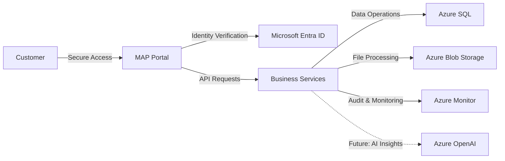

# High-Level Architecture — Migration Assurance Platform

## Overview

MAP follows a clean, service-oriented architecture designed for enterprise security, scalability, and simplicity. The diagram below illustrates the high-level flow from customer interaction to Azure platform services.

## Architecture Diagram

## Flow Description

1. **Customer** accesses MAP through a secure web portal with identity verified via **Microsoft Entra ID**.
2. **MAP Portal** routes requests to the **Business Services** layer, which orchestrates all platform capabilities.
3. **Business Services** interact with Azure data and storage services to process migration validation workflows.
4. All operations are logged and monitored through **Azure Monitor** for observability and compliance.
5. Future **Azure OpenAI** integration (dashed line) will provide AI-powered validation insights within the same secure boundary.

## Design Principles

- **Security by Default**: All traffic is authenticated and encrypted end-to-end.
- **Azure-Native**: Leverages managed Azure services to minimise operational overhead.
- **Compliance-Ready**: Architecture supports UK data residency and financial services regulatory requirements.
- **Modular**: Services are decoupled to enable independent scaling and future capability additions.
