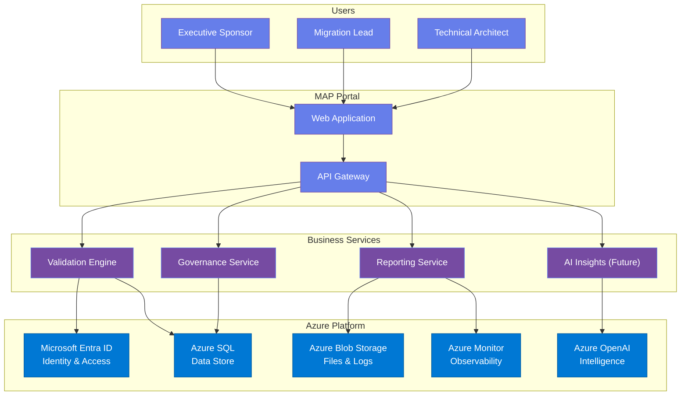

# Diagram 2 — High-Level Azure Architecture

**Architecture Overview:**

MAP is built natively on Microsoft Azure. Users access the MAP Portal through a secure web application, which communicates with business services via an API gateway. The platform leverages core Azure services:

| Layer | Azure Service | Purpose |
|-------|--------------|---------|
| Identity | Microsoft Entra ID | Enterprise SSO and access control |
| Data | Azure SQL | Managed relational data store |
| Storage | Azure Blob Storage | Reports, audit logs, file attachments |
| Observability | Azure Monitor | Platform health and performance |
| Intelligence | Azure OpenAI (Future) | AI-powered migration insights |

All services are Azure-native, managed, and scalable — ensuring enterprise-grade reliability with minimal operational overhead.
