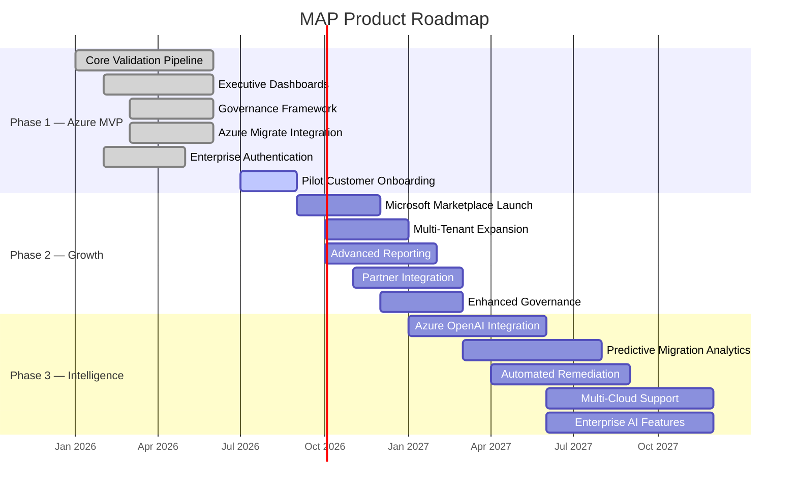

# Diagram 3 — Product Roadmap

**Roadmap Summary:**

| Phase | Timeline | Focus | Key Deliverables |
|-------|----------|-------|-----------------|
| Phase 1 | H1 2026 | Azure MVP | Core validation, dashboards, governance, pilot customers |
| Phase 2 | H2 2026 | Growth | Marketplace launch, multi-tenant, partner integrations |
| Phase 3 | H1 2027 | Intelligence | AI-powered insights, predictive analytics, multi-cloud |

MAP follows a phased approach: validate the market with an Azure-native MVP, scale through the Microsoft ecosystem, then differentiate with AI-powered intelligence.
