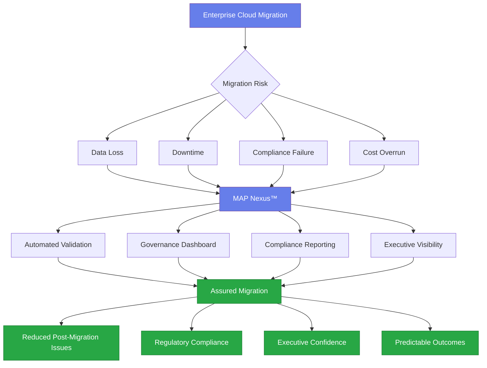

# Diagram 1 — How MAP Delivers Business Outcomes

**Figure 1:** How MAP Nexus™ reduces migration risk and delivers assured business outcomes. Enterprise migrations carry inherent risk — MAP intercepts these risks through automated validation, governance, and compliance reporting, delivering assured migrations with reduced issues, full compliance, and executive confidence.
