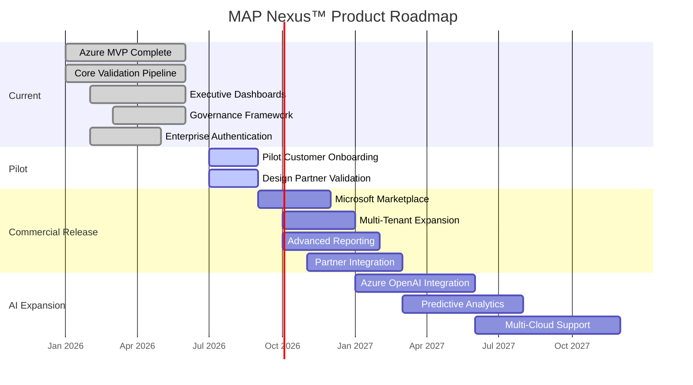

# Diagram 3 — MAP Product Roadmap

**Figure 3:** MAP Nexus™ product roadmap. The platform follows a phased approach — completing the Azure-native MVP (Current), validating with pilot customers (Pilot), scaling through the Microsoft ecosystem (Commercial Release), and differentiating with AI-powered intelligence (AI Expansion).

| Phase | Focus | Key Deliverables |
|-------|-------|-----------------|
| **Current** | Azure MVP | Core validation, dashboards, governance — complete |
| **Pilot** | Customer Validation | Design partners, early enterprise customers |
| **Commercial Release** | Scale | Marketplace launch, multi-tenant, partner integrations |
| **AI Expansion** | Intelligence | Azure OpenAI, predictive analytics, multi-cloud |
