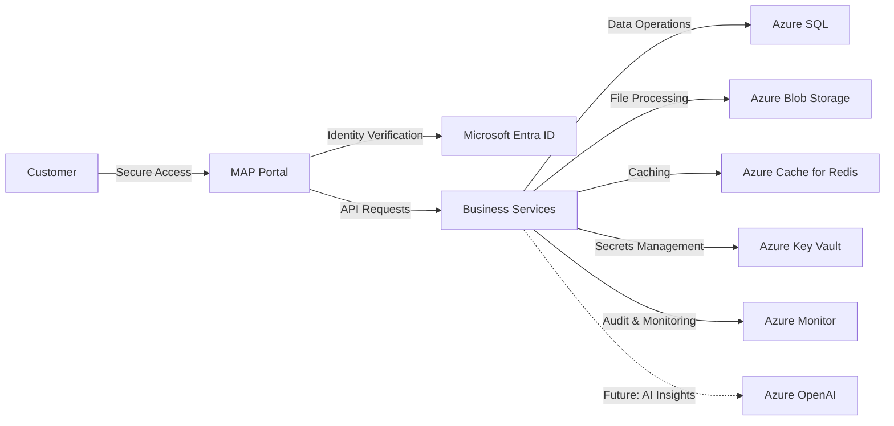

# Supporting — Architecture

**MAP Nexus™ — Migration Assurance Platform**
**Microsoft Founders Hub Submission RC2**

---

## Reference

The MAP Nexus™ Architecture is a high-level Azure-native service diagram.

**Source Location:** `16_Microsoft_Founders_Hub_Application/v1.1/06_High_Level_Architecture.md`

---

## Architecture Overview

---

## Azure Services

| Capability | Azure Service |
|---|---|
| Identity & Access | Microsoft Entra ID |
| Data Platform | Azure SQL |
| File Storage | Azure Blob Storage |
| Application Hosting | Azure Container Apps |
| API Management | Azure API Management |
| Secrets Management | Azure Key Vault |
| Caching | Azure Cache for Redis |
| Observability | Azure Monitor |

---

## Design Principles

- **Security by Default**: All traffic authenticated and encrypted
- **Azure-Native**: Leverages managed Azure services
- **Compliance-Ready**: UK data residency and financial services regulatory requirements
- **Modular**: Services decoupled for independent scaling

---

*Document version: RC2 | Microsoft Founders Hub Submission | mapnexus.com*
