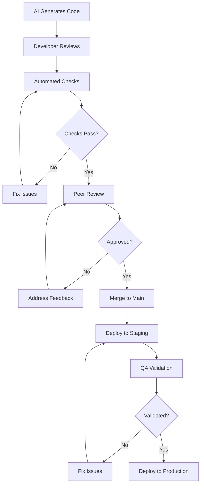

# MAP AI Code Review Standards

| Field | Value |
|-------|-------|
| **Document** | MAP AI Code Review Standards |
| **Version** | 1.0 |
| **Date** | July 2026 |
| **Status** | Official |

---

## 1. Human Review

All AI-generated code must undergo human review before merge. AI is a tool to accelerate development, not replace human judgment.

### Mandatory Review Points

| Review Point | Description | Reviewer Responsibility |
|-------------|-------------|------------------------|
| **Business Logic** | Verify AI-generated logic matches requirements | Feature owner |
| **Edge Cases** | Confirm edge cases are handled appropriately | Senior developer |
| **Security** | Validate security posture of generated code | Security champion |
| **Performance** | Ensure performance meets expectations | Performance owner |
| **Maintainability** | Verify code is readable and maintainable | Team lead |
| **Architecture** | Confirm adherence to architectural patterns | Architect |

### Review Checklist

```markdown
## AI Code Review Checklist

### Functionality
- [ ] Code implements requirements correctly
- [ ] Edge cases are handled
- [ ] Error scenarios are addressed
- [ ] Output format matches specifications

### Security
- [ ] No secrets or hardcoded credentials
- [ ] Input validation is present
- [ ] SQL injection is prevented
- [ ] XSS vulnerabilities are addressed
- [ ] OWASP Top 10 considerations are met

### Performance
- [ ] No N+1 query problems
- [ ] Proper async/await usage
- [ ] Efficient data structures used
- [ ] Memory allocation is reasonable
- [ ] Caching opportunities identified

### Maintainability
- [ ] Code is readable and well-organized
- [ ] Naming conventions are followed
- [ ] Documentation is adequate
- [ ] Complexity is manageable
- [ ] DRY principle is respected

### Testing
- [ ] Unit tests are included
- [ ] Tests cover happy path and edge cases
- [ ] Tests are independent and deterministic
- [ ] Test naming is descriptive

### Architecture
- [ ] Follows Clean Architecture principles
- [ ] Proper separation of concerns
- [ ] Dependency injection is used
- [ ] SOLID principles are followed
```

### Review Process

1. **Developer** — Author reviews AI output for obvious issues
2. **Automated** — CI/CD pipeline runs automated checks
3. **Peer Review** — At least one team member reviews code
4. **Approval** — Reviewer approves with comments
5. **Merge** — Code is merged after approval

### Review Guidelines

| Guideline | Description |
|-----------|-------------|
| **Assume nothing** | Do not assume AI output is correct without verification |
| **Verify logic** | Test the logic mentally or with examples |
| **Check boundaries** | Verify edge cases and boundary conditions |
| **Validate assumptions** | Confirm AI's understanding matches requirements |
| **Document findings** | Record review decisions and rationale |
| **Provide feedback** | Give constructive feedback for prompt improvement |

---

## 2. Automated Review

Automated checks run on every commit and must pass before human review.

### Tool Configuration

| Tool | Purpose | Configuration |
|------|---------|---------------|
| **SonarQube** | Code quality and security | `sonar-project.properties` |
| **ESLint** | JavaScript/TypeScript linting | `.eslintrc.js` |
| **Pylint/Ruff** | Python linting | `pyproject.toml` |
| **StyleCop** | .NET code style | `.editorconfig` |
| **Prettier** | Code formatting | `.prettierrc` |
| **Security Scanner** | Vulnerability detection | Azure DevOps pipeline |

### Automated Checks

```yaml
# Azure DevOps Pipeline
stages:
  - stage: AutomatedReview
    jobs:
      - job: CodeQuality
        steps:
          - task: SonarQubePrepare@5
          - task: DotNetCoreCLI@2
            inputs:
              command: build
          - task: SonarQubeAnalyze@5
          - task: SonarQubePublish@5

      - job: SecurityScan
        steps:
          - task: CredScan@3
          - task: SdtReport@2
          - task: PublishSecurityAnalysisLogs@3

      - job: Linting
        steps:
          - script: npm run lint
          - script: npm run typecheck
          - script: dotnet format --verify-no-changes
```

### Quality Gates

| Metric | Threshold | Action on Failure |
|--------|-----------|-------------------|
| **Code Coverage** | ≥80% | Block merge |
| **Duplicated Lines** | ≤3% | Warning, block if >5% |
| **Maintainability Rating** | ≥A | Block merge |
| **Reliability Rating** | ≥A | Block merge |
| **Security Rating** | ≥A | Block merge |
| **Security Hotspots** | 0 | Block merge |

---

## 3. Security Review

All AI-generated code must be reviewed for security vulnerabilities.

### OWASP Top 10 Checklist

| Vulnerability | Check | Status |
|--------------|-------|--------|
| **A01: Broken Access Control** | Verify authorization checks | [ ] |
| **A02: Cryptographic Failures** | Verify proper encryption | [ ] |
| **A03: Injection** | Verify parameterized queries | [ ] |
| **A04: Insecure Design** | Verify threat modeling | [ ] |
| **A05: Security Misconfiguration** | Verify secure defaults | [ ] |
| **A06: Vulnerable Components** | Verify dependency versions | [ ] |
| **A07: Auth Failures** | Verify authentication logic | [ ] |
| **A08: Data Integrity Failures** | Verify input validation | [ ] |
| **A09: Logging Failures** | Verify security logging | [ ] |
| **A10: SSRF** | Verify URL validation | [ ] |

### Security Checks

| Check | Description | Tool |
|-------|-------------|------|
| **Secrets Detection** | No hardcoded secrets | GitLeaks, CredScan |
| **SQL Injection** | Parameterized queries only | SonarQube |
| **XSS Prevention** | Proper output encoding | ESLint-plugin-security |
| **CSRF Protection** | Anti-forgery tokens | Manual review |
| **Input Validation** | Validate all inputs | Manual review |
| **Dependency Scanning** | No known vulnerabilities | Dependabot, Snyk |
| **Container Scanning** | Secure base images | Trivy, Snyk |

### Security Review Process

1. **Static Analysis** — Run security scanners
2. **Manual Review** — Security champion reviews high-risk code
3. **Penetration Testing** — Test for vulnerabilities
4. **Documentation** — Record security decisions
5. **Approval** — Security champion approves

### Security Anti-Patterns

| Anti-Pattern | Risk | Fix |
|-------------|------|-----|
| Hardcoded secrets | Secret exposure | Use Azure Key Vault |
| String concatenation SQL | SQL injection | Use parameterized queries |
| Unvalidated input | Injection attacks | Validate all inputs |
| Disabled CSRF | Cross-site request forgery | Enable anti-forgery tokens |
| Verbose errors | Information disclosure | Generic error messages |

---

## 4. Performance Review

AI-generated code must be reviewed for performance issues.

### Performance Checklist

| Check | Description | Threshold |
|-------|-------------|-----------|
| **N+1 Queries** | No N+1 query problems | 0 N+1 queries |
| **Async Operations** | Proper async/await usage | All I/O async |
| **Memory Allocation** | Efficient memory usage | No unnecessary allocations |
| **Caching** | Appropriate caching | Cache expensive operations |
| **Database Indexes** | Proper indexing | All queries indexed |
| **Connection Pooling** | Proper connection management | Use connection pooling |
| **Lazy Loading** | Load data on demand | Lazy load collections |
| **Batch Operations** | Batch bulk operations | Batch inserts/updates |

### Performance Anti-Patterns

| Anti-Pattern | Impact | Fix |
|-------------|--------|-----|
| **N+1 Queries** | Database overload | Use eager loading or batching |
| **Synchronous I/O** | Thread blocking | Use async/await |
| **Large Object Allocation** | Memory pressure | Use pooling or streaming |
| **Unbounded Queries** | Memory exhaustion | Use pagination |
| **Missing Indexes** | Slow queries | Add proper indexes |
| **Excessive Logging** | I/O overhead | Use async logging |
| **Tight Coupling** | Performance bottlenecks | Use dependency injection |

### Performance Testing

| Test Type | Tool | Purpose |
|-----------|------|---------|
| **Load Testing** | k6 | Verify under expected load |
| **Stress Testing** | k6 | Find breaking points |
| **Endurance Testing** | k6 | Verify over time |
| **Spike Testing** | k6 | Verify under sudden load |

---

## 5. Architecture Review

AI-generated code must comply with architectural patterns and principles.

### Architecture Checklist

| Check | Description | Standard |
|-------|-------------|----------|
| **Clean Architecture** | Proper layer separation | Domain, Application, Infrastructure, Presentation |
| **SOLID Principles** | Follow SOLID | Single Responsibility, Open/Closed, etc. |
| **DRY** | No code duplication | Extract common logic |
| **Separation of Concerns** | Clear responsibilities | One class, one purpose |
| **Dependency Inversion** | Depend on abstractions | Interface-based design |
| **Law of Demeter** | Minimal knowledge | Talk only to friends |
| **Composition Over Inheritance** | Prefer composition | Use interfaces and composition |

### Pattern Compliance

| Pattern | Description | Verification |
|---------|-------------|-------------|
| **Repository** | Data access abstraction | Verify interface usage |
| **Unit of Work** | Transaction management | Verify scope usage |
| **CQRS** | Command/Query separation | Verify query isolation |
| **Mediator** | Request handling | Verify mediator usage |
| **Decorator** | Cross-cutting concerns | Verify decorator pattern |
| **Strategy** | Algorithm encapsulation | Verify strategy pattern |

### Architecture Review Process

1. **Pattern Verification** — Verify correct pattern usage
2. **Dependency Analysis** — Verify dependency direction
3. **Coupling Analysis** — Check for tight coupling
4. **Cohesion Analysis** — Check for high cohesion
5. **Documentation** — Record architecture decisions

---

## 6. Maintainability Review

AI-generated code must be maintainable and readable.

### Maintainability Checklist

| Check | Description | Threshold |
|-------|-------------|-----------|
| **Cyclomatic Complexity** | Complexity per method | ≤10 per method |
| **Code Duplication** | Duplicated code blocks | ≤3% |
| **Method Length** | Lines per method | ≤50 lines |
| **Class Length** | Lines per class | ≤500 lines |
| **Nesting Depth** | Maximum nesting level | ≤4 levels |
| **Parameter Count** | Parameters per method | ≤5 parameters |
| **Naming Conventions** | Descriptive naming | Clear, consistent names |

### Code Smells

| Smell | Description | Fix |
|-------|-------------|-----|
| **Long Method** | Method too long | Extract method |
| **Large Class** | Class too large | Extract class |
| **Long Parameter List** | Too many parameters | Use parameter object |
| **Divergent Change** | Multiple reasons to change | Single Responsibility |
| **Shotgun Surgery** | Multiple places to change | Move logic to one place |
| **Feature Envy** | Method uses other class data | Move method |
| **Data Clumps** | Related data together | Extract class |

### Documentation Requirements

| Documentation | Requirement |
|--------------|-------------|
| **XML Comments** | All public members |
| **README** | Project and module READMEs |
| **API Documentation** | OpenAPI specs |
| **Architecture Decision Records** | Key decisions |
| **Inline Comments** | Complex logic only |
| **Changelog** | All changes documented |

---

## 7. Approval Workflow

### Workflow Steps



### Approval Requirements

| Stage | Approver | Criteria |
|-------|----------|----------|
| **Automated** | CI/CD pipeline | All checks pass |
| **Peer Review** | Team member | Code quality, functionality |
| **Security Review** | Security champion | No vulnerabilities |
| **Architecture Review** | Architect | Pattern compliance |
| **Final Approval** | Tech lead | Overall quality |

### Merge Criteria

| Criterion | Requirement | Evidence |
|-----------|-------------|----------|
| **Automated Checks** | All pass | Pipeline status |
| **Code Coverage** | ≥80% | Coverage report |
| **Security Scan** | No vulnerabilities | Scan report |
| **Peer Review** | Approved | PR approval |
| **Tests Passing** | All tests pass | Test results |
| **Documentation** | Updated | PR description |

### Rejection Criteria

| Criterion | Action |
|-----------|--------|
| **Security Vulnerability** | Reject immediately |
| **Architecture Violation** | Reject with explanation |
| **Insufficient Tests** | Request additional tests |
| **Poor Documentation** | Request documentation |
| **Performance Issues** | Reject with performance requirements |
| **Code Smells** | Request refactoring |
