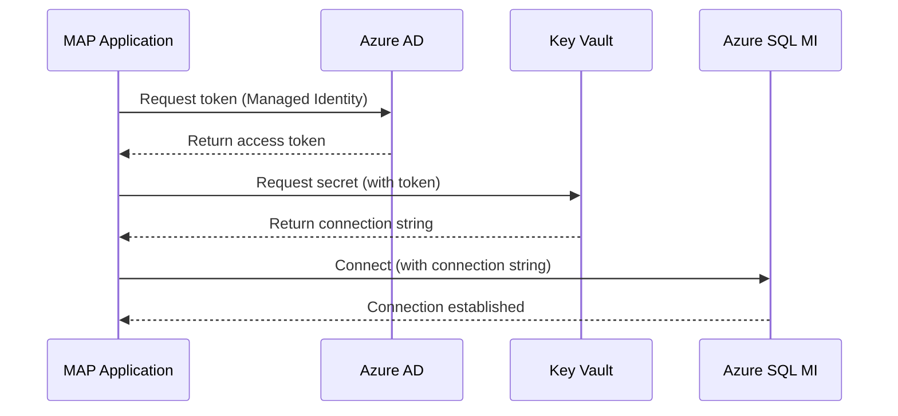

# MAP AI Security Standards

| Field | Value |
|-------|-------|
| **Document** | MAP AI Security Standards |
| **Version** | 1.0 |
| **Date** | July 2026 |
| **Status** | Official |

---

## 1. Data Privacy

All AI interactions must protect personally identifiable information (PII) and sensitive data.

### Data Handling Rules

| Data Type | Allowed in Prompts | Handling |
|-----------|-------------------|----------|
| **PII** | ❌ Never | Anonymize before prompting |
| **Credentials** | ❌ Never | Use Azure Key Vault |
| **Financial Data** | ❌ Never | Use synthetic data |
| **Business Logic** | ⚠️ Limited | Use generic examples |
| **Architecture** | ✅ Yes | Use generic patterns |
| **Public API** | ✅ Yes | Use official documentation |

### Anonymization Guidelines

```text
❌ DO NOT include in prompts:
- Customer names, emails, phone numbers
- Social Security numbers, credit card numbers
- Account numbers, routing numbers
- Internal IP addresses, hostnames
- Database connection strings
- API keys, tokens, secrets

✅ DO include in prompts:
- Generic field names (e.g., "userId", "emailAddress")
- Schema structures without data
- Architecture patterns
- Code examples with synthetic data
- Public documentation references
```

### Enterprise AI Tools

| Requirement | Standard |
|-------------|----------|
| **Tool Selection** | Use enterprise-tier AI tools with data protection |
| **Data Retention** | Verify AI tool data retention policies |
| **Opt-Out** | Opt out of model training on your data |
| **Encryption** | Ensure data is encrypted in transit and at rest |
| **Audit Logs** | Enable audit logging for all AI interactions |
| **Compliance** | Verify AI tool compliance certifications |

### Data Classification

| Classification | Description | AI Usage |
|---------------|-------------|----------|
| **Public** | Publicly available information | ✅ Allowed |
| **Internal** | Internal company information | ⚠️ Limited |
| **Confidential** | Sensitive business information | ❌ Restricted |
| **Restricted** | Highly sensitive data | ❌ Prohibited |

---

## 2. Prompt Privacy

Prompts must not contain secrets, credentials, or sensitive information.

### Prompt Review Checklist

| Check | Description |
|-------|-------------|
| **No Secrets** | Verify no API keys, tokens, or passwords |
| **No PII** | Verify no personal information |
| **No Credentials** | Verify no database connection strings |
| **No Internal URLs** | Verify no internal hostnames or IPs |
| **No Business Secrets** | Verify no proprietary algorithms or logic |
| **No Financial Data** | Verify no account numbers or financial info |

### Prompt Sanitization

```python
import re
from typing import Optional

class PromptSanitizer:
    """Sanitize prompts before sending to AI."""

    PATTERNS = {
        'email': r'[a-zA-Z0-9._%+-]+@[a-zA-Z0-9.-]+\.[a-zA-Z]{2,}',
        'phone': r'\b\d{3}[-.]?\d{3}[-.]?\d{4}\b',
        'ssn': r'\b\d{3}-\d{2}-\d{4}\b',
        'credit_card': r'\b\d{4}[-\s]?\d{4}[-\s]?\d{4}[-\s]?\d{4}\b',
        'ip_address': r'\b\d{1,3}\.\d{1,3}\.\d{1,3}\.\d{1,3}\b',
        'api_key': r'(?i)(api[_-]?key|apikey)\s*[=:]\s*["\']?[^\s"\']+',
        'secret': r'(?i)(secret|password|token)\s*[=:]\s*["\']?[^\s"\']+',
    }

    def sanitize(self, prompt: str) -> Optional[str]:
        """Remove sensitive data from prompt."""
        sanitized = prompt

        for name, pattern in self.PATTERNS.items():
            sanitized = re.sub(pattern, f'[REDACTED_{name.upper()}]', sanitized)

        if sanitized != prompt:
            logger.warning(f"Prompt sanitized: removed {name} patterns")

        return sanitized

    def validate(self, prompt: str) -> tuple[bool, list[str]]:
        """Validate prompt for sensitive data."""
        issues = []

        for name, pattern in self.PATTERNS.items():
            if re.search(pattern, prompt):
                issues.append(f"Contains {name}")

        return len(issues) == 0, issues
```

### Prompt Logging

| Log Field | Description |
|-----------|-------------|
| **Timestamp** | When the prompt was created |
| **User** | Who created the prompt |
| **Category** | Type of prompt (code-gen, review, etc.) |
| **Sanitized** | Whether the prompt was sanitized |
| **Issues Found** | Any sensitive data detected |
| **Action Taken** | What was done about issues |

---

## 3. Source Code Protection

Source code must be protected when using AI tools.

### Protection Guidelines

| Guideline | Description |
|-----------|-------------|
| **Enterprise Tools** | Use enterprise AI tools with code protection |
| **Data Retention** | Review AI tool data retention policies |
| **Opt-Out** | Opt out of model training on code |
| **Private Repos** | Use private repositories for AI-assisted code |
| **Access Control** | Restrict AI tool access to authorized users |
| **Audit Logging** | Log all AI interactions with code |

### AI Tool Evaluation

| Criteria | Requirement |
|----------|-------------|
| **SOC 2 Compliance** | Must have SOC 2 Type II certification |
| **Data Residency** | Must support data residency requirements |
| **Encryption** | Must encrypt data in transit and at rest |
| **Retention Policy** | Must have clear data retention policy |
| **Opt-Out** | Must allow opting out of model training |
| **Audit Logs** | Must provide audit logging |
| **Access Control** | Must support SSO and RBAC |

### Code Sharing Guidelines

| Scenario | Allowed | Requirements |
|----------|---------|--------------|
| **Public Code** | ✅ Yes | No restrictions |
| **Internal Code** | ⚠️ Limited | Use enterprise AI tools |
| **Confidential Code** | ❌ No | Do not share with AI |
| **Customer Code** | ❌ No | Do not share with AI |
| **Third-Party Code** | ⚠️ Limited | Check license compatibility |

---

## 4. Intellectual Property

AI tool usage must respect intellectual property rights.

### AI Tool Terms of Service

| Check | Description |
|-------|-------------|
| **Ownership** | Verify ownership of AI-generated code |
| **Licensing** | Understand licensing implications |
| **Commercial Use** | Verify commercial use is allowed |
| **Attribution** | Determine if attribution is required |
| **Liability** | Understand liability for AI-generated code |

### AI Contribution Documentation

```markdown
# AI Contribution Record

## Date
2026-07-15

## AI Tool Used
GitHub Copilot

## Prompt/Context
Generated repository pattern for migration validation.

## Human Reviewer
@developer1

## Changes Made
- Created MigrationRepository class
- Added CRUD operations
- Implemented pagination

## Review Status
- [x] Code reviewed
- [x] Tests written
- [x] Documentation updated
- [x] License compatible

## License Compliance
- Generated code: MIT License
- Dependencies: MIT License
- No license conflicts detected
```

### IP Protection Guidelines

| Guideline | Description |
|-----------|-------------|
| **Attribution** | Document AI contributions in code comments |
| **License Check** | Verify AI-generated code license compatibility |
| **Originality** | Ensure AI output is sufficiently original |
| **Third-Party** | Check for third-party code in AI output |
| **Documentation** | Maintain records of AI-assisted development |

---

## 5. Secrets Management

Secrets must never be included in prompts or source code.

### Secret Types

| Secret Type | Storage | Usage |
|-------------|---------|-------|
| **API Keys** | Azure Key Vault | Managed identity or SDK |
| **Connection Strings** | Azure Key Vault | Managed identity or SDK |
| **Passwords** | Azure Key Vault | Managed identity or SDK |
| **Certificates** | Azure Key Vault | Managed identity or SDK |
| **Encryption Keys** | Azure Key Vault | Managed identity or SDK |

### Azure Key Vault Integration

```csharp
// AI-Generated Key Vault Integration
using Azure.Identity;
using Azure.Security.KeyVault.Secrets;

public class SecretManager
{
    private readonly SecretClient _client;

    public SecretManager(string vaultUri)
    {
        _client = new SecretClient(
            new Uri(vaultUri),
            new DefaultAzureCredential());
    }

    public async Task<string> GetSecretAsync(string secretName)
    {
        var secret = await _client.GetSecretAsync(secretName);
        return secret.Value.Value;
    }
}
```

### Secret Handling Rules

| Rule | Description |
|------|-------------|
| **Never in Prompts** | Never include secrets in AI prompts |
| **Never in Code** | Never hardcode secrets in source code |
| **Never in Logs** | Never log secrets or sensitive data |
| **Never in Comments** | Never include secrets in code comments |
| **Never in Commits** | Never commit secrets to version control |
| **Always in Key Vault** | Store all secrets in Azure Key Vault |

### Pre-Commit Hooks

```bash
#!/bin/bash
# pre-commit hook to detect secrets

# Check for potential secrets
if grep -r -E "(password|secret|apikey|token)\s*=\s*['\"]" --include="*.cs" --include="*.py" --include="*.js" --include="*.ts" .; then
    echo "ERROR: Potential secrets detected in code!"
    echo "Please remove secrets before committing."
    exit 1
fi

# Check for connection strings
if grep -r -E "Server=.*Database=.*" --include="*.cs" --include="*.json" --include="*.config" .; then
    echo "ERROR: Potential connection strings detected!"
    echo "Please use Azure Key Vault instead."
    exit 1
fi
```

---

## 6. Credential Handling

Credentials must be managed securely using Azure best practices.

### Credential Types

| Credential Type | Management | Usage |
|----------------|------------|-------|
| **Managed Identity** | Azure AD | Preferred for Azure resources |
| **Service Principal** | Azure AD | For service-to-service auth |
| **Client Credentials** | Azure AD | For confidential client apps |
| **User Credentials** | Azure AD | For user interactive auth |

### Managed Identity Configuration

```csharp
// AI-Generated Managed Identity Configuration
using Azure.Identity;
using Microsoft.EntityFrameworkCore;

public static class ServiceCollectionExtensions
{
    public static IServiceCollection AddMapServices(
        this IServiceCollection services,
        IConfiguration configuration)
    {
        // Use Managed Identity for SQL connection
        var connectionString = configuration.GetConnectionString("DefaultConnection");
        
        services.AddDbContext<MigrationContext>(options =>
            options.UseSqlServer(connectionString, sqlOptions =>
            {
                sqlOptions.EnableRetryOnFailure(
                    maxRetryCount: 3,
                    maxRetryDelay: TimeSpan.FromSeconds(30),
                    errorNumbersToAdd: null);
            }));

        // Use DefaultAzureCredential for Azure services
        services.AddSingleton<TokenCredential>(new DefaultAzureCredential());

        return services;
    }
}
```

### Credential Management Rules

| Rule | Description |
|------|-------------|
| **Prefer Managed Identity** | Use Managed Identity for Azure resources |
| **No Hardcoded Credentials** | Never hardcode credentials in source code |
| **Use Azure Key Vault** | Store credentials in Azure Key Vault |
| **Rotate Regularly** | Rotate credentials regularly |
| **Least Privilege** | Grant minimum required permissions |
| **Audit Access** | Log all credential usage |

### Authentication Flow



---

## 7. Sensitive Information

Sensitive information must be classified and protected.

### Data Classification Matrix

| Classification | Examples | AI Usage | Protection |
|---------------|----------|----------|------------|
| **Public** | Public docs, open source | ✅ Allowed | None |
| **Internal** | Internal docs, code | ⚠️ Limited | Access control |
| **Confidential** | Customer data, financials | ❌ Restricted | Encryption |
| **Restricted** | PII, PHI, credentials | ❌ Prohibited | Full protection |

### Sensitive Data Detection

```python
import re
from dataclasses import dataclass
from typing import List

@dataclass
class SensitiveDataIssue:
    """Sensitive data detection result."""
    data_type: str
    location: str
    severity: str
    recommendation: str

class SensitiveDataDetector:
    """Detect sensitive data in prompts and code."""

    PATTERNS = {
        'pii': {
            'ssn': r'\b\d{3}-\d{2}-\d{4}\b',
            'email': r'[a-zA-Z0-9._%+-]+@[a-zA-Z0-9.-]+\.[a-zA-Z]{2,}',
            'phone': r'\b\d{3}[-.]?\d{3}[-.]?\d{4}\b',
        },
        'financial': {
            'credit_card': r'\b\d{4}[-\s]?\d{4}[-\s]?\d{4}[-\s]?\d{4}\b',
            'account': r'\b\d{10,12}\b',
        },
        'credentials': {
            'api_key': r'(?i)(api[_-]?key|apikey)\s*[=:]\s*["\']?[^\s"\']+',
            'password': r'(?i)(password|pwd)\s*[=:]\s*["\']?[^\s"\']+',
            'token': r'(?i)(token|secret)\s*[=:]\s*["\']?[^\s"\']+',
        },
        'infrastructure': {
            'ip_address': r'\b\d{1,3}\.\d{1,3}\.\d{1,3}\.\d{1,3}\b',
            'connection_string': r'(?i)(server|database|data source)\s*=',
        }
    }

    def detect(self, text: str) -> List[SensitiveDataIssue]:
        """Detect sensitive data in text."""
        issues = []

        for category, patterns in self.PATTERNS.items():
            for name, pattern in patterns.items():
                matches = re.finditer(pattern, text)
                for match in matches:
                    issues.append(SensitiveDataIssue(
                        data_type=f"{category}.{name}",
                        location=f"Position {match.start()}",
                        severity=self._get_severity(category),
                        recommendation=self._get_recommendation(category)
                    ))

        return issues

    def _get_severity(self, category: str) -> str:
        """Get severity level for data category."""
        severity_map = {
            'credentials': 'critical',
            'pii': 'high',
            'financial': 'high',
            'infrastructure': 'medium'
        }
        return severity_map.get(category, 'low')

    def _get_recommendation(self, category: str) -> str:
        """Get recommendation for data category."""
        recommendations = {
            'credentials': 'Remove immediately and rotate credentials',
            'pii': 'Anonymize or remove personal data',
            'financial': 'Anonymize or remove financial data',
            'infrastructure': 'Remove internal infrastructure details'
        }
        return recommendations.get(category, 'Review and remove if sensitive')
```

### Usage Auditing

| Audit Event | Description | Retention |
|------------|-------------|-----------|
| **AI Request** | Prompt sent to AI | 90 days |
| **Data Detection** | Sensitive data detected | 1 year |
| **Policy Violation** | Security policy violated | 1 year |
| **Access Attempt** | Unauthorized access attempt | 1 year |
| **Credential Usage** | Credential accessed | 90 days |

---

## 8. Compliance

MAP must comply with relevant regulations and standards.

### Compliance Requirements

| Regulation | Requirements | MAP Implementation |
|-----------|--------------|-------------------|
| **GDPR** | Data protection, right to erasure | Data anonymization, retention policies |
| **SOC 2** | Security controls, audit trails | Access controls, logging |
| **PCI DSS** | Cardholder data protection | Encryption, access controls |
| **HIPAA** | Health data protection | Anonymization, access controls |
| **ISO 27001** | Information security management | Security policies, controls |

### GDPR Compliance

| Requirement | Implementation |
|------------|----------------|
| **Data Minimization** | Collect only necessary data |
| **Purpose Limitation** | Use data only for stated purpose |
| **Storage Limitation** | Implement data retention policies |
| **Data Protection** | Encrypt data at rest and in transit |
| **Right to Erasure** | Implement data deletion capabilities |
| **Data Portability** | Support data export in standard formats |
| **Consent Management** | Implement consent tracking |

### SOC 2 Compliance

| Criteria | Implementation |
|----------|----------------|
| **Security** | Access controls, encryption, monitoring |
| **Availability** | Redundancy, failover, disaster recovery |
| **Processing Integrity** | Validation, error handling |
| **Confidentiality** | Data classification, access controls |
| **Privacy** | Privacy policies, consent management |

### Audit Trail Requirements

| Event | Data Captured | Retention |
|-------|--------------|-----------|
| **AI Interactions** | Prompt, user, timestamp | 90 days |
| **Data Access** | User, resource, action | 1 year |
| **Configuration Changes** | User, change, timestamp | 1 year |
| **Security Events** | Event, user, timestamp | 1 year |
| **Compliance Events** | Event, user, timestamp | 2 years |

### Compliance Monitoring

```yaml
# Compliance Monitoring Configuration
compliance:
  gdpr:
    data_retention_days: 365
    anonymization_enabled: true
    consent_tracking: true

  soc2:
    access_logging: true
    change_logging: true
    security_monitoring: true

  audit:
    ai_interactions: true
    data_access: true
    configuration_changes: true
    retention_days: 365

  reporting:
    compliance_report_frequency: monthly
    security_report_frequency: weekly
    audit_report_frequency: quarterly
```

### Compliance Reporting

| Report | Frequency | Audience |
|--------|-----------|----------|
| **Compliance Status** | Monthly | Management |
| **Security Metrics** | Weekly | Security Team |
| **Audit Findings** | Quarterly | Compliance Team |
| **Risk Assessment** | Annually | Executive Team |
| **Incident Report** | As needed | Stakeholders |
