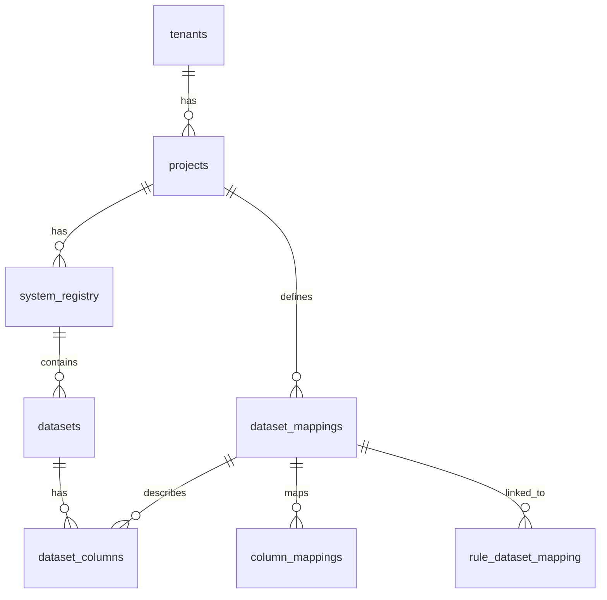
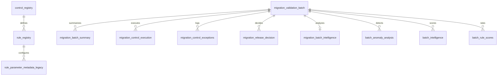
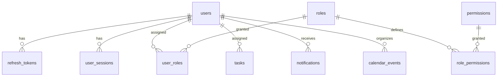
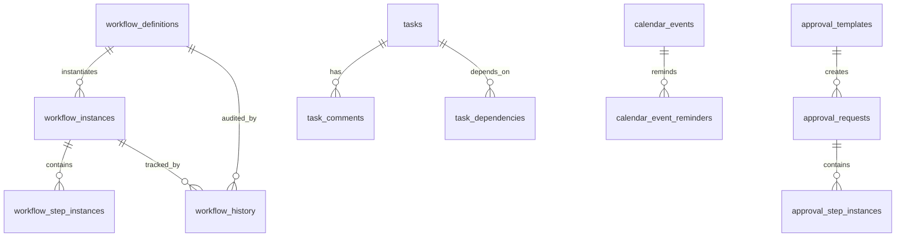
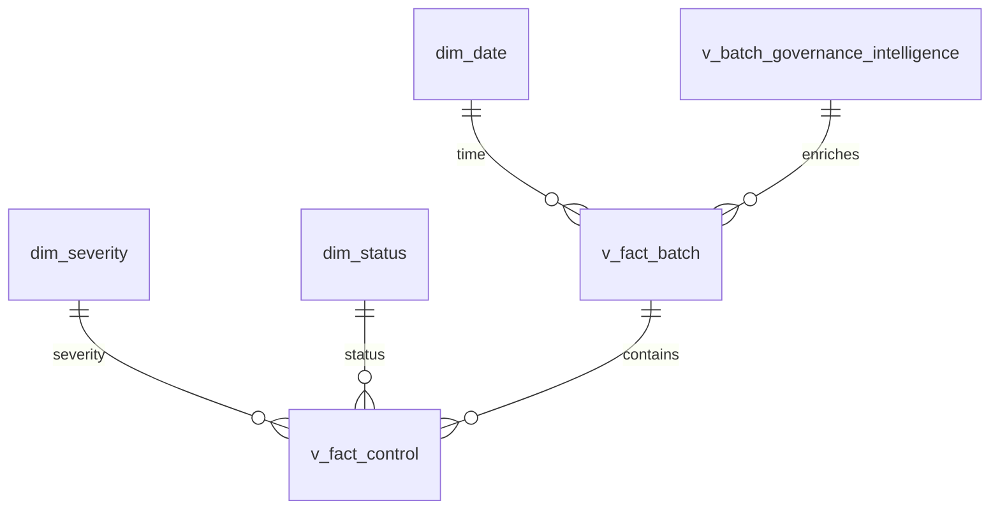
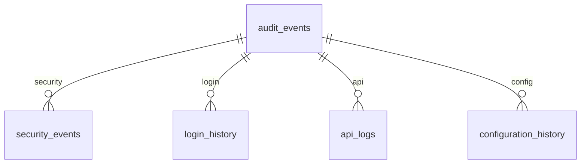

# 04_Logical_Data_Model.md

## Overview

The MAP Nexus logical data model is organized across 6 PostgreSQL schemas within the `migration_engine` database. The model supports a multi-tenant migration validation platform with three core subsystems: **Core** (business entities), **Engine** (validation execution), and **Platform** (enterprise features).

## Core Domain Model

### Tenant → Project → System Hierarchy

### Entity Descriptions

| Entity | Schema | Purpose | Key Relationships |
|--------|--------|---------|-------------------|
| **Tenants** | core | Multi-tenant organizations | Parent of all business entities |
| **Projects** | core | Migration projects | Belongs to tenant, contains systems |
| **System Registry** | core | Database connections (SOURCE/TARGET) | Belongs to project |
| **Datasets** | core | Discovered tables | Belongs to system |
| **Dataset Columns** | core | Column metadata | Belongs to dataset mapping |
| **Dataset Mappings** | core | Source-to-target table mappings | Links source and target systems |
| **Column Mappings** | core | Source-to-target column mappings | Links source and target columns |
| **Rule Dataset Mapping** | core | Links validation rules to mappings | Connects rules to data entities |

## Engine Domain Model

### Validation Execution Hierarchy

### Entity Descriptions

| Entity | Schema | Purpose | Key Relationships |
|--------|--------|---------|-------------------|
| **Control Registry** | engine | Validation controls (C01-C03) | Parent of rules |
| **Rule Registry** | engine | Validation rules | Belongs to control |
| **Migration Validation Batch** | engine | Batch execution records | Root of execution hierarchy |
| **Migration Batch Summary** | engine | Batch-level summaries | Belongs to batch |
| **Migration Control Execution** | engine | Individual execution results | Belongs to batch, references control |
| **Migration Control Summary** | engine | Control-level summaries | Belongs to batch |
| **Migration Control Exceptions** | engine | Exception records | Belongs to batch |
| **Migration Exception Register** | engine | Exception register with PKs | Belongs to batch |
| **Migration Release Decision** | engine | Release gate decisions | Belongs to batch |
| **Migration Batch Intelligence** | engine | Governance intelligence | Belongs to batch |
| **Batch Anomaly Analysis** | engine | Anomaly detection | Belongs to batch |
| **Governance Config** | engine | Configuration parameters | Standalone |

## Platform Domain Model

### User and Access Management

### Workflow and Approval Management

### Entity Descriptions

| Entity | Schema | Purpose | Key Relationships |
|--------|--------|---------|-------------------|
| **Users** | platform | User accounts | Root of user hierarchy |
| **Roles** | platform | System and custom roles | Hierarchical (self-referencing) |
| **Permissions** | platform | Permission definitions | Resource + action model |
| **Role Permissions** | platform | Role-permission mappings | Many-to-many bridge |
| **User Roles** | platform | User-role assignments | Many-to-many bridge |
| **Workflow Definitions** | platform | Workflow templates | Versioned templates |
| **Workflow Instances** | platform | Running workflows | Instantiated from definitions |
| **Workflow Step Instances** | platform | Workflow steps | Individual steps in workflow |
| **Workflow History** | platform | Workflow audit trail | Tracks all workflow actions |
| **Approval Templates** | platform | Approval templates | Reusable approval flows |
| **Approval Requests** | platform | Approval instances | Created from templates |
| **Approval Step Instances** | platform | Approval steps | Individual approval decisions |
| **Tasks** | platform | Task management | Self-referencing parent-child |
| **Task Comments** | platform | Task discussions | Threaded comments |
| **Task Dependencies** | platform | Task relationships | Finish-to-start dependencies |
| **Notifications** | platform | User notifications | Multi-channel delivery |
| **Notification Preferences** | platform | Channel preferences | Per-user, per-type settings |
| **Calendar Events** | platform | Calendar management | With reminders |
| **Calendar Event Reminders** | platform | Event reminders | Email/in-app triggers |
| **System Settings** | platform | Configuration | Category + key model |
| **Feature Flags** | platform | Feature toggles | Rollout percentage control |

## Reporting Domain Model

### Dimensional Model

### Entity Descriptions

| Entity | Schema | Purpose | Key Relationships |
|--------|--------|---------|-------------------|
| **dim_date** | reporting | Date dimension | Time-based reporting |
| **dim_severity** | reporting | Severity reference | CRITICAL, HIGH, MEDIUM, LOW |
| **dim_status** | reporting | Status reference | PASS, FAIL, ERROR |
| **v_fact_batch** | reporting | Batch fact view | Combines batch + release |
| **v_fact_control** | reporting | Control fact view | Control execution summaries |
| **v_batch_governance_intelligence** | reporting | Governance intelligence view | Enriched batch metrics |

## Audit Domain Model

### Immutable Audit Trail

### Entity Descriptions

| Entity | Schema | Purpose | Key Relationships |
|--------|--------|---------|-------------------|
| **Audit Events** | audit | General audit trail | Root of audit hierarchy |
| **Security Events** | audit | Security-specific events | Login, role, permission changes |
| **Login History** | audit | Login attempts | Success/failure tracking |
| **API Logs** | audit | API request/response logs | Full HTTP lifecycle |
| **Configuration History** | audit | Config change tracking | Before/after values |

## Cross-Schema Relationships

### Platform → Core Dependencies

| Platform Table | FK Column | Core Table | Purpose |
|----------------|-----------|------------|---------|
| `users` | `tenant_id` | `tenants` | Tenant isolation |
| `roles` | `tenant_id` | `tenants` | Tenant isolation |
| `tasks` | `tenant_id` | `tenants` | Tenant isolation |
| `tasks` | `project_id` | `projects` | Project association |
| `workflow_definitions` | `tenant_id` | `tenants` | Tenant isolation |
| `workflow_instances` | `tenant_id` | `tenants` | Tenant isolation |
| `approval_requests` | `tenant_id` | `tenants` | Tenant isolation |
| `approval_templates` | `tenant_id` | `tenants` | Tenant isolation |
| `calendar_events` | `tenant_id` | `tenants` | Tenant isolation |
| `calendar_events` | `project_id` | `projects` | Project association |

### Engine → Core Dependencies

| Engine Table | FK Column | Core Table | Purpose |
|--------------|-----------|------------|---------|
| `control_registry` | `project_id` | `projects` | Project association |
| `migration_control_execution` | `mapping_id` | `dataset_mappings` | Entity reference |

### Reporting → Engine Dependencies

| Reporting View | Engine Table | Purpose |
|----------------|--------------|---------|
| `v_fact_batch` | `migration_validation_batch` | Batch facts |
| `v_fact_control` | `migration_control_summary` | Control facts |
| `v_batch_governance_intelligence` | `migration_batch_intelligence_OLD` | Governance metrics |

---

**Version:** 2.1

**Status:** Current State Documentation
