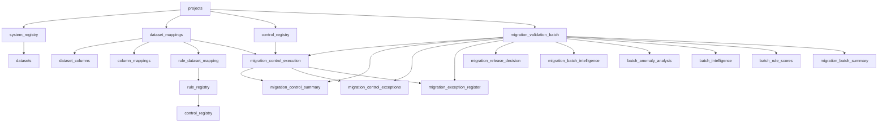
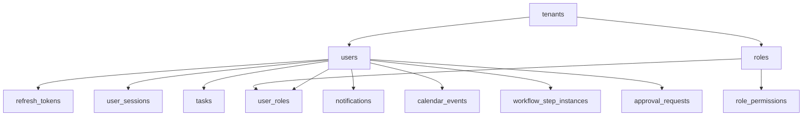
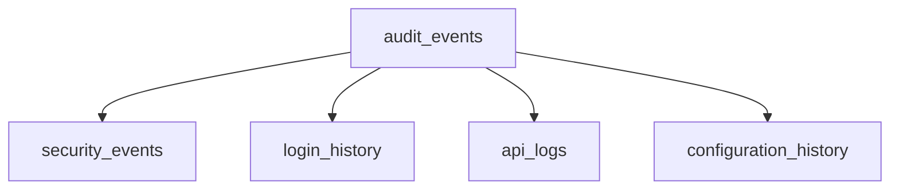

# 06_Database_Relationships.md

## Overview

This document describes all implemented database relationships in the MAP Nexus platform, including one-to-one, one-to-many, many-to-many, bridge tables, composite keys, and dependency chains.

---

## One-to-Many Relationships

### Core Schema

| Parent Table | Parent Column | Child Table | Child Column | On Delete |
|--------------|---------------|-------------|--------------|-----------|
| `tenants` | `tenant_id` | `projects` | `tenant_id` | CASCADE |
| `projects` | `project_id` | `system_registry` | `project_id` | CASCADE |
| `projects` | `project_id` | `dataset_mappings` | `project_id` | CASCADE |
| `projects` | `project_id` | `rule_dataset_mapping` | `mapping_id` | — |
| `system_registry` | `system_id` | `datasets` | `system_id` | — |
| `dataset_mappings` | `mapping_id` | `dataset_columns` | `mapping_id` | — |
| `dataset_mappings` | `mapping_id` | `column_mappings` | `mapping_id` | — |
| `dataset_columns` | `column_id` | `column_mappings` | `source_column_id` | — |

**Evidence:** `engine_backup.sql:5406-5919`

### Engine Schema

| Parent Table | Parent Column | Child Table | Child Column | On Delete |
|--------------|---------------|-------------|--------------|-----------|
| `control_registry` | `control_id` | `rule_registry` | `control_id` | — |
| `migration_validation_batch` | `batch_id` | `migration_batch_summary` | `batch_id` | — |
| `migration_validation_batch` | `batch_id` | `migration_control_execution` | `batch_id` | — |
| `migration_validation_batch` | `batch_id` | `migration_control_exceptions` | `batch_id` | — |
| `migration_validation_batch` | `batch_id` | `migration_exception_register` | `batch_id` | — |
| `migration_validation_batch` | `batch_id` | `migration_release_decision` | `batch_id` | — |
| `migration_validation_batch` | `batch_id` | `migration_batch_intelligence` | `batch_id` | — |
| `migration_validation_batch` | `batch_id` | `batch_anomaly_analysis` | `batch_id` | — |
| `migration_validation_batch` | `batch_id` | `batch_intelligence` | `batch_id` | — |
| `migration_validation_batch` | `batch_id` | `batch_rule_scores` | `batch_id` | — |

**Evidence:** `engine_backup.sql:5959-6000`

### Platform Schema

| Parent Table | Parent Column | Child Table | Child Column | On Delete |
|--------------|---------------|-------------|--------------|-----------|
| `users` | `id` | `refresh_tokens` | `user_id` | CASCADE |
| `users` | `id` | `user_sessions` | `user_id` | CASCADE |
| `users` | `id` | `user_roles` | `user_id` | CASCADE |
| `users` | `id` | `tasks` | `assigned_to` | — |
| `users` | `id` | `task_comments` | `user_id` | — |
| `users` | `id` | `notifications` | `user_id` | CASCADE |
| `users` | `id` | `notification_preferences` | `user_id` | CASCADE |
| `users` | `id` | `calendar_events` | `organizer_id` | — |
| `users` | `id` | `calendar_event_reminders` | `user_id` | — |
| `users` | `id` | `workflow_step_instances` | `assigned_to` | — |
| `users` | `id` | `workflow_step_instances` | `approved_by` | — |
| `roles` | `id` | `role_permissions` | `role_id` | CASCADE |
| `roles` | `id` | `user_roles` | `role_id` | CASCADE |
| `permissions` | `id` | `role_permissions` | `permission_id` | CASCADE |
| `workflow_definitions` | `id` | `workflow_instances` | `workflow_definition_id` | — |
| `workflow_definitions` | `id` | `workflow_history` | `workflow_definition_id` | CASCADE |
| `workflow_instances` | `id` | `workflow_step_instances` | `workflow_instance_id` | CASCADE |
| `workflow_instances` | `id` | `workflow_history` | `workflow_instance_id` | SET NULL |
| `approval_templates` | `id` | `approval_requests` | `template_id` | — |
| `approval_requests` | `id` | `approval_step_instances` | `request_id` | CASCADE |
| `tasks` | `id` | `task_comments` | `task_id` | CASCADE |
| `tasks` | `id` | `task_dependencies` | `task_id` | CASCADE |
| `tasks` | `id` | `task_dependencies` | `depends_on_id` | CASCADE |
| `calendar_events` | `id` | `calendar_event_reminders` | `event_id` | CASCADE |

**Evidence:** `create_platform_schema.sql:451-462`

---

## Many-to-Many Relationships (Bridge Tables)

### User Roles

| Bridge Table | First Table | Second Table | Purpose |
|--------------|-------------|--------------|---------|
| `platform.user_roles` | `users` | `roles` | Assigns roles to users |

**Composite Primary Key:** `(user_id, role_id)`

**Additional Columns:**
- `assigned_at` (TIMESTAMP)
- `assigned_by` (UUID → users)
- `expires_at` (TIMESTAMP)
- `is_temporary` (BOOLEAN)

**Evidence:** `create_platform_schema.sql:122-130`

### Role Permissions

| Bridge Table | First Table | Second Table | Purpose |
|--------------|-------------|--------------|---------|
| `platform.role_permissions` | `roles` | `permissions` | Assigns permissions to roles |

**Composite Primary Key:** `(role_id, permission_id)`

**Additional Columns:**
- `granted` (BOOLEAN)
- `conditions` (JSONB)
- `created_at` (TIMESTAMP)

**Evidence:** `create_platform_schema.sql:113-120`

### Rule Dataset Mapping

| Bridge Table | First Table | Second Table | Purpose |
|--------------|-------------|--------------|---------|
| `core.rule_dataset_mapping` | `rule_registry` (via `rule_id`) | `dataset_mappings` (via `mapping_id`) | Links validation rules to dataset mappings |

**Primary Key:** `id` (UUID)

**Additional Columns:**
- `is_active` (BOOLEAN)
- `created_at` (TIMESTAMP)

**Evidence:** `engine_backup.sql:711-717`

---

## Composite Keys

### Platform Schema

| Table | Columns | Purpose |
|-------|---------|---------|
| `role_permissions` | `(role_id, permission_id)` | Role-permission mapping |
| `user_roles` | `(user_id, role_id)` | User-role assignment |
| `notification_preferences` | `(user_id, type, channel)` | Notification channel preference |
| `system_settings` | `(category, key)` | Configuration setting |
| `task_dependencies` | `(task_id, depends_on_id)` | Task dependency (unique constraint) |

**Evidence:** `create_platform_schema.sql:119,129,358,426,323`

---

## Self-Referencing Relationships

### Hierarchical Structures

| Table | Parent Column | Child Column | Purpose |
|-------|---------------|--------------|---------|
| `roles` | `parent_id` | `id` | Role hierarchy (system roles) |
| `tasks` | `parent_task_id` | `id` | Task hierarchy (parent-child tasks) |

**Evidence:** `create_platform_schema.sql:81,286`

---

## Dependency Chains

### Validation Execution Chain

### Platform User Chain

### Audit Chain

---

## Cross-Schema Foreign Keys

### Platform → Core

| Platform Table | FK Column | Core Table | Constraint Name |
|----------------|-----------|------------|-----------------|
| `users` | `tenant_id` | `tenants` | `fk_users_tenant_id` |
| `roles` | `tenant_id` | `tenants` | `fk_roles_tenant_id` |
| `tasks` | `tenant_id` | `tenants` | `fk_tasks_tenant_id` |
| `tasks` | `project_id` | `projects` | `fk_tasks_project` |
| `workflow_definitions` | `tenant_id` | `tenants` | `fk_workflow_definitions_tenant_id` |
| `workflow_instances` | `tenant_id` | `tenants` | — |
| `approval_requests` | `tenant_id` | `tenants` | `fk_approval_requests_tenant_id` |
| `approval_templates` | `tenant_id` | `tenants` | — |
| `calendar_events` | `tenant_id` | `tenants` | `fk_calendar_events_tenant_id` |
| `calendar_events` | `project_id` | `projects` | `fk_calendar_events_project` |

**Evidence:** `workstream_05_compliance_fixes.sql:27-196`

### Engine → Core

| Engine Table | FK Column | Core Table | Constraint Name |
|--------------|-----------|------------|-----------------|
| `control_registry` | `project_id` | `projects` | `control_registry_project_id_fkey` |
| `migration_control_execution` | `mapping_id` | `dataset_mappings` | — |
| `migration_batch_summary` | `project_id` | `projects` | `fk_batch_summary_project` |
| `dataset_mappings_OLD` | `project_id` | `projects` | `dataset_mappings_project_id_fkey` |

**Evidence:** `engine_backup.sql:5847-5959`

---

**Version:** 2.1

**Status:** Current State Documentation
