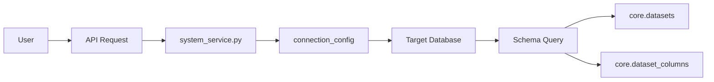
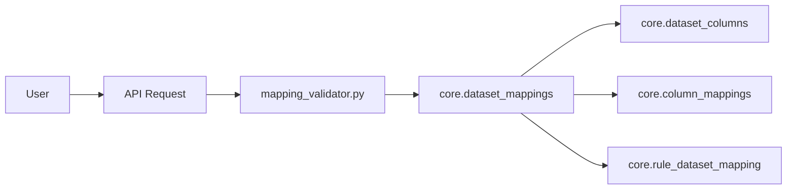
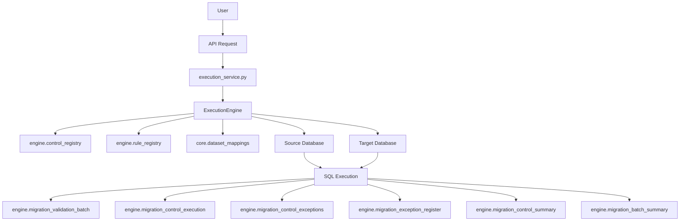
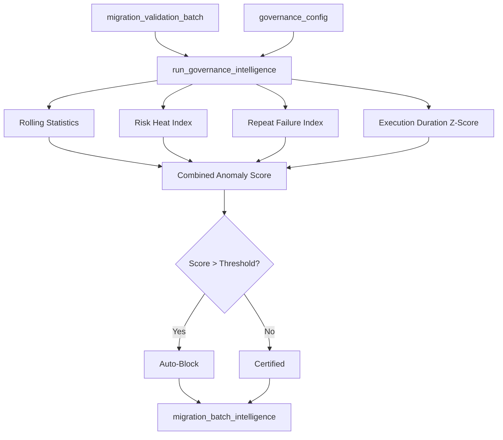
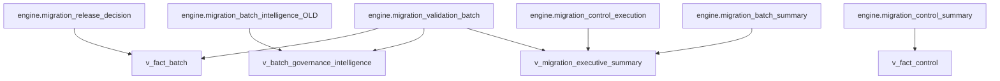
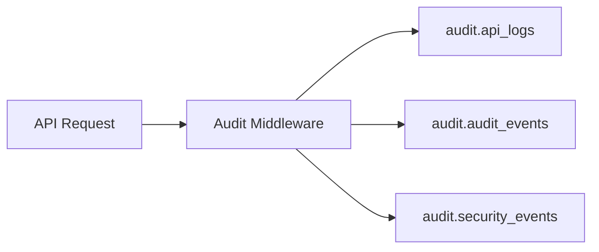
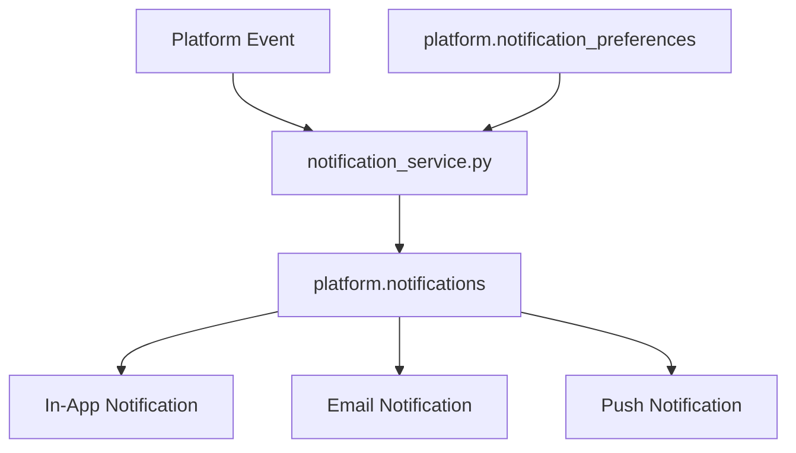
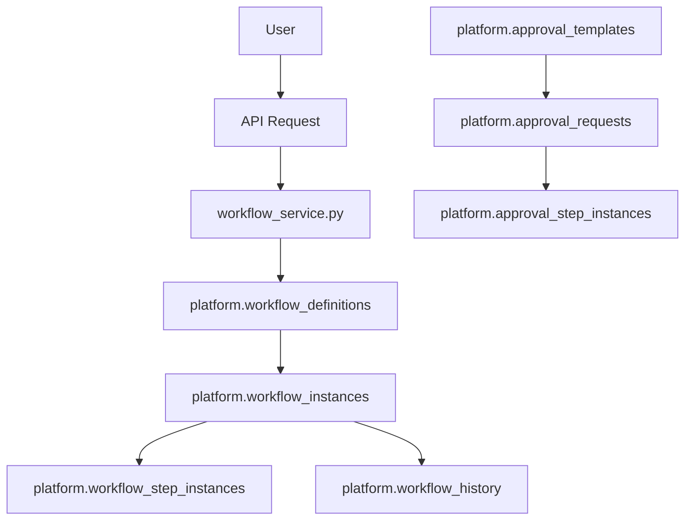
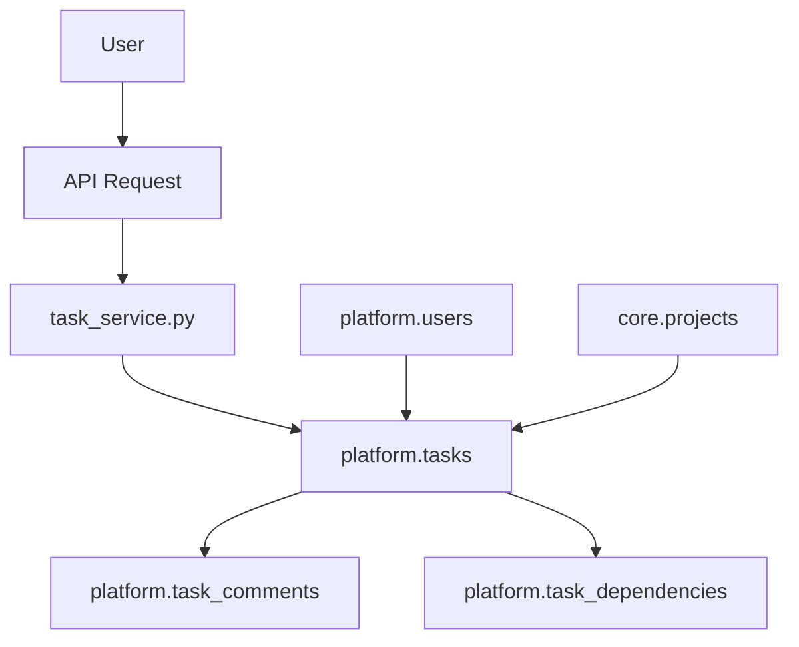

# 07_Data_Flow.md

## Overview

This document describes the implemented data movement paths in the MAP Nexus platform, from discovery through reporting and audit.

---

## Discovery Flow

### Dataset Discovery

**Code Path:**
- `app/services/system_service.py` → `core.system_registry` (connection config)
- `app/services/dataset_discovery_service.py` → `core.datasets` + `core.dataset_columns`

**Tables Involved:**
- `core.system_registry` (source of connection details)
- `core.datasets` (discovered tables)
- `core.dataset_columns` (discovered columns)

**Evidence:** `app/services/dataset_discovery_service.py`

---

## Mapping Flow

### Dataset Mapping Creation

**Code Path:**
- `app/services/mapping_validator.py` → `core.dataset_mappings` (validation)
- `app/services/mapping_resolver.py` → `core.dataset_mappings` (resolution)

**Tables Involved:**
- `core.dataset_mappings` (source-to-target table mappings)
- `core.dataset_columns` (column metadata)
- `core.column_mappings` (source-to-target column mappings)
- `core.rule_dataset_mapping` (rule-to-mapping links)

**Evidence:** `app/services/mapping_validator.py:33-47`

---

## Execution Flow

### Validation Execution

**Code Path:**
- `app/services/execution_service.py` → `app/execution_engine.py`
- `ExecutionEngine.run()` → validates batch execution
- Results written to `engine.migration_validation_batch` and child tables

**Tables Involved:**
- `engine.migration_validation_batch` (batch record)
- `engine.migration_control_execution` (control results)
- `engine.migration_control_summary` (control summaries)
- `engine.migration_control_exceptions` (exception details)
- `engine.migration_exception_register` (exception register)

**Evidence:** `app/services/execution_service.py:64-82`

---

## Governance Intelligence Flow

### Anomaly Detection

**Code Path:**
- `engine.run_governance_intelligence(batch_id)` (PostgreSQL function)
- Reads `engine.governance_config` for parameters
- Calculates rolling statistics from `engine.migration_validation_batch`
- Writes to `engine.migration_batch_intelligence`

**Tables Involved:**
- `engine.governance_config` (input parameters)
- `engine.migration_validation_batch` (input data)
- `engine.migration_batch_intelligence` (output scores)

**Evidence:** `engine_backup.sql:60-263`

---

## Reporting Flow

### Dashboard Views

**Views:**
- `reporting.v_fact_batch` — Batch facts with release decisions
- `reporting.v_fact_control` — Control execution summaries
- `reporting.v_batch_governance_intelligence` — Governance intelligence metrics
- `engine.v_migration_executive_summary` — Executive dashboard
- `engine.v_migration_control_summary` — Control summaries
- `engine.v_migration_exception_detail` — Exception drill-down
- `engine.v_migration_score_trend` — Score trend analysis

**Evidence:** `engine_backup.sql:1567-1961`

---

## Audit Flow

### API Request Logging

**Code Path:**
- `app/api/core/middleware/audit_middleware.py` logs all API calls
- Security events logged by `app/api/core/auth/auth_service.py`

**Tables Involved:**
- `audit.api_logs` (API request/response logs)
- `audit.audit_events` (general audit events)
- `audit.security_events` (security-specific events)
- `audit.login_history` (login attempts)
- `audit.configuration_history` (config changes)

**Evidence:** `app/api/core/middleware/audit_middleware.py`

---

## Notification Flow

### User Notifications

**Code Path:**
- `app/services/notification_service.py` → `platform.notifications`
- Respects `platform.notification_preferences` for channel selection

**Tables Involved:**
- `platform.notifications` (notification records)
- `platform.notification_preferences` (channel preferences)

**Evidence:** `app/services/notification_service.py`

---

## Workflow Flow

### Workflow Execution

**Code Path:**
- `app/services/workflow_service.py` → `platform.workflow_definitions`
- Creates `platform.workflow_instances` and `platform.workflow_step_instances`
- Tracks history in `platform.workflow_history`

**Tables Involved:**
- `platform.workflow_definitions` (workflow templates)
- `platform.workflow_instances` (running workflows)
- `platform.workflow_step_instances` (workflow steps)
- `platform.workflow_history` (audit trail)

**Evidence:** `app/services/workflow_service.py`

---

## Task Flow

### Task Management

**Code Path:**
- `app/services/task_service.py` → `platform.tasks`
- Comments via `platform.task_comments`
- Dependencies via `platform.task_dependencies`

**Tables Involved:**
- `platform.tasks` (task records)
- `platform.task_comments` (task discussions)
- `platform.task_dependencies` (task relationships)

**Evidence:** `app/services/task_service.py`

---

## Data Movement Summary

| Flow | Source | Destination | Trigger |
|------|--------|-------------|---------|
| Discovery | Target Database | `core.datasets`, `core.dataset_columns` | User action |
| Mapping | User input | `core.dataset_mappings`, `core.column_mappings` | User action |
| Execution | Source/Target DBs | `engine.migration_*` tables | User action |
| Governance | `engine.migration_validation_batch` | `engine.migration_batch_intelligence` | Execution complete |
| Reporting | `engine.*` tables | `reporting.*` views | Query time |
| Audit | API requests | `audit.*` tables | Every request |
| Notifications | Platform events | `platform.notifications` | Event trigger |
| Workflow | User actions | `platform.workflow_*` tables | User action |
| Tasks | User actions | `platform.tasks` tables | User action |

---

**Version:** 2.1

**Status:** Current State Documentation
