# 09_Configuration_Model.md

## Overview

This document describes the implemented configuration mechanisms in the MAP Nexus platform.

---

## System Settings

### platform.system_settings

**Purpose:** Platform configuration key-value pairs.

**Structure:** Category + Key → JSONB Value

| Column | Type | Notes |
|--------|------|-------|
| `id` | UUID | PK |
| `category` | VARCHAR(100) | Setting category |
| `key` | VARCHAR(200) | Setting key |
| `value` | JSONB | Setting value |
| `description` | TEXT | Description |
| `data_type` | VARCHAR(50) | 'string', 'number', 'boolean', 'json' |
| `is_required` | BOOLEAN | Required flag |
| `is_readonly` | BOOLEAN | Read-only flag |
| `default_value` | JSONB | Default value |
| `tenant_scoped` | BOOLEAN | Per-tenant setting |
| `created_at` | TIMESTAMP WITH TIME ZONE | Creation time |
| `updated_at` | TIMESTAMP WITH TIME ZONE | Last update |
| `updated_by` | UUID | Last updater |

**Unique Constraint:** `(category, key)`

**Evidence:** `create_platform_schema.sql:412-427`

### Default Settings

| Category | Key | Value | Data Type |
|----------|-----|-------|-----------|
| `general` | `platform_name` | "MAP Nexus" | string |
| `general` | `platform_version` | "2.0.0" | string |
| `general` | `support_email` | "support@mapnexus.com" | string |
| `general` | `max_upload_size_mb` | 50 | number |
| `authentication` | `max_login_attempts` | 5 | number |
| `authentication` | `lockout_duration_minutes` | 30 | number |
| `authentication` | `session_timeout_minutes` | 60 | number |
| `authentication` | `password_min_length` | 8 | number |
| `authentication` | `require_email_verification` | true | boolean |
| `authentication` | `mfa_enabled` | false | boolean |
| `notifications` | `email_enabled` | true | boolean |
| `notifications` | `in_app_enabled` | true | boolean |
| `notifications` | `digest_enabled` | false | boolean |
| `integrations` | `slack_enabled` | false | boolean |
| `integrations` | `teams_enabled` | false | boolean |

**Evidence:** `seed_platform_data.sql:106-121`

---

## Feature Flags

### platform.feature_flags

**Purpose:** Feature toggle definitions with rollout control.

| Column | Type | Notes |
|--------|------|-------|
| `id` | UUID | PK |
| `name` | VARCHAR(100) | Display name |
| `description` | TEXT | Description |
| `key` | VARCHAR(100) | Unique key |
| `enabled` | BOOLEAN | Enabled flag |
| `rollout_percentage` | NUMERIC(5,2) | Rollout percentage (0-100) |
| `status` | VARCHAR(50) | 'active', 'inactive' |
| `created_at` | TIMESTAMP WITH TIME ZONE | Creation time |
| `updated_at` | TIMESTAMP WITH TIME ZONE | Last update |
| `created_by` | UUID | Creator |

**Unique Constraint:** `key`

**Evidence:** `create_platform_schema.sql:431-442`

### Default Feature Flags

| Name | Key | Enabled | Rollout % |
|------|-----|---------|-----------|
| Workflow Engine | `workflow_engine` | TRUE | 100 |
| Task Management | `task_management` | TRUE | 100 |
| Calendar | `calendar` | TRUE | 100 |
| AI Copilot | `ai_copilot` | FALSE | 0 |
| Advanced Reporting | `advanced_reporting` | FALSE | 0 |
| Multi-tenant | `multi_tenant` | FALSE | 0 |

**Evidence:** `seed_platform_data.sql:127-133`

---

## Governance Configuration

### engine.governance_config

**Purpose:** Governance intelligence parameters.

| Column | Type | Notes |
|--------|------|-------|
| `id` | SERIAL | PK |
| `client_name` | VARCHAR(100) | Client scope |
| `environment` | VARCHAR(20) | Environment scope |
| `rolling_window_size` | INTEGER | Rolling stats window |
| `anomaly_std_threshold` | NUMERIC(5,2) | Std dev threshold |
| `repeat_failure_threshold` | INTEGER | Repeat failure threshold |
| `anomaly_block_threshold` | NUMERIC(5,2) | Auto-block threshold |
| `volatility_multiplier` | NUMERIC(5,2) | Volatility factor |
| `created_at` | TIMESTAMP | Creation time |

**Default Values:**

| Parameter | Default | Description |
|-----------|---------|-------------|
| `client_name` | 'GLOBAL' | Applies to all clients |
| `environment` | 'ALL' | Applies to all environments |
| `rolling_window_size` | 5 | Last 5 batches for rolling stats |
| `anomaly_std_threshold` | 2.0 | 2 standard deviations |
| `repeat_failure_threshold` | 3 | 3 repeat failures triggers alert |
| `anomaly_block_threshold` | 70 | Score > 70 triggers auto-block |
| `volatility_multiplier` | 1.5 | 1.5x volatility adjustment |

**Evidence:** `engine_backup.sql:927-937`

---

## Rule Configuration

### engine.rule_weight_config

**Purpose:** Rule severity weights for scoring.

| Column | Type | Notes |
|--------|------|-------|
| `rule_id` | VARCHAR(50) | PK, FK → rule_registry |
| `weight_score` | NUMERIC(5,2) | Weight for scoring |
| `severity_level` | VARCHAR(20) | 'CRITICAL', 'HIGH', 'MEDIUM', 'LOW' |

**Evidence:** `engine_backup.sql:1512-1516`

### engine.rule_weights

**Purpose:** Legacy rule weights.

| Column | Type | Notes |
|--------|------|-------|
| `rule_id` | VARCHAR(50) | PK |
| `weight` | INTEGER | Weight value |

**Evidence:** `engine_backup.sql:1525-1528`

### engine.rule_parameter_metadata_legacy

**Purpose:** Entity mapping for rules (legacy).

| Column | Type | Notes |
|--------|------|-------|
| `id` | SERIAL | PK |
| `rule_id` | VARCHAR(50) | FK → rule_registry |
| `entity_name` | VARCHAR(100) | Entity name |
| `source_schema` | VARCHAR(100) | Source schema |
| `source_table` | VARCHAR(100) | Source table |
| `target_schema` | VARCHAR(100) | Target schema |
| `target_table` | VARCHAR(100) | Target table |
| `primary_key_column` | VARCHAR(100) | PK column |
| `filter_condition` | TEXT | Filter condition |
| `tolerance_value` | NUMERIC | Tolerance for numeric comparisons |
| `active` | BOOLEAN | Active flag |
| `numeric_column` | VARCHAR(100) | Numeric column for aggregation |

**Evidence:** `engine_backup.sql:1448-1462`

---

## Execution Configuration

### engine.migration_validation_batch

**Purpose:** Batch execution records with configuration context.

| Column | Type | Notes |
|--------|------|-------|
| `batch_id` | UUID | PK |
| `execution_start` | TIMESTAMP | Start time |
| `execution_end` | TIMESTAMP | End time |
| `overall_status` | VARCHAR(20) | 'PASS', 'FAIL', 'ERROR' |
| `overall_score` | NUMERIC(5,2) | Overall score |
| `project_id` | UUID | FK → core.projects |

**Evidence:** `engine_backup.sql:1338-1345`

---

## Platform Configuration Summary

### Configuration Hierarchy

```mermaid
graph TD
    A[platform.system_settings] --> B[General Settings]
    A --> C[Authentication Settings]
    A --> D[Notification Settings]
    A --> E[Integration Settings]
    F[platform.feature_flags] --> G[Workflow Engine]
    F --> H[Task Management]
    F --> I[Calendar]
    F --> J[AI Copilot]
    F --> K[Advanced Reporting]
    F --> L[Multi-tenant]
    M[engine.governance_config] --> N[Anomaly Detection]
    M --> O[Risk Assessment]
    M --> P[Repeat Failure Analysis]
    Q[engine.rule_weight_config] --> R[Rule Scoring]
    S[engine.rule_parameter_metadata_legacy] --> T[Entity Mapping]
```

### Configuration Access Patterns

| Configuration | Access Pattern | Scope |
|---------------|----------------|-------|
| `system_settings` | Read on startup, cache in memory | Global |
| `feature_flags` | Read on request, check per-user | Global |
| `governance_config` | Read per execution | Per-client |
| `rule_weight_config` | Read per rule execution | Per-rule |
| `rule_parameter_metadata_legacy` | Read per rule execution | Per-rule-mapping |

---

## Configuration Security

### Sensitive Settings

| Setting | Sensitivity | Protection |
|---------|-------------|------------|
| `system_settings` (general) | Low | None |
| `system_settings` (authentication) | Medium | Audit trail |
| `feature_flags` | Medium | Audit trail |
| `governance_config` | Medium | Audit trail |
| `rule_weight_config` | Low | None |

### Configuration Changes

All configuration changes are tracked in `audit.configuration_history`:
- Before/after values
- Change reason
- User and timestamp
- IP address

**Evidence:** `create_audit_schema.sql:139-151`

---

**Version:** 2.1

**Status:** Current State Documentation
