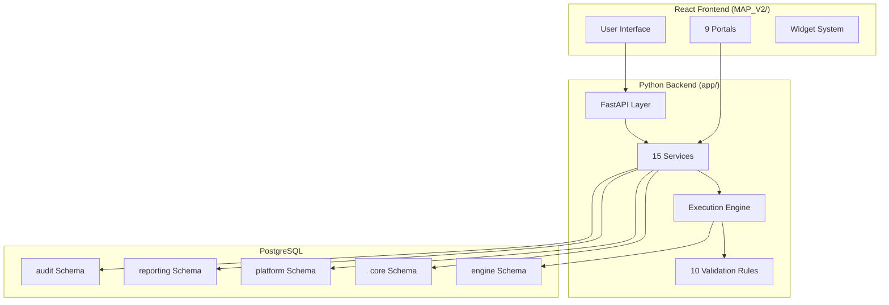
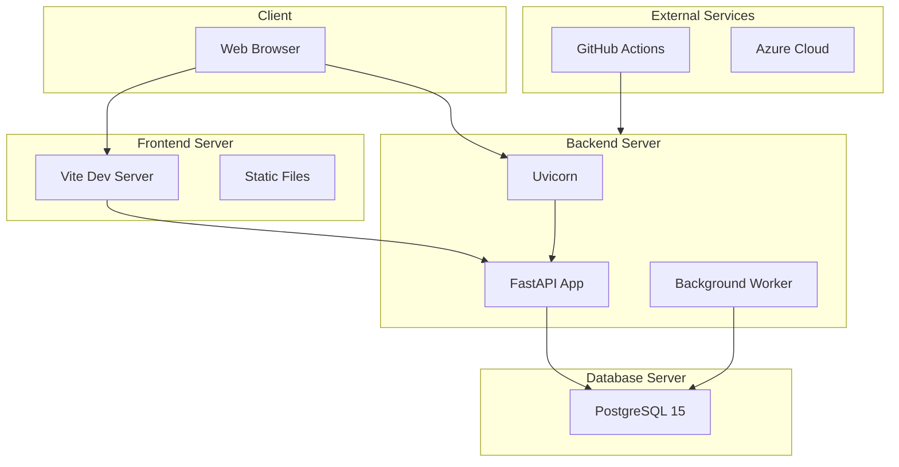

# 02_Solution_Architecture_Overview.md

# Enterprise Solution Architecture — Overview

### MAP Nexus Enterprise Architecture

---

## High-Level Architecture

MAP Nexus follows a **three-tier architecture** with clear separation of concerns:



---

## Logical Architecture

```mermaid
graph LR
    subgraph Presentation["Presentation Layer"]
        React[React 19]
        TypeScript[TypeScript]
        Tailwind[Tailwind CSS]
    end
    
    subgraph Application["Application Layer"]
        FastAPI[FastAPI]
        Routes[12 Routers]
        Middleware[Middleware Stack]
    end
    
    subgraph Business["Business Logic Layer"]
        Services[15 Services]
        Engine[Execution Engine]
        Rules[Validation Rules]
        Governance[Governance Engine]
    end
    
    subgraph Data["Data Access Layer"]
        Repositories[Repositories]
        Adapters[7 Adapters]
        ConnectionPool[Connection Management]
    end
    
    subgraph Storage["Storage Layer"]
        PostgreSQL[PostgreSQL 15]
        Schemas[5 Schemas]
    end
    
    Presentation --> Application
    Application --> Business
    Business --> Data
    Data --> Storage
```



---

## Physical Architecture



---

## Repository Organisation

```
fs-migration-validation-engine/
├── app/                          # Python backend
│   ├── api/                      # FastAPI layer
│   │   ├── main.py               # Application entry
│   │   ├── routes/               # 12 route modules
│   │   ├── core/                 # Auth, middleware, security
│   │   └── models/               # Pydantic models
│   ├── services/                 # 15 service classes
│   ├── db/                       # Database adapters
│   │   ├── adapters/             # 7 database adapters
│   │   └── repositories/         # Data access
│   ├── rules/                    # 10 validation rules
│   ├── controls/                 # Control abstraction
│   ├── execution/                # Execution context
│   ├── governance/               # Decision engine
│   ├── orchestration/            # DAG, retry, isolation
│   ├── discovery/                # Auto rule discovery
│   └── security/                 # Encryption
├── MAP_V2/                       # React frontend
│   └── 03_Source/frontend/
│       └── src/
│           ├── portal/           # 9 portals
│           ├── navigation/       # Navigation system
│           ├── authentication/   # Auth implementation
│           ├── services/         # 7 frontend services
│           ├── hooks/            # Custom React hooks
│           ├── components/       # Shared components
│           ├── dashboard/        # Dashboard framework
│           ├── ai/               # AI platform
│           └── reporting/        # Reporting system
├── config.yaml                   # Application configuration
├── requirements.txt              # Python dependencies
├── Dockerfile                    # Container build
├── docker/                       # Docker Compose
└── .github/workflows/           # CI/CD
```

---

## Architectural Style

| Style | Implementation |
|-------|----------------|
| **Layered Architecture** | Presentation → Application → Business → Data → Storage |
| **Service-Oriented** | 15 backend services with clear responsibilities |
| **Adapter Pattern** | 7 database adapters via factory |
| **Factory Pattern** | Rule factory, connection factory |
| **Registry Pattern** | Widget registry, portal registry, rule registry |
| **Pipeline Pattern** | 6-step execution pipeline |
| **DAG Execution** | Control dependency resolution |

---

**Version:** 1.0

**Status:** Engineering Review
