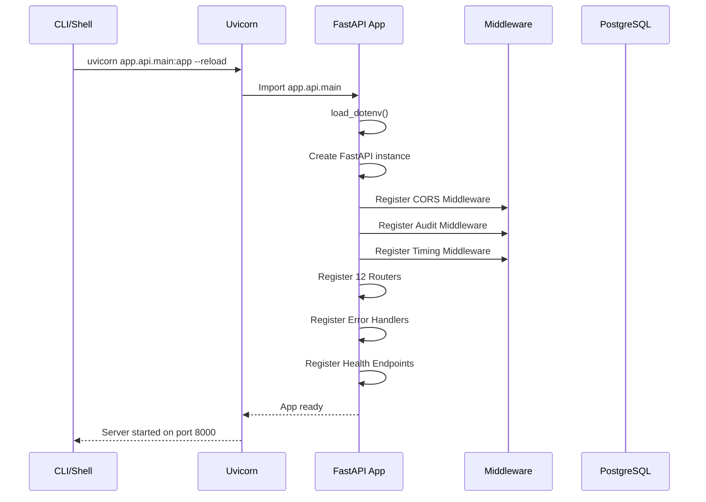
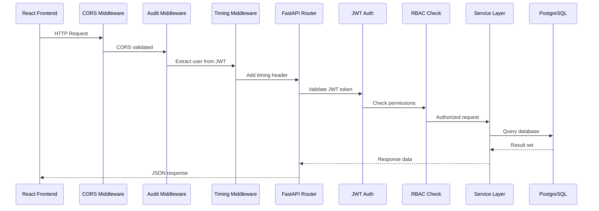
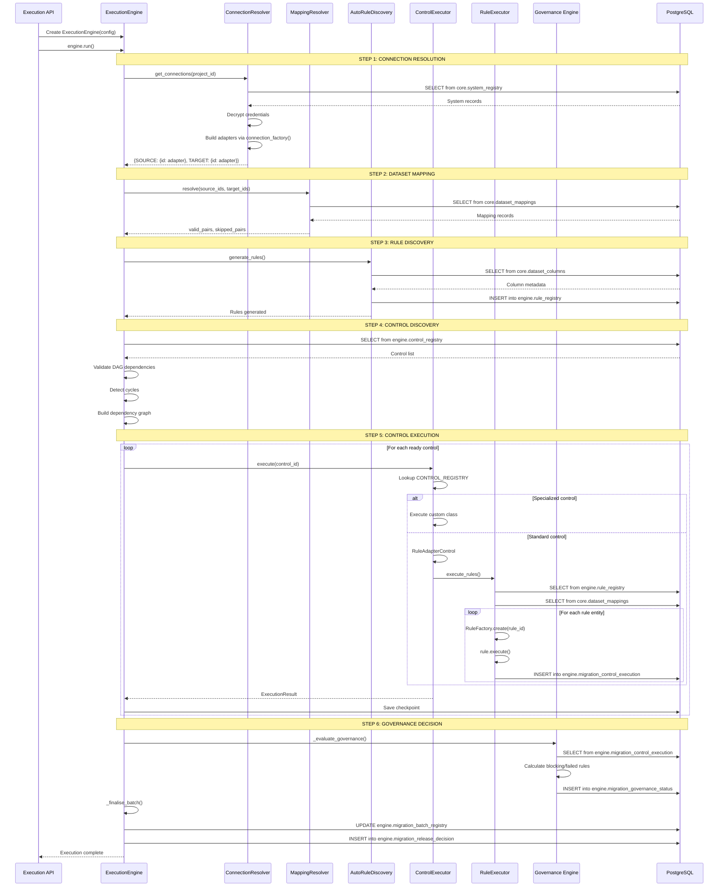
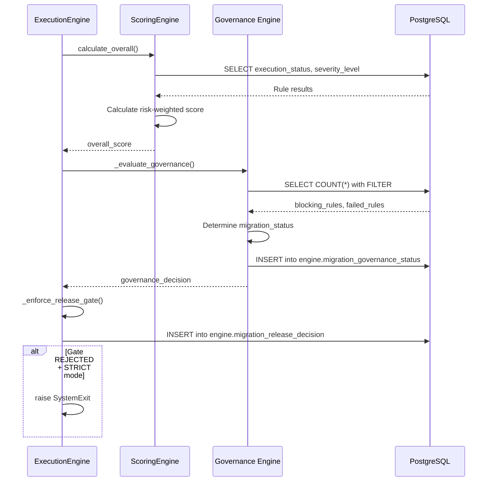
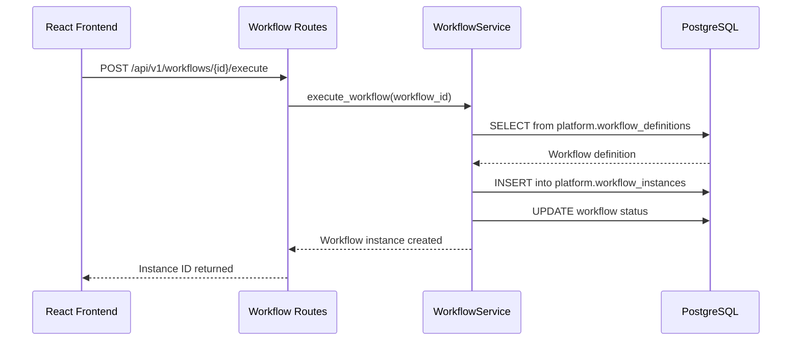
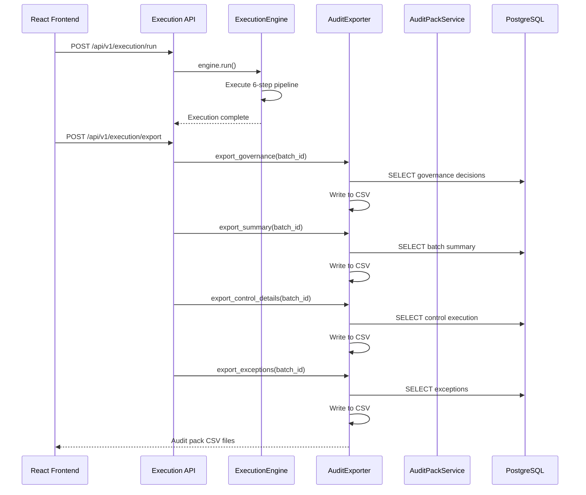
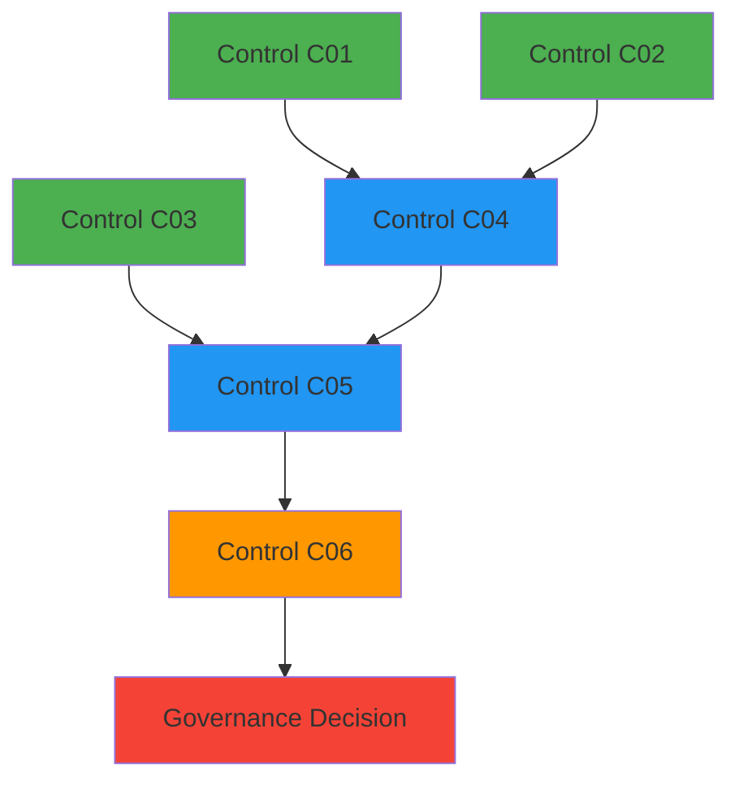
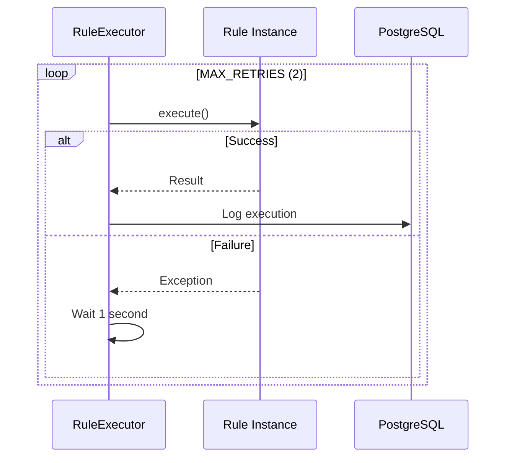

# 09_Runtime_Architecture.md

# Runtime Architecture

### MAP Nexus Enterprise Solution Architecture

---

## Purpose

This document describes the runtime execution flows including process startup, request lifecycle, validation execution, governance execution, workflow execution, and reporting flow.

---

## Process Startup (Uvicorn)

### Startup Sequence

### Startup Evidence
| Step | File | Line |
|------|------|------|
| Load env | `app/main.py:3` | `load_dotenv()` |
| Import app | `app/main.py:6` | `from .api.main import app` |
| Create FastAPI | `app/api/main.py:33` | `app = FastAPI(...)` |
| CORS middleware | `app/api/main.py:41` | `app.add_middleware(CORSMiddleware)` |
| Audit middleware | `app/api/main.py:54` | `app.add_middleware(AuditLoggingMiddleware)` |
| Timing middleware | `app/api/main.py:60` | `@app.middleware("http")` |
| Route registration | `app/api/main.py:146-158` | `app.include_router(...)` |

---

## Request Lifecycle

### Request Processing Evidence
| Step | File | Description |
|------|------|-------------|
| CORS | `app/api/main.py:41` | Allow origins |
| Audit | `app/api/core/middleware/audit_middleware.py:10` | Log request |
| Timing | `app/api/main.py:61` | Add X-Response-Time |
| JWT decode | `app/api/core/auth/jwt_handler.py:13` | Decode token |
| RBAC check | `app/api/core/auth/rbac.py:7` | Check permissions |

---

## 6-Step Validation Execution

### Pipeline Evidence
| Step | File | Line |
|------|------|------|
| Connection Resolution | `app/execution_engine.py:81` | `[STEP 01/06]` |
| Dataset Mapping | `app/execution_engine.py:115` | `[STEP 02/06]` |
| Rule Discovery | `app/execution_engine.py:190` | `[STEP 03/06]` |
| Control Discovery | `app/execution_engine.py:210` | `[STEP 04/06]` |
| Control Execution | `app/execution_engine.py:354` | `[STEP 05/06]` |
| Governance Decision | `app/execution_engine.py:459` | `[STEP 06/06]` |

---

## Governance Execution

### Governance Evidence
| Component | File | Line |
|-----------|------|------|
| Scoring | `app/scoring_engine.py:52` | `calculate_overall()` |
| Governance eval | `app/execution_engine.py:841` | `_evaluate_governance()` |
| Release gate | `app/execution_engine.py:736` | `_enforce_release_gate()` |
| Decision engine | `app/governance/decision_engine.py:3` | `record_decision()` |
| Risk scoring | `app/governance/risk_scoring.py:1` | `calculate_migration_risk()` |

---

## Workflow Execution

### Workflow Evidence
| Component | File | Line |
|-----------|------|------|
| Workflow routes | `app/api/routes/workflow_routes.py:86` | `execute` endpoint |
| Workflow service | `app/services/workflow_service.py:10` | `WorkflowService` |

---

## Reporting Flow

### Reporting Evidence
| Component | File | Line |
|-----------|------|------|
| Audit export | `app/audit_export.py` | `AuditExporter` |
| Audit pack service | `app/services/audit_pack_service.py:4` | `generate()` |
| CLI export | `app/main.py:25` | `export_audit()` |

---

## DAG Execution Model

### DAG Evidence
| Component | File | Line |
|-----------|------|------|
| Dependency validation | `app/execution_engine.py:992` | `_validate_dependencies()` |
| Cycle detection | `app/execution_engine.py:1009` | `_detect_cycles()` |
| Ready queue | `app/execution_engine.py:343` | `ready_queue` |
| Parallel execution | `app/execution_engine.py:368` | `ThreadPoolExecutor` |

---

## Retry Mechanism

### Retry Evidence
| Component | File | Line |
|-----------|------|------|
| Rule retry | `app/rule_executor.py:461` | `execute_with_retry()` |
| Control retry | `app/execution_engine.py:1046` | `_execute_control_with_retry()` |
| Max retries | `app/rule_executor.py:8` | `MAX_RETRIES = 2` |

---

## Summary

| Flow | Entry Point | Key Files |
|------|-------------|-----------|
| Process startup | `uvicorn app.api.main:app` | `app/api/main.py:33` |
| Request lifecycle | HTTP request | `app/api/main.py:41-66` |
| Validation execution | `POST /api/v1/execution/run` | `app/execution_engine.py:68` |
| Governance execution | `app/execution_engine.py:841` | `app/governance/` |
| Workflow execution | `POST /api/v1/workflows/{id}/execute` | `app/services/workflow_service.py` |
| Reporting flow | `POST /api/v1/execution/export` | `app/audit_export.py` |

---

*Document Version: 1.0 | Evidence-Based: Yes | File References: 25+*
