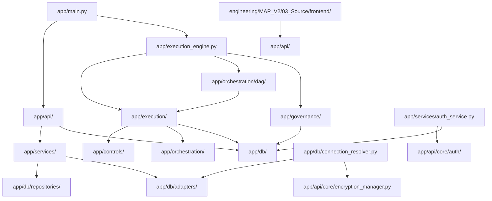

# 14. Directory Architecture

## Overview

Repository organisation with folder responsibilities and inter-folder dependencies.

---

## 1. Repository Tree

```
fs-migration-validation-engine/
├── .github/
│   └── workflows/
│       └── ci.yml                          # GitHub Actions CI/CD pipeline
├── app/                                    # Backend Python application
│   ├── api/                                # FastAPI layer
│   │   ├── core/                           # Core configurations
│   │   │   ├── auth/                       # JWT, RBAC, dependencies
│   │   │   ├── middleware/                 # Audit, tenant middleware
│   │   │   ├── security/                  # Encryption manager
│   │   │   ├── app_config.py              # YAML config loader
│   │   │   ├── config.py                  # Env variable loader
│   │   │   └── encryption_manager.py      # Fernet encryption
│   │   ├── models/                        # Pydantic response models
│   │   ├── routes/                        # API route handlers
│   │   ├── helpers.py                     # Route helper functions
│   │   └── main.py                        # FastAPI app factory
│   ├── controls/                          # Control implementations
│   │   ├── base_control.py                # Abstract base control
│   │   └── rule_adapter_control.py        # Rule adapter control
│   ├── db/                                # Database layer
│   │   ├── adapters/                      # Multi-database adapters
│   │   ├── repositories/                  # Data access objects
│   │   ├── connection.py                  # DB connection helper
│   │   ├── connection_factory.py          # Adapter factory
│   │   ├── connection_resolver.py         # Dynamic connection builder
│   │   ├── connection_validator.py        # Connection health check
│   │   ├── safe_sql.py                    # SQL safety utilities
│   │   └── sql/                           # SQL query files
│   ├── discovery/                         # Auto rule discovery
│   ├── execution/                         # Control execution
│   │   ├── control_executor.py            # Control execution logic
│   │   ├── control_registry.py            # Control registration
│   │   ├── execution_context.py           # Execution context
│   │   └── execution_result.py            # Result data class
│   ├── governance/                        # Governance decision engine
│   │   ├── decision_engine.py             # Governance decisions
│   │   └── risk_scoring.py                # Risk scoring
│   ├── intelligence/                      # Intelligence services
│   ├── mapping_engine/                    # Mapping resolution
│   ├── orchestration/                     # Orchestration layer
│   │   ├── dag/                           # DAG execution
│   │   ├── execution/                     # Rule execution
│   │   ├── observability/                 # Execution tracing
│   │   └── retry/                         # Retry management
│   ├── prompt/                            # Prompt engineering
│   ├── rules/                             # Rule implementations
│   ├── schemas/                           # Pydantic schemas
│   ├── scripts/                           # Utility scripts
│   ├── security/                          # Crypto utilities
│   ├── services/                          # Business logic layer
│   ├── utils/                             # Shared utilities
│   ├── config_loader.py                   # YAML config parser
│   ├── db_connector.py                    # psycopg2 connection
│   ├── execution_engine.py                # Main execution engine
│   ├── main.py                            # CLI entry point
│   ├── parameter_injector.py              # Parameter injection
│   ├── rule_executor.py                   # Rule execution
│   ├── rule_factory.py                    # Rule factory
│   ├── scoring_engine.py                  # Scoring engine
│   └── audit_export.py                    # Audit export
├── dashboard/                             # SQL dashboard queries
│   └── Execution Dashboard Query/
├── deploy/
│   └── azure/
│       └── main.tf                        # Azure Terraform template
├── docker/
│   └── docker-compose.yml                 # Docker Compose config
├── engineering/                           # Architecture documentation
│   ├── MAP_V1/
│   └── MAP_V2/
│       ├── 00_Architecture/
│       ├── 01_Prompts/
│       ├── 02_Output/                     # Generated documents
│       ├── 03_Source/
│       │   └── frontend/                  # React frontend source
│       ├── 04_Testing/
│       ├── 05_Releases/
│       ├── 06_Design_System/
│       ├── 07_Documentation/
│       ├── 08_Scripts/
│       └── 09_Tools/
├── MAP_V2/                                # Alternate MAP_V2 location
├── exports/                               # Runtime log output
├── old_dbs/                               # Legacy database dumps
├── Reports/                               # Generated HTML reports
├── research/                              # Research documents
├── scripts/                               # Standalone scripts
├── sql/                                   # SQL scripts
├── tests/                                 # Test files
├── .env.example                           # Environment template
├── .flake8                                # Flake8 config
├── config.yaml                            # Main application config
├── Dockerfile                             # Docker build file
├── packages.txt                           # System packages
├── requirements.txt                       # Python dependencies
└── README.md                              # Project readme
```

---

## 2. Folder Responsibilities

### `app/` — Backend Application
| Subfolder | Responsibility |
|-----------|---------------|
| `app/api/` | FastAPI routes, middleware, models, auth |
| `app/api/core/` | JWT config, RBAC, middleware, encryption |
| `app/api/routes/` | HTTP endpoint handlers (12 route modules) |
| `app/controls/` | Control implementations (base class + adapters) |
| `app/db/` | Database adapters, repositories, connections |
| `app/db/adapters/` | 7 database-specific adapter implementations |
| `app/db/repositories/` | Data access objects (credential, system) |
| `app/execution/` | Control executor, context, result types |
| `app/governance/` | Decision engine, risk scoring |
| `app/orchestration/` | DAG execution, retry, observability |
| `app/services/` | Business logic (18 service modules) |
| `app/utils/` | Logger, sanitizer, encryption utilities |
| `app/security/` | Fernet crypto manager |

### `engineering/` — Documentation & Frontend
| Subfolder | Responsibility |
|-----------|---------------|
| `engineering/MAP_V2/03_Source/frontend/` | React frontend source code |
| `engineering/MAP_V2/02_Output/` | Generated architecture documents |

### `deploy/` — Infrastructure
| Subfolder | Responsibility |
|-----------|---------------|
| `deploy/azure/` | Azure Terraform template |

### `docker/` — Containerization
| Subfolder | Responsibility |
|-----------|---------------|
| `docker/` | Docker Compose configuration |

---

## 3. Dependencies Between Folders



### Key Dependency Relationships
1. **Routes → Services**: `app/api/routes/` depends on `app/services/` for business logic
2. **Services → Repositories**: `app/services/` depends on `app/db/repositories/` for data access
3. **Services → Adapters**: `app/services/` depends on `app/db/adapters/` for database connections
4. **Execution → Controls**: `app/execution/` depends on `app/controls/` for control implementations
5. **Execution → Orchestration**: `app/execution/` depends on `app/orchestration/` for DAG and retry
6. **Engine → All**: `app/execution_engine.py` orchestrates execution, governance, and orchestration
7. **Auth → Config**: `app/services/auth_service.py` depends on `app/api/core/auth/jwt_config.py`
8. **Connection Resolver → Encryption**: `app/db/connection_resolver.py` depends on `app/api/core/encryption_manager.py`
