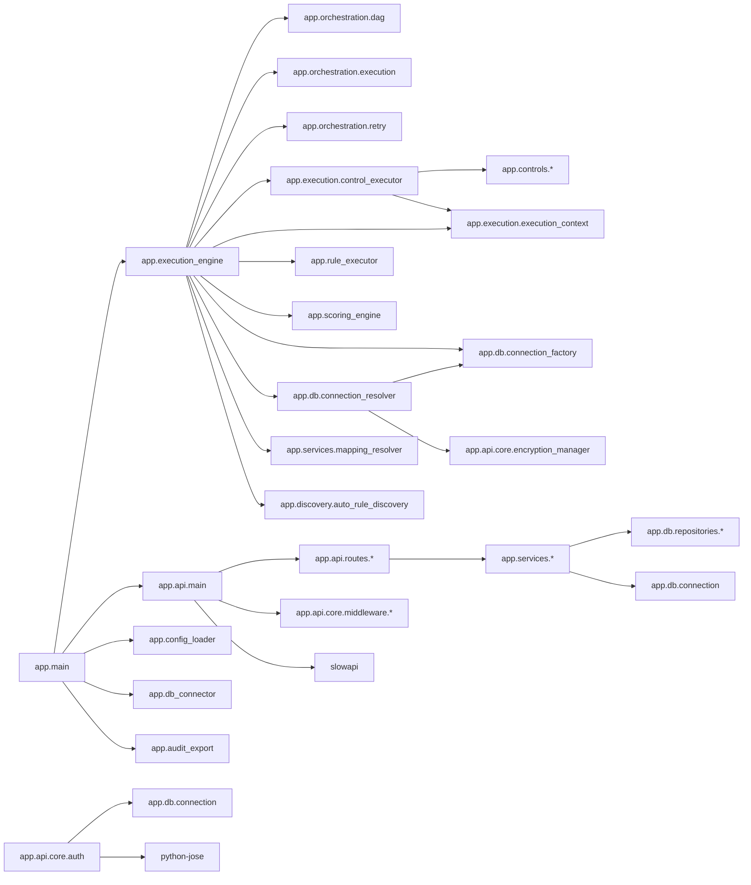
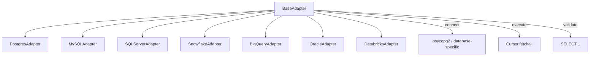
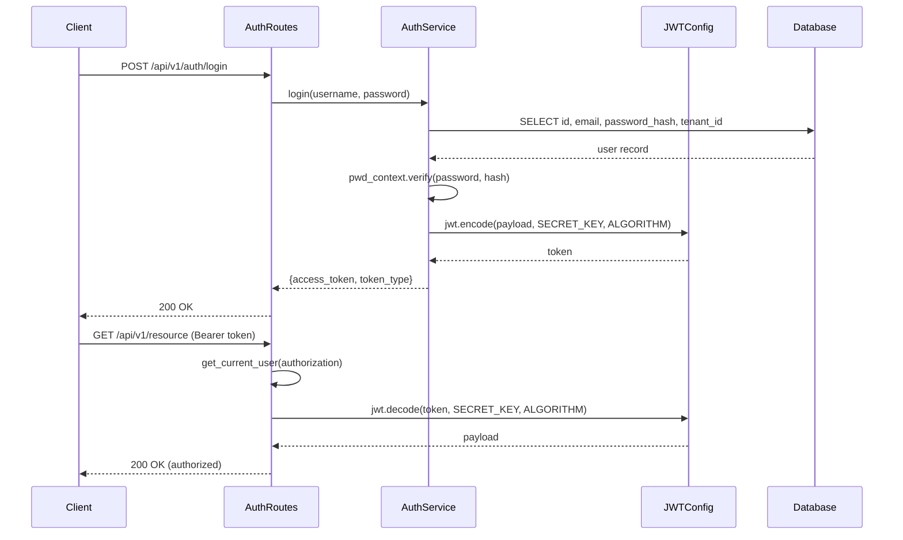

# 15. Dependencies Architecture

## Overview

Module, service, and package dependency graphs for the MAP Nexus platform.

---

## 1. Module Dependency Graph (Python Packages)



---

## 2. Service Dependency Graph (Services → Repositories → Adapters)

```mermaid
graph TD
    subgraph "API Routes"
        AR1[auth_routes]
        AR2[credential_routes]
        AR3[system_routes]
        AR4[execution_routes]
        AR5[user_routes]
        AR6[role_routes]
        AR7[workflow_routes]
        AR8[task_routes]
        AR9[approval_routes]
        AR10[calendar_routes]
        AR11[notification_routes]
        AR12[settings_routes]
    end

    subgraph "Services"
        S1[auth_service]
        S2[credential_service]
        S3[system_service]
        S4[execution_service]
        S5[user_service]
        S6[role_service]
        S7[workflow_service]
        S8[task_service]
        S9[approval_service]
        S10[calendar_service]
        S11[notification_service]
        S12[settings_service]
        S13[dataset_discovery_service]
        S14[mapping_resolver]
        S15[mapping_validator]
        S16[metadata_intelligence_service]
        S17[audit_pack_service]
    end

    subgraph "Repositories"
        R1[credential_repository]
        R2[system_repository]
    end

    subgraph "Adapters"
        AD1[base_adapter]
        AD2[postgres_adapter]
        AD3[mysql_adapter]
        AD4[sqlserver_adapter]
        AD5[snowflake_adapter]
        AD6[bigquery_adapter]
        AD7[oracle_adapter]
        AD8[databricks_adapter]
    end

    subgraph "Connection Layer"
        CF[connection_factory]
        CR[connection_resolver]
        CV[connection_validator]
    end

    AR1 --> S1
    AR2 --> S2
    AR3 --> S3
    AR4 --> S4
    AR5 --> S5
    AR6 --> S6
    AR7 --> S7
    AR8 --> S8
    AR9 --> S9
    AR10 --> S10
    AR11 --> S11
    AR12 --> S12

    S2 --> R1
    S3 --> R2
    S13 --> CF
    S14 --> CR
    S15 --> CF

    CR --> CF
    CR --> AD1
    CF --> AD2
    CF --> AD3
    CF --> AD4
    CF --> AD5
    CF --> AD6
    CF --> AD7
    CF --> AD8
    AD2 --> AD1
    AD3 --> AD1
    AD4 --> AD1
    AD5 --> AD1
    AD6 --> AD1
    AD7 --> AD1
    AD8 --> AD1
```



---

## 3. Package Dependency Graph (requirements.txt)

```mermaid
graph TD
    subgraph "Python Packages (requirements.txt)"
        PQ1[psycopg2-binary]
        PQ2[PyYAML]
        PQ3[python-dotenv]
        PQ4[pytest]
        PQ5[pandas]
        PQ6[reportlab]
        PQ7[fastapi]
        PQ8[uvicorn]
        PQ9[python-jose cryptography]
        PQ10[python-multipart]
    end

    subgraph "Implicit Dependencies (imported in code)"
        ID1[passlib]
        ID2[cryptography]
        ID3[slowapi]
    end

    subgraph "Usage"
        U1[app/db_connector.py]
        U2[app/config_loader.py]
        U3[app/api/main.py]
        U4[app/services/auth_service.py]
        U5[app/security/crypto.py]
        U6[app/utils/encryption_utils.py]
        U7[app/api/routes/auth_routes.py]
    end

    PQ1 --> U1
    PQ2 --> U2
    PQ3 --> U2
    PQ7 --> U3
    PQ8 --> U3
    PQ9 --> U4
    PQ10 --> U3
    ID1 --> U4
    ID2 --> U5
    ID2 --> U6
    ID3 --> U7
```



---

## 4. Frontend Package Dependency Graph

```mermaid
graph TD
    subgraph "Core Dependencies"
        FD1[react 19.2.7]
        FD2[react-dom 19.2.7]
        FD3[react-router-dom 7.18.1]
        FD4[@tanstack/react-query 5.101.2]
        FD5[axios 1.18.1]
    end

    subgraph "UI Components"
        UC1[ag-grid-community 36.0.0]
        UC2[ag-grid-react 36.0.0]
        UC3[recharts 3.9.2]
        UC4[react-hook-form 7.81.0]
        UC5[react-toastify 11.1.0]
        UC6[lucide-react 1.23.0]
    end

    subgraph "Validation"
        V1[zod 4.4.3]
    end

    subgraph "Build Tools"
        BT1[vite 8.1.1]
        BT2[typescript ~6.0.2]
        BT3[tailwindcss 4.3.2]
        BT4[oxlint 1.71.0]
    end

    FD1 --> FD2
    FD1 --> FD3
    FD1 --> FD4
    FD4 --> FD5
    FD1 --> UC1
    FD1 --> UC2
    FD1 --> UC3
    FD1 --> UC4
    FD1 --> UC5
    FD1 --> UC6
    UC4 --> V1
    BT1 --> BT2
    BT1 --> BT3
    BT1 --> BT4
```

---

## 5. Database Adapter Hierarchy



---

## 6. Authentication Flow Dependencies


