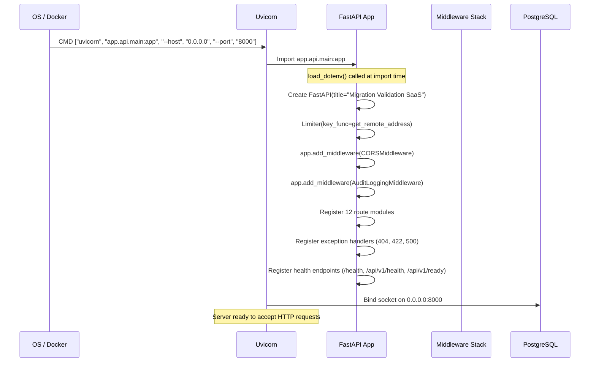

# 02 — Runtime Implementation

## Application Startup

The FastAPI application is started via uvicorn using the ASGI entry point:

```
uvicorn app.api.main:app --host 0.0.0.0 --port 8000
```

This is defined in `Dockerfile:37` as the default `CMD`. The ASGI application object is created in `app/api/main.py:33`:

```python
app = FastAPI(title="Migration Validation SaaS")
```

The CLI entry point (`app/main.py:37-73`) provides three subcommands via `argparse`:
- `run` — executes the validation engine with a config file
- `discover` — runs dataset discovery
- `export` — exports audit packs for a batch

## Process Lifecycle



## Runtime Flow

### Middleware Stack (order of execution)

1. **Rate Limiting** — `slowapi.Limiter` with `get_remote_address` key (`app/api/main.py:31`)
2. **CORS** — allows origins `http://localhost:5173` and `http://localhost:3000` (`app/api/main.py:41-47`)
3. **Audit Logging** — `AuditLoggingMiddleware` decodes JWT Bearer token and logs method, path, user, status, duration (`app/api/core/middleware/audit_middleware.py:9-33`)
4. **Request Timing** — Adds `X-Response-Time` header to every response (`app/api/main.py:60-66`)

### Exception Handlers

| Handler | Status | Source |
|---------|--------|--------|
| Global unhandled | 500 | `app/api/main.py:72-82` |
| Not found | 404 | `app/api/main.py:85-93` |
| Validation error | 422 | `app/api/main.py:96-105` |
| Rate limit exceeded | 429 | `slowapi` built-in |

## Execution Sequence (Engine CLI)

When `python app/main.py run --config config.yaml` is invoked, the following sequence occurs (`app/main.py:16-22`):

1. `load_config(config_path)` — parses YAML with env var expansion (`app/config_loader.py:6-25`)
2. `ExecutionEngine(config, batch_id)` — constructs engine with batch UUID
3. `engine.run()` — executes the 6-step pipeline

### Execution Engine Pipeline (`app/execution_engine.py:68-488`)

| Step | Name | Description |
|------|------|-------------|
| STEP 01/06 | Connection Resolution | Resolves SOURCE/TARGET database adapters via `ConnectionResolver` |
| STEP 02/06 | Dataset Mapping | Resolves valid source→target mapping pairs via `MappingResolver` |
| STEP 03/06 | Rule Discovery | Auto-generates rules via `AutoRuleDiscovery` |
| STEP 04/06 | Control Discovery | Loads controls from `engine.control_registry`, applies config.yaml filter |
| STEP 05/06 | Control Execution | DAG-based parallel execution via `ThreadPoolExecutor` |
| STEP 06/06 | Governance Decision | Evaluates blocking rules and writes governance status |

## Background Workers

### ThreadPoolExecutor

The engine uses `concurrent.futures.ThreadPoolExecutor` with `max_workers=4` for parallel control execution (`app/execution_engine.py:70,368`):

```python
MAX_WORKERS = 4
# ...
with ThreadPoolExecutor(max_workers=MAX_WORKERS) as executor_pool:
```

### DAG Scheduling

Controls are executed respecting dependency constraints defined in `config.yaml`:

```yaml
control_dependencies:
  C02:
    - C01
  C09:
    - C03
```

The engine builds a dependency graph, validates it with `_validate_dependencies()` and `_detect_cycles()`, then schedules ready controls into a `deque` ready queue (`app/execution_engine.py:325-345`).

### Retry Logic

Each control execution supports configurable retries via `_execute_control_with_retry()` (`app/execution_engine.py:1046-1091`):
- `max_retries` from `config.yaml` → `retry_policy.max_retries` (default: 0)
- `retry_delay_seconds` from `config.yaml` → `retry_policy.delay_seconds` (default: 0)

## Async Execution

The FastAPI application runs in async mode via uvicorn's ASGI event loop. Middleware hooks (`AuditLoggingMiddleware.dispatch`, `add_timing_header`) are `async def`. However, the `ExecutionEngine` runs synchronously in a background thread or CLI process — it is not integrated into the ASGI async loop.

## Health Check Endpoints

| Endpoint | Rate Limited | Description | Source |
|----------|-------------|-------------|--------|
| `GET /health` | No | Basic health | `app/api/main.py:111-114` |
| `GET /api/v1/health` | No | API health | `app/api/main.py:117-120` |
| `GET /api/v1/ready` | No | Readiness with DB check | `app/api/main.py:123-140` |

The readiness probe executes `SELECT 1` against the engine database to confirm connectivity.
