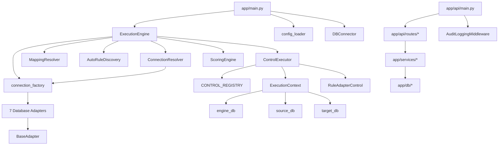

# 08 — Backend Implementation

## Package Structure

```
app/
  api/
    main.py                    # FastAPI application entry point
    routes/                    # API route modules (12 routers)
    core/
      app_config.py            # Config loader singleton
      config.py                # Core configuration
      encryption_manager.py    # Fernet encryption
      auth/                    # JWT auth, RBAC, dependencies
      middleware/               # AuditMiddleware, TenantMiddleware
      security/                # Encryption utilities
  db/
    connection.py              # get_db_connection()
    connection_factory.py      # connection_factory() — adapter dispatch
    connection_resolver.py     # ConnectionResolver — resolves SOURCE/TARGET adapters
    connection_validator.py    # Connection validation
    safe_sql.py                # Safe SQL utilities
    adapters/                  # 7 database adapters
    repositories/              # Data access layer
  execution/
    control_executor.py        # ControlExecutor — executes individual controls
    control_registry.py        # CONTROL_REGISTRY dict
    execution_context.py       # ExecutionContext data class
    execution_result.py        # ExecutionResult data class
  orchestration/
    dag/                       # DAG validation and scheduling
    execution/                 # Rule isolation, control execution
    observability/             # Execution trace
    retry/                     # Rule retry manager
  discovery/
    auto_rule_discovery.py     # AutoRuleDiscovery
  services/                    # 17 service modules
  execution_engine.py          # ExecutionEngine — main orchestrator
  config_loader.py             # YAML config parser with env expansion
  rule_executor.py             # RuleExecutor
  scoring_engine.py            # ScoringEngine
  audit_export.py              # AuditExporter
  db_connector.py              # DBConnector
```

## Services (17 files)

| Service | File | Purpose |
|---------|------|---------|
| `AuthService` | `app/services/auth_service.py` | Authentication logic |
| `ApprovalService` | `app/services/approval_service.py` | Approval workflow management |
| `AuditPackService` | `app/services/audit_pack_service.py` | Audit pack generation |
| `CalendarService` | `app/services/calendar_service.py` | Calendar event management |
| `CredentialService` | `app/services/credential_service.py` | Credential CRUD |
| `DatasetDiscoveryService` | `app/services/dataset_discovery_service.py` | Auto-discover datasets |
| `ExecutionService` | `app/services/execution_service.py` | Execution orchestration |
| `MappingResolver` | `app/services/mapping_resolver.py` | Resolve source-target mappings |
| `MappingValidator` | `app/services/mapping_validator.py` | Validate mappings |
| `MetadataIntelligenceService` | `app/services/metadata_intelligence_service.py` | Metadata analysis |
| `NotificationService` | `app/services/notification_service.py` | Notification delivery |
| `RoleService` | `app/services/role_service.py` | Role management |
| `SettingsService` | `app/services/settings_service.py` | System settings |
| `SystemService` | `app/services/system_service.py` | System registry |
| `TaskService` | `app/services/task_service.py` | Task management |
| `UserService` | `app/services/user_service.py` | User management |
| `WorkflowService` | `app/services/workflow_service.py` | Workflow management |

## Repositories

| Repository | File | Purpose |
|-----------|------|---------|
| `SystemRepository` | `app/db/repositories/system_repository.py` | System registry data access |
| `CredentialRepository` | `app/db/repositories/credential_repository.py` | Credential data access |

## Adapters (7 database adapters)

All adapters extend `BaseAdapter` (`app/db/adapters/base_adapter.py`) which provides:
- `connect()` with retry logic (default 3 retries, 2s delay)
- `execute(query, params)` with cursor management
- `validate_connection()` via `SELECT 1`
- `close()` connection cleanup

| Adapter | File | DB Type |
|---------|------|---------|
| `PostgresAdapter` | `app/db/adapters/postgres_adapter.py` | `postgres` |
| `MySQLAdapter` | `app/db/adapters/mysql_adapter.py` | `mysql` |
| `SQLServerAdapter` | `app/db/adapters/sqlserver_adapter.py` | `sqlserver` |
| `SnowflakeAdapter` | `app/db/adapters/snowflake_adapter.py` | `snowflake` |
| `BigQueryAdapter` | `app/db/adapters/bigquery_adapter.py` | `bigquery` |
| `OracleAdapter` | `app/db/adapters/oracle_adapter.py` | `oracle` |
| `DatabricksAdapter` | `app/db/adapters/odatabricks_adapter.py` | `databricks` |

## Dependency Injection

The application uses manual dependency injection via the `ExecutionContext` class (`app/execution/execution_context.py`):

```python
class ExecutionContext:
    def __init__(self, batch_id, project_id, engine_db, source_db, target_db,
                 config, source_connections=None, target_connections=None):
```

This context is passed to `ControlExecutor` (`app/execution/control_executor.py:13`):

```python
class ControlExecutor:
    def __init__(self, context):
        self.context = context
```

The FastAPI dependency injection system uses `app/api/core/auth/dependencies.py` for JWT authentication.

## Factories

### connection_factory

File: `app/db/connection_factory.py`

```python
def connection_factory(config):
    db_type = config.get("type") or config.get("database_type")
    # Dispatches to appropriate adapter based on type string
    if db_type == "postgres": return PostgresAdapter(config)
    elif db_type == "mysql": return MySQLAdapter(config)
    elif db_type == "sqlserver": return SQLServerAdapter(config)
    elif db_type == "snowflake": return SnowflakeAdapter(config)
    elif db_type == "bigquery": return BigQueryAdapter(config)
    elif db_type == "oracle": return OracleAdapter(config)
    elif db_type == "databricks": return DatabricksAdapter(config)
```

Called from `ConnectionResolver._build_adapter()` (`app/db/connection_resolver.py:209-267`) and `ExecutionEngine.__init__()` (`app/execution_engine.py:41`).

### rule_factory

No standalone `rule_factory.py` file exists. Rule creation is handled by `AutoRuleDiscovery` (`app/discovery/auto_rule_discovery.py`) which generates rules and inserts them into `engine.rule_registry`.

## Registries

### CONTROL_REGISTRY

File: `app/execution/control_registry.py`

```python
CONTROL_REGISTRY = {}
```

Currently empty — all controls fall back to `RuleAdapterControl` (`app/execution/control_executor.py:30-31`):

```python
control_class = CONTROL_REGISTRY.get(control_id)
if not control_class:
    from app.controls.rule_adapter_control import RuleAdapterControl
    control_class = RuleAdapterControl
```

### Rule Registry (database)

Stored in `engine.rule_registry` table (`sql/schema/01_engine_schema.sql:19-27`):

```sql
CREATE TABLE engine.rule_registry (
    rule_id VARCHAR(50) PRIMARY KEY,
    control_id VARCHAR(10) REFERENCES engine.control_registry(control_id),
    rule_name TEXT NOT NULL,
    sql_template_file TEXT NOT NULL,
    severity_level VARCHAR(20),
    enabled_flag BOOLEAN DEFAULT TRUE
);
```

### Control Registry (database)

Stored in `engine.control_registry` table (`sql/schema/01_engine_schema.sql:6-13`):

```sql
CREATE TABLE engine.control_registry (
    control_id VARCHAR(10) PRIMARY KEY,
    control_name TEXT NOT NULL,
    description TEXT,
    severity_level VARCHAR(20),
    enabled_flag BOOLEAN DEFAULT TRUE
);
```

## Route Modules (12 routers)

Registered in `app/api/main.py:146-158`:

| Router | File | Module |
|--------|------|--------|
| `auth_routes` | `app/api/routes/auth_routes.py` | Authentication |
| `credential_routes` | `app/api/routes/credential_routes.py` | Credential management |
| `system_routes` | `app/api/routes/system_routes.py` | System registry |
| `execution_routes` | `app/api/routes/execution_routes.py` | Execution control |
| `user_routes` | `app/api/routes/user_routes.py` | User management |
| `role_routes` | `app/api/routes/role_routes.py` | Role management |
| `workflow_routes` | `app/api/routes/workflow_routes.py` | Workflow management |
| `task_routes` | `app/api/routes/task_routes.py` | Task management |
| `approval_routes` | `app/api/routes/approval_routes.py` | Approval management |
| `calendar_routes` | `app/api/routes/calendar_routes.py` | Calendar management |
| `notification_routes` | `app/api/routes/notification_routes.py` | Notification management |
| `settings_routes` | `app/api/routes/settings_routes.py` | Settings management |

## Package Dependency Diagram


