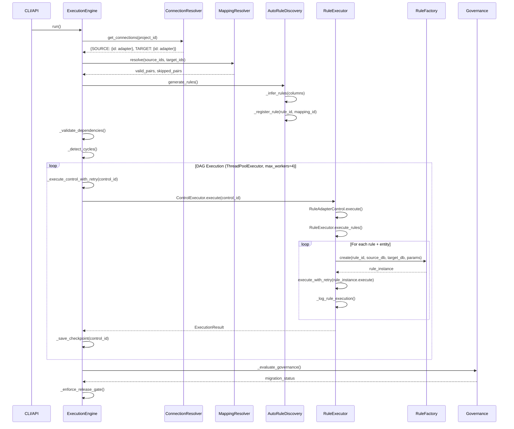
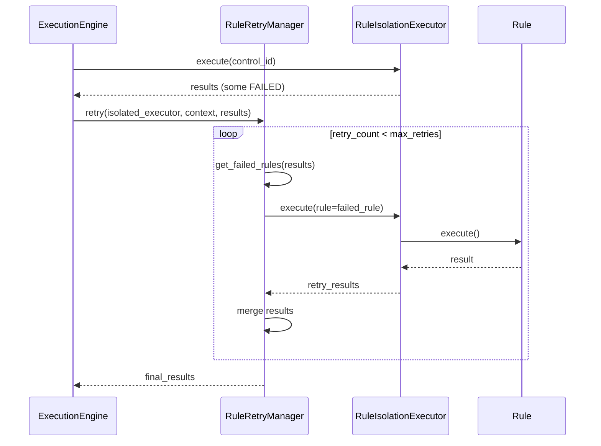
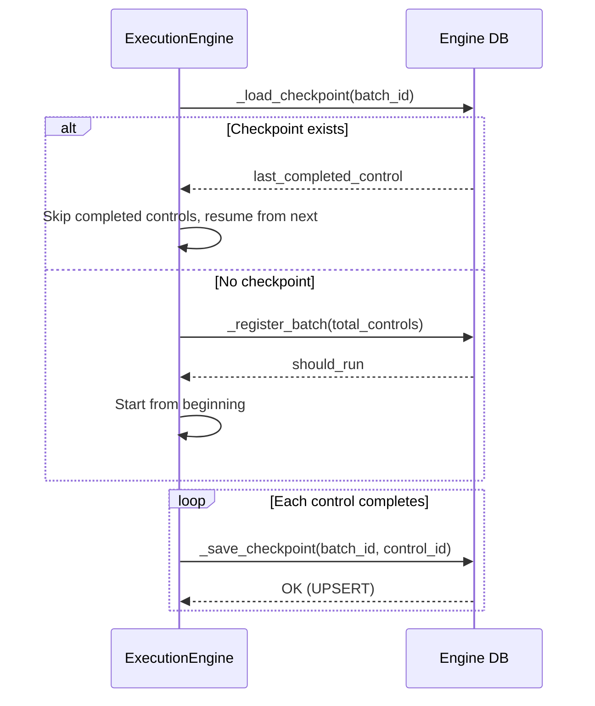

# Document 10: Execution & Implementation Pipeline

## Overview

The execution pipeline is a 6-step DAG-based batch processor that orchestrates migration validation controls across multiple source-target database pairs. Entry points include CLI (`app/main.py`), API (`app/api/routes/execution_routes.py`), and service layer (`app/services/execution_service.py`).

---

## Execution Pipeline Components

### 1. Batch Execution — `app/execution_engine.py`

The `ExecutionEngine` class is the top-level orchestrator. It manages the complete batch lifecycle:

| Responsibility | Implementation |
|---|---|
| Batch ID generation | `uuid.uuid4()` auto-generated or externally provided |
| Connection resolution | `ConnectionResolver` (line 85) |
| Dataset mapping | `MappingResolver` (line 119) |
| Rule discovery | `AutoRuleDiscovery` (line 196) |
| Control discovery | `_get_controls()` queries `engine.control_registry` (line 812) |
| DAG validation | `_validate_dependencies()`, `_detect_cycles()` (lines 992–1035) |
| Parallel execution | `ThreadPoolExecutor(max_workers=4)` (line 368) |
| Checkpoint persistence | `_save_checkpoint()` / `_load_checkpoint()` (lines 884–913) |
| Governance evaluation | `_evaluate_governance()` (line 841) |
| Release gate enforcement | `_enforce_release_gate()` (line 736) |

**Entry point**: `ExecutionEngine.run()` at `app/execution_engine.py:68`

### 2. Rule Execution — `app/rule_executor.py`

The `RuleExecutor` class handles rule-level execution within a control:

- Fetches rules from `engine.rule_registry` via `_get_rules()` (line 177)
- Resolves entity mappings via `_get_rule_entities()` (line 192) joining `core.dataset_mappings` and `core.rule_dataset_mapping`
- Uses `RuleFactory.create()` to instantiate rule classes (line 96)
- Executes rules with retry protection via `execute_with_retry()` (line 461)
- Logs results to `engine.migration_control_execution` with slow-flag profiling (line 365)
- Tracks pass/fail/error counts per control

**MAX_RETRIES**: 2 (defined at module level, line 8)

### 3. Control Execution — `app/controls/`

| File | Class | Purpose |
|---|---|---|
| `app/controls/base_control.py` | `BaseControl` | Abstract base with `execute()`, `safe_query()`, `success()`, `fail()` |
| `app/controls/rule_adapter_control.py` | `RuleAdapterControl` | Bridges control layer to `RuleExecutor`; default for all controls |

The control registry at `app/execution/control_registry.py` is currently empty (`CONTROL_REGISTRY = {}`), meaning all controls fall back to `RuleAdapterControl`.

### 4. Orchestration — `app/orchestration/`

```
app/orchestration/
├── dag/
│   ├── dag_validator.py       (empty — logic in execution_engine.py)
│   └── dag_scheduler.py       (empty — logic in execution_engine.py)
├── execution/
│   ├── control_executor.py    (empty — logic in execution_engine.py)
│   └── rule_isolation.py
├── observability/
│   └── execution_trace.py     (empty — logic in execution_engine.py)
└── retry/
    └── rule_retry_manager.py
```

DAG execution is implemented inline in `ExecutionEngine.run()` using:
- Dependency graph built from `config.yaml` `control_dependencies` (line 325)
- `ready_queue` (deque) for topological scheduling (line 343)
- `dependency_count` dict for tracking unsatisfied dependencies (line 335)
- Deadlock detection when `ready_queue` is empty but futures remain (line 390)

### 5. Retry Mechanism — `RuleRetryManager`

**File**: `app/orchestration/retry/rule_retry_manager.py`

```python
class RuleRetryManager:
    def __init__(self, max_retries=1):
        self.max_retries = max_retries
```

- Retries only failed rules (not successful ones)
- Merges retry results, replacing old failed entries
- Additionally, `RuleExecutor.execute_with_retry()` provides rule-level retry with `MAX_RETRIES=2` and 1-second delay between attempts (`app/rule_executor.py:461`)
- `ExecutionEngine._execute_control_with_retry()` provides control-level retry using `retry_policy.max_retries` from config (`app/execution_engine.py:1046`)

### 6. Checkpoint — `batch_execution_checkpoint` Table

**Persisted via** `ExecutionEngine._save_checkpoint()` at `app/execution_engine.py:884`:

```sql
INSERT INTO engine.batch_execution_checkpoint
(batch_id, last_completed_control)
VALUES (%s,%s)
ON CONFLICT (batch_id)
DO UPDATE SET
    last_completed_control = EXCLUDED.last_completed_control,
    updated_at = NOW()
```

**Loaded via** `_load_checkpoint()` at line 901 — enables batch resume on failure or restart.

### 7. Governance — `app/governance/`

| File | Function | Purpose |
|---|---|---|
| `app/governance/risk_scoring.py` | `calculate_migration_risk()` | Computes risk_score = ((failures + errors) / total) * 100; inserts into `engine.migration_risk_scores` |
| `app/governance/decision_engine.py` | `record_decision()` | Records per-entity governance decisions to `engine.migration_control_decisions` |

Governance is triggered via `ExecutionEngine._evaluate_governance()` (line 841) which calls `engine.run_governance_intelligence()` PostgreSQL function (line 717).

---

## Sequence Diagram — Full Execution Pipeline



## Sequence Diagram — Retry Flow



## Sequence Diagram — Checkpoint Resume



---

## Batch Status Lifecycle

```
NOT_STARTED → RUNNING → COMPLETED
                     → FAILED
                     → NO_EXECUTION_SCOPE
```

## Control Status Values

| Status | Meaning |
|---|---|
| `PASS` | All rules passed |
| `FAIL` | One or more non-critical rules failed |
| `BLOCKED` | A CRITICAL severity rule failed |
| `ERROR` | Unhandled exception during execution |

## Configuration References

- `config.yaml` → `control_dependencies`: defines DAG edges (e.g., C02 depends on C01)
- `config.yaml` → `retry_policy.max_retries`: controls retry count
- `config.yaml` → `engine.control_timeout_seconds`: timeout per control (default 300)
- `config.yaml` → `release_gate`: enforcement mode, minimum score, block statuses
