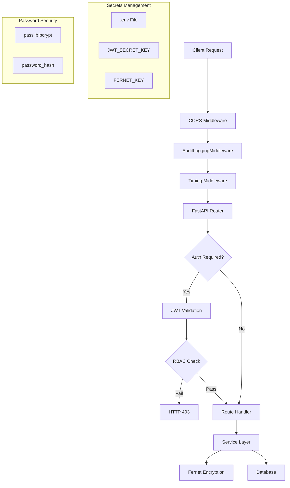

# Document 11: Security Implementation

## Overview

Security is implemented across JWT authentication, bcrypt password hashing, RBAC authorization, Fernet encryption, audit middleware, CORS configuration, and secrets management. All components reference actual repository files.

---

## 1. JWT Authentication

### Token Creation & Decoding

**File**: `app/api/core/auth/jwt_handler.py`

```python
def create_token(data: dict, expires_minutes: int = 60):
    payload = data.copy()
    payload["exp"] = datetime.datetime.utcnow() + datetime.timedelta(minutes=expires_minutes)
    return jwt.encode(payload, SECRET_KEY, algorithm=ALGORITHM)

def decode_token(token: str):
    return jwt.decode(token, SECRET_KEY, algorithms=[ALGORITHM])
```

### JWT Configuration

**File**: `app/api/core/auth/jwt_config.py`

- **Algorithm**: `HS256` (line 16)
- **SECRET_KEY**: loaded from environment variable `JWT_SECRET_KEY` via `get_secret()` (line 15)
- **Environment loading**: `.env` file loaded from project root via `dotenv` (line 7)

### Token Payload (Actual)

**File**: `app/services/auth_service.py:41-45`

```python
payload = {
    "sub": str(user_id),
    "user": email,
    "tenant_id": str(tenant_id) if tenant_id else None,
    "exp": datetime.utcnow() + timedelta(hours=2)
}
```

**Expiry**: 2 hours (hardcoded in `auth_service.py:45`)

### Token Dependencies

**File**: `app/api/core/auth/dependencies.py`

| Function | Purpose |
|---|---|
| `get_current_user()` | Extracts user from Bearer token, raises 401 on missing/invalid |
| `get_current_user_with_tenant()` | Same + requires `tenant_id` in payload, raises 403 if absent |

---

## 2. Authentication — Password Hashing

**File**: `app/services/auth_service.py`

```python
from passlib.context import CryptContext
pwd_context = CryptContext(schemes=["bcrypt"], deprecated="auto")
```

- **Password verification**: `pwd_context.verify(password, password_hash)` (line 31)
- **Password hashing**: `pwd_context.hash(password)` via `get_password_hash()` (line 55)
- **Failed login tracking**: `failed_login_attempts = 0` on successful login (line 37)
- **Account status check**: `status != "active"` raises exception (line 28)

---

## 3. RBAC — Role-Based Access Control

**File**: `app/api/core/auth/rbac.py`

### Permission Format

Permissions use `resource:action` format, validated at line 29:

```python
parts = perm.split(":")
if len(parts) == 2:
    resource, action = parts
```

### Two Decorator Functions

| Decorator | Database Query | Purpose |
|---|---|---|
| `require_permissions(*required)` | Joins `platform.user_roles` → `platform.roles` → `platform.role_permissions` → `platform.permissions` | Checks specific `resource:action` pairs |
| `require_role(*role_names)` | Joins `platform.user_roles` → `platform.roles` | Checks role membership |

### Wildcard Support

```python
if (resource, action) not in user_permissions and ("*", "*") not in user_permissions:
```

### Token Extraction in RBAC

```python
user_id = current_user.get("sub")
```

---

## 4. Middleware — Audit Logging

**File**: `app/api/core/middleware/audit_middleware.py`

```python
class AuditLoggingMiddleware(BaseHTTPMiddleware):
    async def dispatch(self, request: Request, call_next):
```

- Extracts `user_id` from JWT in Authorization header (lines 14-22)
- Logs: method, path, user, status code, duration in ms (line 28-32)
- Format: `AUDIT | {method} {path} | user={user_id} | status={status_code} | duration={duration}ms`

### Middleware Registration

**File**: `app/api/main.py:53-54`

```python
from app.api.core.middleware.audit_middleware import AuditLoggingMiddleware
app.add_middleware(AuditLoggingMiddleware)
```

---

## 5. Fernet Encryption — 4 Implementations

### Implementation 1: `app/utils/encryption_utils.py`

Static utility class with `generate_key()`, `encrypt()`, `decrypt()` methods.

### Implementation 2: `app/security/crypto.py`

`CryptoManager` class — handles PostgreSQL BYTEA, memoryview, and base64 string inputs. Includes `decrypt_password()` convenience function.

### Implementation 3: `app/api/core/security/encryption.py`

`EncryptionManager` class — used by `CredentialService` for credential encryption/decryption. Reads `FERNET_KEY` from environment.

### Implementation 4: `app/api/core/encryption_manager.py`

`EncryptionManager` class — used by `ConnectionResolver._get_credentials()` for decrypting database connection passwords. Reads `FERNET_KEY` via `get_env()`.

### Encryption Key Source

**File**: `config.yaml:92-93`

```yaml
encryption_keys:
  env-key-1: "YOUR_FERNET_BASE64_KEY_HERE"
```

Credentials stored with `encryption_key_id = "env-key-1"` (`app/db/repositories/credential_repository.py:33`).

---

## 6. Audit Logging

### Middleware Layer

`AuditLoggingMiddleware` captures every HTTP request/response (see section 4).

### Custom AUDIT Log Level

**File**: `app/utils/logger.py:8-9`

```python
AUDIT_LEVEL = 25
logging.addLevelName(AUDIT_LEVEL, "AUDIT")
```

### Audit Log Handler

**File**: `app/utils/logger.py:148-155`

- Writes to `exports/audit.log`
- Filtered to level 25 (AUDIT) only
- Format: `%(asctime)s | %(levelname)s | %(message)s`

### Governance Audit Events

**File**: `app/execution_engine.py` — emits audit events for:
- `BATCH_STARTED` (line 73)
- `MAPPING_RESOLVED` (lines 146, 154)
- `GOVERNANCE_DECISION` (line 879)
- `CONNECTION_RESOLVED` (app/db/connection_resolver.py:247)

---

## 7. CORS Configuration

**File**: `app/api/main.py:41-47`

```python
app.add_middleware(
    CORSMiddleware,
    allow_origins=["http://localhost:5173", "http://localhost:3000"],
    allow_credentials=True,
    allow_methods=["*"],
    allow_headers=["*"],
)
```

| Setting | Value |
|---|---|
| Allowed Origins | `localhost:5173` (Vite dev), `localhost:3000` (React dev) |
| Credentials | `true` |
| Methods | All |
| Headers | All |

---

## 8. Secrets Management

### Environment Variables

**File**: `app/api/core/auth/jwt_config.py:6-7`

```python
env_path = Path(__file__).resolve().parents[4] / ".env"
load_dotenv(dotenv_path=env_path)
```

**File**: `app/api/core/config.py:9-10`

```python
BASE_DIR = Path(__file__).resolve().parent.parent.parent.parent
load_dotenv(BASE_DIR / ".env")
```

### Required Environment Variables

| Variable | Used By | Purpose |
|---|---|---|
| `JWT_SECRET_KEY` | `jwt_config.py` | JWT signing key |
| `FERNET_KEY` | `encryption.py`, `encryption_manager.py` | Credential encryption |
| `ENGINE_DB_PASS` | `config.yaml` | Engine database password |
| `SOURCE_DB_PASS` | `config.yaml` | Source database password |
| `TARGET_DB_PASS` | `config.yaml` | Target database password |

### Rate Limiting

**File**: `app/api/routes/auth_routes.py:17`

```python
@limiter.limit("5/minute")
```

Login endpoint limited to 5 requests per minute via `slowapi`.

---

## 9. Tenant Isolation Middleware

**File**: `app/api/core/middleware/tenant_middleware.py`

```python
async def tenant_middleware(request: Request, call_next):
    auth = request.headers.get("Authorization")
    if auth:
        token = auth.replace("Bearer ", "")
        payload = decode_token(token)
        request.state.tenant_id = payload.get("tenant_id")
```

Extracts `tenant_id` from JWT and attaches to request state.

---

## Security Architecture Diagram


