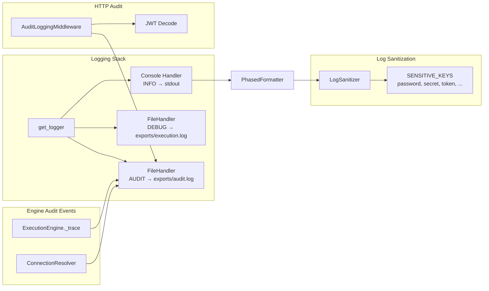

# Document 12: Logging, Audit & Monitoring Implementation

## Overview

Logging uses a custom Python logger with a bespoke AUDIT level (25), structured formatting, and log sanitization. Audit trails are captured via middleware and custom audit events. Health endpoints provide monitoring. Diagnostic logs are persisted to the filesystem.

---

## 1. Logging Framework — `app/utils/logger.py`

### Custom AUDIT Level

```python
AUDIT_LEVEL = 25
logging.addLevelName(AUDIT_LEVEL, "AUDIT")
```

Level 25 sits between `INFO` (20) and `WARNING` (30). All audit events are routed to a dedicated log file.

### Logger Configuration

**`get_logger(name)`** creates a logger with:

| Handler | Level | Target | Format |
|---|---|---|---|
| Console | `INFO` | `sys.stdout` | `%(asctime)s \| %(levelname)s \| %(name)s \| %(message)s` |
| Execution Log | `DEBUG` | `exports/execution.log` | Same as console |
| Audit Log | `AUDIT` (25) | `exports/audit.log` | `%(asctime)s \| %(levelname)s \| %(message)s` |

### IndentContext

Thread-local indentation control for phased execution logging:

```python
class IndentContext:
    _local = threading.local()
    @classmethod
    def set_indent(cls, level: int): ...
    @classmethod
    def increment(cls): ...
    @classmethod
    def decrement(cls): ...
```

Used by `ExecutionEngine` to indent sub-phase logs.

### PhasedFormatter

**File**: `app/utils/logger.py:79-117`

Custom formatter that:
1. Sanitizes messages via `LogSanitizer.sanitize_message()`
2. Detects progress-style messages (step headers, system listings, etc.)
3. Returns progress messages unformatted; other messages get standard prefix
4. Applies indentation when inside a phase

### ConsoleProgressFilter

**File**: `app/utils/logger.py:52-76`

Filters console output to show only:
- `WARNING` and above
- `AUDIT` level (25)
- Progress messages matching known patterns (e.g., `[STEP`, `Active Systems:`, `Running`, etc.)

### Audit Logger Access

```python
def get_audit_logger():
    return get_logger("audit")
```

Returns a logger instance specifically for audit events.

---

## 2. Log Sanitization — `app/utils/sanitizer.py`

### Sensitive Key Detection

```python
SENSITIVE_KEYS = {
    'password', 'pass', 'pwd', 'secret', 'key', 'token',
    'credential', 'fernet', 'authorization', 'api_key', 'api-key'
}
```

### Sanitization Methods

| Method | Input | Behavior |
|---|---|---|
| `sanitize(data)` | dict, list, or string | Recursively masks sensitive keys; regex-matches `key=value` patterns in strings |
| `sanitize_message(message)` | any | Converts to string, applies `sanitize()`, returns `[SANITIZATION_FAILED]` on error |

### Integration Point

Called automatically by `PhasedFormatter.format()` at `app/utils/logger.py:82`:
```python
record.msg = LogSanitizer.sanitize_message(record.msg)
```

---

## 3. Audit Implementation — Middleware Layer

**File**: `app/api/core/middleware/audit_middleware.py`

Every HTTP request is logged with:

```
AUDIT | {METHOD} {PATH} | user={user_id} | status={status_code} | duration={duration}ms
```

- `user_id` extracted from JWT Bearer token
- Duration computed as `(time.time() - start_time) * 1000`

### Registered at

**File**: `app/api/main.py:53-54`
```python
app.add_middleware(AuditLoggingMiddleware)
```

### Audit Events Emitted by Execution Engine

| Event | Location | Message Format |
|---|---|---|
| `BATCH_STARTED` | `execution_engine.py:73` | `BATCH_STARTED \| Batch ID: {id} \| Project ID: {id} \| Status: IN_PROGRESS` |
| `MAPPING_RESOLVED` | `execution_engine.py:146` | `MAPPING_RESOLVED \| Source ID: {id} \| Target ID: {id} \| Outcome: SUCCESS` |
| `MAPPING_RESOLVED` | `execution_engine.py:154` | `MAPPING_RESOLVED \| ... \| Outcome: SKIPPED \| Reason: ...` |
| `CONNECTION_RESOLVED` | `connection_resolver.py:247` | `CONNECTION_RESOLVED \| Role: {role} \| System: {type} ({host}) \| ID: {id} \| Outcome: SUCCESS` |
| `CONNECTION_RESOLVED` | `connection_resolver.py:260` | `CONNECTION_RESOLVED \| ... \| Outcome: FAILED \| Error: ...` |
| `GOVERNANCE_DECISION` | `execution_engine.py:879` | `GOVERNANCE_DECISION \| Batch ID: {id} \| Decision: {status} \| Outcome: FINALIZED` |

---

## 4. Monitoring — Health Endpoints

**File**: `app/api/main.py:111-140`

| Endpoint | Purpose | Response |
|---|---|---|
| `GET /health` | Basic liveness check | `{"status": "healthy", "version": "2.0.0"}` |
| `GET /api/v1/health` | Same, API-versioned | Same |
| `GET /api/v1/ready` | Readiness check with DB probe | `{"status": "ready"\|"degraded", "checks": {"database": bool}}` |

The readiness check executes `SELECT 1` against the platform database (`app/db/connection.py`).

All health endpoints are rate-limit exempt via `@limiter.exempt`.

---

## 5. Diagnostic Log Locations

| Log | Path | Level | Purpose |
|---|---|---|---|
| Execution Log | `exports/execution.log` | `DEBUG` | Full execution trace including all debug messages |
| Audit Log | `exports/audit.log` | `AUDIT` (25) | Compliance-only audit events |
| Console Output | `stdout` | `INFO` | Real-time progress during CLI execution |

### Log Directory Creation

**File**: `app/utils/logger.py:138`
```python
os.makedirs("exports", exist_ok=True)
```

---

## 6. Execution Trace Export

**File**: `app/execution_engine.py:981-990`

```python
def export_execution_trace(self):
    return {
        "batch_id": self.batch_id,
        "project_id": self.project_id,
        "trace": self.execution_trace,
        "control_map": self.control_trace_map
    }
```

In-memory trace stored in `self.execution_trace` (list) and `self.control_trace_map` (dict). Events are also written to structured logs via `_trace()` (line 939).

---

## Log Format Summary

### Standard Log Format
```
2026-07-16 10:30:45,123 | INFO | app.execution_engine | [STEP 01/06] CONNECTION RESOLUTION STARTED
```

### Audit Log Format
```
2026-07-16 10:30:45,123 | AUDIT | BATCH_STARTED | Batch ID: abc-123 | Project ID: proj-456 | Status: IN_PROGRESS
```

### HTTP Audit Format
```
AUDIT | POST /api/v1/execution/run | user=user-789 | status=200 | duration=45.23ms
```

---

## Architecture Diagram


