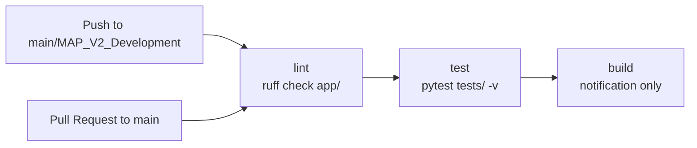

# Document 13: CI/CD Implementation

## Overview

CI/CD is implemented via a single GitHub Actions workflow. The pipeline covers lint, test, and build stages.

---

## GitHub Actions Workflow

**File**: `.github/workflows/ci.yml`

### Triggers

```yaml
on:
  push:
    branches: [main, MAP_V2_Development]
  pull_request:
    branches: [main]
```

### Jobs

#### 1. `lint`

| Property | Value |
|---|---|
| Runner | `ubuntu-latest` |
| Python | 3.12 |
| Linter | `ruff` |
| Command | `ruff check app/` |

#### 2. `test`

| Property | Value |
|---|---|
| Runner | `ubuntu-latest` |
| Depends on | `lint` |
| Python | 3.12 |
| Services | `postgres:16` with `migration_engine` database |
| Test command | `python -m pytest tests/ -v --tb=short` |

**Environment variables for test**:
- `ENGINE_DB_HOST: localhost`
- `ENGINE_DB_PORT: 5432`
- `ENGINE_DB_NAME: migration_engine`
- `ENGINE_DB_USER: postgres`
- `ENGINE_DB_PASS: ********`
- `JWT_SECRET_KEY: REDACTED`
- `APP_ADMIN_USER: admin@test.com`
- `APP_ADMIN_PASS: ********`

#### 3. `build`

| Property | Value |
|---|---|
| Runner | `ubuntu-latest` |
| Depends on | `test` |
| Condition | `github.ref == 'refs/heads/main' \|\| github.ref == 'refs/heads/MAP_V2_Development'` |
| Action | `echo "Build successful - ready for deployment"` |

---

## Pipeline Flow



---

## Testing

**Test files**:
- `tests/test_engine.py`
- `tests/test_controls.py`

Framework: `pytest` (invoked via `python -m pytest`)

### Database Service Container

The `test` job spins up a PostgreSQL 16 container:

```yaml
services:
  postgres:
    image: postgres:16
    env:
      POSTGRES_USER: postgres
      POSTGRES_PASSWORD: ********
      POSTGRES_DB: migration_engine
    ports:
      - 5432:5432
```

---

## Deployment

### Docker

**File**: `Dockerfile`

- Multi-stage build: `python:3.11-slim` (builder) → `python:3.11-slim` (runtime)
- Installs `libpq-dev`/`libpq5` for `psycopg2`
- Exposes port 8000
- Default command: `uvicorn app.api.main:app --host 0.0.0.0 --port 8000`

### Docker Compose

**File**: `docker/docker-compose.yml`

---

## What Is NOT Implemented

| Capability | Status |
|---|---|
| CD (automated deployment) | Not implemented — build job only echoes success |
| Staging/production environment promotion | Not implemented |
| Infrastructure-as-Code | Not implemented |
| Container registry push | Not implemented |
| Smoke tests post-deploy | Not implemented |
