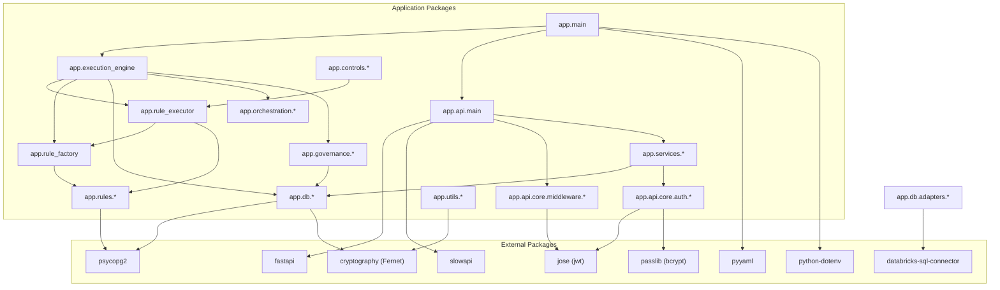
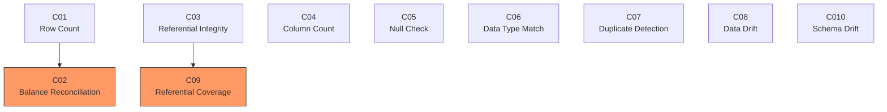
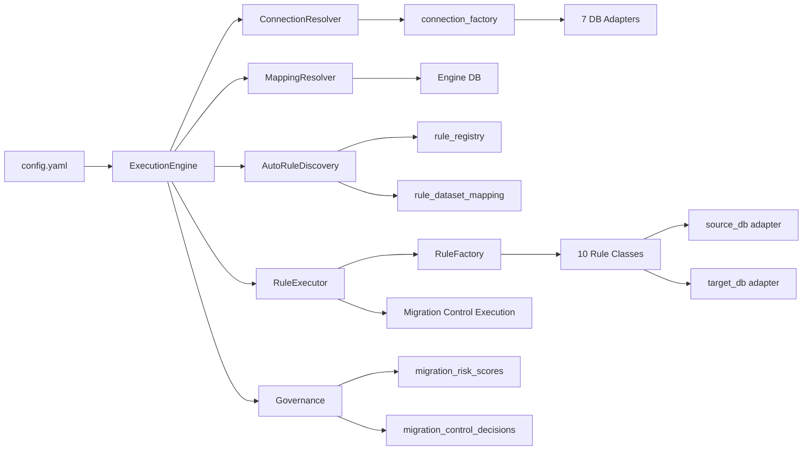

# Document 15: Implementation Dependency Graph

## 1. Package Dependencies (Python)



## 2. Module Dependencies (Backend)

```mermaid
graph TD
    subgraph Entry["Entry Points"]
        CLI["app.main<br/>(CLI)"]
        API_APP["app.api.main<br/>(FastAPI)"]
    end

    subgraph Core["Core Engine"]
        EE["execution_engine.py<br/>ExecutionEngine"]
        RE["rule_executor.py<br/>RuleExecutor"]
        RF["rule_factory.py<br/>RuleFactory"]
        SE["scoring_engine.py<br/>ScoringEngine"]
        CL["config_loader.py<br/>load_config()"]
    end

    subgraph Rules["Rule Layer"]
        BR["base_rule.py<br/>BaseRule"]
        C01["C01_row_count_rule.py"]
        C02["C02_sum_compare_rule.py"]
        C03["C03_referential_rule.py"]
        C04["C04_column_count_rule.py"]
        C05["C05_column_null_compare_rule.py"]
        C06["C06_data_type_match_rule.py"]
        C07["C07_duplicate_detection_rule.py"]
        C08["C08_data_drift_detection_rule.py"]
        C09["C09_referential_coverage_rule.py"]
        C010["C010_schema_drift_rule.py"]
    end

    subgraph DB["Database Layer"]
        CF["connection_factory.py"]
        CR["connection_resolver.py"]
        BASE["base_adapter.py"]
        PG["postgres_adapter.py"]
        MY["mysql_adapter.py"]
        SS["sqlserver_adapter.py"]
        SF["snowflake_adapter.py"]
        BQ["bigquery_adapter.py"]
        OR["oracle_adapter.py"]
        DBRK["databricks_adapter.py"]
        DBC["db_connector.py"]
    end

    subgraph Control["Control Layer"]
        BC["base_control.py<br/>BaseControl"]
        RAC["rule_adapter_control.py<br/>RuleAdapterControl"]
        CTRL_EXEC["control_executor.py"]
        CTX["execution_context.py<br/>ExecutionContext"]
    end

    subgraph Orchestration["Orchestration"]
        RRM["rule_retry_manager.py<br/>RuleRetryManager"]
        RI["rule_isolation.py<br/>RuleIsolationExecutor"]
    end

    subgraph Security["Security"]
        JWT_H["jwt_handler.py"]
        JWT_C["jwt_config.py"]
        RBAC["rbac.py"]
        DEP["dependencies.py"]
        ENC1["encryption.py<br/>EncryptionManager"]
        ENC2["encryption_manager.py<br/>EncryptionManager"]
        CRYPTO["crypto.py<br/>CryptoManager"]
        EU["encryption_utils.py<br/>EncryptionUtils"]
        AUTH_SVC["auth_service.py<br/>AuthService"]
        AUD_MW["audit_middleware.py<br/>AuditLoggingMiddleware"]
    end

    CLI --> EE
    API_APP --> EE

    EE --> RE
    EE --> CF
    EE --> CR
    EE --> RRM
    EE --> SE

    RE --> RF
    RE --> BR

    RF --> C01 & C02 & C03 & C04 & C05 & C06 & C07 & C08 & C09 & C010
    C01 & C02 & C03 & C04 & C05 & C06 & C07 & C08 & C09 & C010 --> BR

    CF --> BASE
    BASE --> PG & MY & SS & SF & BQ & OR & DBRK

    CR --> CF
    CR --> ENC2

    RAC --> BC
    RAC --> RE
    BC --> CTX

    AUTH_SVC --> JWT_H
    AUTH_SVC --> JWT_C
    DEP --> JWT_H
    RBAC --> DEP
    AUD_MW --> JWT_H

    ENC1 --> CRYPTO
    ENC2 --> EU
```



## 3. Service Dependencies (API Layer)

```mermaid
graph TD
    subgraph Routes["API Routes (app/api/routes/)"]
        AUTH_R["auth_routes.py"]
        EXEC_R["execution_routes.py"]
        CRED_R["credential_routes.py"]
        SYS_R["system_routes.py"]
        USER_R["user_routes.py"]
        ROLE_R["role_routes.py"]
        WF_R["workflow_routes.py"]
        TASK_R["task_routes.py"]
        CAL_R["calendar_routes.py"]
        NOTIF_R["notification_routes.py"]
        SET_R["settings_routes.py"]
        APPR_R["approval_routes.py"]
    end

    subgraph Services["Services (app/services/)"]
        AUTH_SVC["auth_service.py"]
        EXEC_SVC["execution_service.py"]
        CRED_SVC["credential_service.py"]
        SYS_SVC["system_service.py"]
        USER_SVC["user_service.py"]
        ROLE_SVC["role_service.py"]
        WF_SVC["workflow_service.py"]
        TASK_SVC["task_service.py"]
        CAL_SVC["calendar_service.py"]
        NOTIF_SVC["notification_service.py"]
        SET_SVC["settings_service.py"]
        APPR_SVC["approval_service.py"]
        MAP_RES["mapping_resolver.py"]
        MAP_VAL["mapping_validator.py"]
        META_INT["metadata_intelligence_service.py"]
        AUD_SVC["audit_pack_service.py"]
        DS_SVC["dataset_discovery_service.py"]
    end

    subgraph Repositories["Repositories (app/db/repositories/)"]
        CRED_REPO["credential_repository.py"]
        SYS_REPO["system_repository.py"]
    end

    subgraph Engine["Engine"]
        EE["execution_engine.py"]
    end

    AUTH_R --> AUTH_SVC
    EXEC_R --> EXEC_SVC
    CRED_R --> CRED_SVC
    SYS_R --> SYS_SVC
    USER_R --> USER_SVC
    ROLE_R --> ROLE_SVC
    WF_R --> WF_SVC
    TASK_R --> TASK_SVC
    CAL_R --> CAL_SVC
    NOTIF_R --> NOTIF_SVC
    SET_R --> SET_SVC
    APPR_R --> APPR_SVC

    CRED_SVC --> CRED_REPO
    CRED_SVC --> ENC["EncryptionManager"]
    SYS_SVC --> SYS_REPO

    EXEC_SVC --> EE
```



## 4. Execution Dependencies (DAG)

From `config.yaml` control_dependencies:



### DAG Execution Order

```
Level 0 (no deps):  C01, C03, C04, C05, C06, C07, C08, C010
Level 1 (after C01): C02
Level 1 (after C03): C09
```

### Dependency Validation

Implemented in `ExecutionEngine`:

| Method | File:Line | Purpose |
|---|---|---|
| `_validate_dependencies()` | `execution_engine.py:992` | Checks all dependency refs exist in control set |
| `_detect_cycles()` | `execution_engine.py:1009` | DFS-based cycle detection |
| `_trace_dag_event()` | `execution_engine.py:1037` | Logs DAG events to execution trace |

---

## 5. Data Flow Diagram


