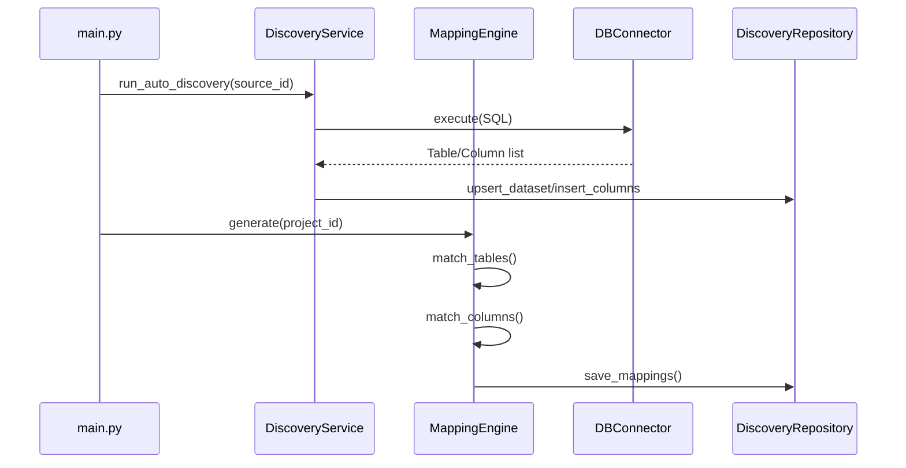

# AutoMapping Architecture Analysis

## 1. Executive Summary
This document provides a comprehensive reverse engineering and architectural analysis of the AutoMapping feature within the legacy Migration Validation Engine. The goal is to identify and document reusable components for migration to the new enterprise platform `fs-migration-validation-engine`.

## 2. Architecture Overview
The system is a Python-based migration validation engine designed to automate the discovery, mapping, and validation of data migrations between financial systems. It uses a metadata-driven approach where source and target database schemas are discovered, compared, and mapped automatically or through human review.

Key architectural pillars:
- **Adapter Pattern:** Decouples the engine from specific database technologies (Postgres, Snowflake, etc.).
- **Metadata-Driven:** Discovery processes populate a core repository with schema definitions, which then drive the mapping and validation phases.
- **Scoring Engine:** Uses fuzzy matching and heuristic algorithms to suggest mappings between source and target entities.
- **Control-Based Validation:** Executes predefined rules (controls) based on the discovered mappings.

## 3. Folder Structure
- `app/`: Core application logic.
    - `core/`: Core utilities and security (largely placeholder in this version).
    - `db/`: Database connectivity and adapters.
        - `adapters/`: Implementation of specific DB connectors (Postgres, Snowflake, etc.).
        - `repositories/`: Data access layer for core engine tables.
    - `discovery/`: Logic for schema and constraint discovery.
    - `mapping/`: Mapping service and repository.
    - `mapping_engine/`: The core engine for generating mapping suggestions.
    - `matching/`: Table-level matching logic.
    - `rules/`: Implementation of validation controls (C01-C10).
    - `scoring/`: Scoring engines for confidence calculation.
    - `services/`: Higher-level orchestration services.
    - `utils/`: Common utilities (logging, etc.).
- `docs/`: Architectural and release documentation.
- `sql/`: Database schema and demo data scripts.
- `tests/`: Unit and integration tests.

## 4. Folder Responsibilities
| Folder | Responsibility |
|---|---|
| `app/db` | Manages connections and abstracts DB-specific SQL through adapters. |
| `app/discovery` | Extracts metadata (tables, columns, PKs, FKs) from information schemas. |
| `app/mapping_engine` | Implements matching strategies (fuzzy/heuristic) to link source and target. |
| `app/rules` | Contains the business logic for data validation (e.g., row counts, drift detection). |
| `app/scoring` | Evaluates the health and confidence of mappings and migration results. |
| `app/pipelines_TO_BE_DELETED`| Legacy orchestration logic being phased out. |

## 5. Module Responsibilities
- `app/main.py`: Entry point for CLI commands (run, discover, export).
- `app/execution_engine.py`: Orchestrates the execution of validation controls.
- `app/db/db_connector.py`: Primary interface for database interactions, using the adapter factory.
- `app/discovery/discovery_service.py`: High-level service for schema discovery and persistence.
- `app/mapping_engine/mapping_engine.py`: Generates mapping suggestions between systems.
- `app/matching/table_matching_engine.py`: Specialized engine for table-level similarity analysis.

## 6. Startup Sequence
1. **CLI Invocation:** `app/main.py` is called with a command (`run`, `discover`, `export`).
2. **Configuration Loading:** `config_loader.py` reads `config.yaml`.
3. **Database Initialization:** `DBConnector` instances are created for Engine, Source, and Target databases.
4. **Command Execution:**
    - `run`: Instantiates `ExecutionEngine` and executes validation controls.
    - `discover`: Instantiates `DatasetDiscoveryService` (or `DiscoveryService`) to scan schemas.
    - `export`: Uses `AuditExporter` to generate reports from the engine DB.

## 7. Configuration Flow
1. `config.yaml` defines project metadata, database connection strings, and enabled rules.
2. `main.py` loads the YAML into a dictionary.
3. Components (e.g., `ExecutionEngine`, `DBConnector`) receive relevant sub-sections of the configuration.
4. Environment variables (via `.env`) can override or provide sensitive credentials (noted in `requirements.txt` via `python-dotenv`).

## 8. Database Architecture
The Engine Database uses a multi-schema design to separate core metadata from execution logic.

### Schemas
- **`core`**: Contains persistent metadata about tenants, projects, systems, discovered datasets, and mappings.
- **`engine`**: Contains the control registry, rule registry, and execution logs/results.
- **`public`**: Typically used for demo data or general objects.

## 9. Entity Relationship Overview
- **Tenant (1) -> Project (N)**
- **Project (1) -> System Registry (N)** (Source vs Target roles)
- **Project (1) -> Dataset Mapping (N)**
- **Dataset Mapping (1) -> Column Mapping (N)**
- **Dataset Mapping (1) -> Rule Dataset Mapping (N)**
- **Rule Registry (1) -> Rule Dataset Mapping (N)**

## 10. Database Discovery Process
The system uses `information_schema` to discover metadata across supported databases.

### Discovery SQL (Postgres Example)
- **Table Discovery:**
  ```sql
  SELECT table_name
  FROM information_schema.tables
  WHERE table_schema = 'public'
  AND table_type = 'BASE TABLE';
  ```
- **Column Discovery:**
  ```sql
  SELECT column_name, data_type, is_nullable, column_default, ordinal_position
  FROM information_schema.columns
  WHERE table_schema = 'public' AND table_name = 'your_table'
  ORDER BY ordinal_position;
  ```
- **Primary Key Discovery:**
  ```sql
  SELECT kcu.column_name
  FROM information_schema.table_constraints tc
  JOIN information_schema.key_column_usage kcu
    ON tc.constraint_name = kcu.constraint_name
  WHERE tc.table_schema = 'public'
  AND tc.table_name = 'your_table'
  AND tc.constraint_type = 'PRIMARY KEY';
  ```
- **Foreign Key Discovery:**
  ```sql
  SELECT
      tc.table_schema, tc.table_name, kcu.column_name,
      ccu.table_schema AS foreign_table_schema,
      ccu.table_name AS foreign_table_name,
      ccu.column_name AS foreign_column_name
  FROM information_schema.table_constraints tc
  JOIN information_schema.key_column_usage kcu
      ON tc.constraint_name = kcu.constraint_name
  JOIN information_schema.constraint_column_usage ccu
      ON ccu.constraint_name = tc.constraint_name
  WHERE constraint_type = 'FOREIGN KEY';
  ```

## 11. Metadata Discovery Process
1. **Connection Establishment:** Using `DBConnector` and the appropriate adapter.
2. **Table Enumeration:** Fetching all base tables in the target schema.
3. **Column Extraction:** For each table, fetch name, type, and nullability.
4. **Constraint Loading:** identifying PKs and FKs to enrich the metadata.
5. **Persistence:** Saving metadata to `core.datasets` and `core.dataset_columns` (as seen in `DiscoveryRepository`).

## 12. Auto Mapping Pipeline
The end-to-end flow from connection to suggested mappings:

1. **Initiation:** Triggered by `discover` command or `MappingEngine`.
2. **Schema Scanning:** Simultaneous discovery of Source and Target metadata.
3. **Table Matching (Heuristic):**
    - **Name Similarity:** `difflib.SequenceMatcher` on normalized table names (removing prefixes/suffixes like `_source`, `_src`).
    - **Column Overlap:** Jaccard similarity of column name sets.
    - **Weighted Score:** `(0.4 * Name) + (0.6 * ColumnOverlap)`.
4. **Column Matching:**
    - Fuzzy matching of column names.
    - Bonuses for matching datatypes (+0.05) and mutual PK status (+0.1).
5. **Classification:**
    - **AUTO_MATCHED:** Confidence > 0.85
    - **REVIEW_REQUIRED:** Confidence > 0.65
    - **REJECTED:** Confidence < 0.65
6. **Persistence:** Mappings are saved to `core.dataset_mappings` and `core.column_mappings`.
7. **Rule Binding:** Automatically linking enabled rules (controls) to the new mappings based on `engine.rule_registry`.

## 13. Sequence Diagrams (Mermaid)


## 14. Class Relationships
The system relies on composition and the Factory pattern for database interactions.
- `DBConnector` **uses** `ConnectionFactory`.
- `ConnectionFactory` **instantiates** `BaseAdapter` subclasses (e.g., `PostgresAdapter`).
- `DiscoveryService` **uses** `DBConnector`.
- `MappingEngine` **uses** `MatchingStrategies` and `DBConnector`.

## 15. Function Call Hierarchy
1. `main.py`: `run_engine()` or `DatasetDiscoveryService.discover()`.
2. `DatasetDiscoveryService`: `_get_system()` -> `_fetch_tables()` -> `_match_tables()`.
3. `_fetch_tables()` calls `DBConnector.execute()`.
4. `_match_tables()` iterates and calls `_create_mapping()`.
5. `_create_mapping()` calls `_fetch_columns()` and `_bind_default_rules()`.

## 16. Reusable Components
| Component | Purpose | Reusability (1-5) | Migration Difficulty |
|---|---|---|---|
| `DB Adapters` | Cross-DB SQL abstraction. | 5 | Low |
| `ConstraintLoader` | Metadata extraction for PK/FK. | 4 | Low |
| `TableMatchingEngine` | Heuristic similarity logic. | 4 | Medium |
| `Scoring Engine` | Confidence calculation. | 3 | Medium |
| `AuditExporter` | CSV/Summary generation. | 3 | Low |

## 17. Technical Debt
- **Code Duplication:** Multiple versions of `ExecutionEngine` and `ConnectionManager` (legacy files) indicate a lack of clean refactoring during evolution.
- **Service Duplication:** `DiscoveryService` and `PostgresAdapter` both implement schema discovery logic with slight variations.
- **Hardcoding:** Frequent use of `public` schema in discovery queries instead of using configuration-driven schema resolution.
- **Dead Code:** Entire directories like `pipelines_TO_BE_DELETED` and files marked `NOT_IN_USE` clutter the codebase.
- **Inconsistent Patterns:** Some modules use the Adapter pattern while others interact directly with `psycopg2` cursors.

## 18. Risks
- **Schema Rigidity:** The engine's metadata schema (`core`) is tightly coupled to the PostgreSQL implementation.
- **Performance:** Fuzzy matching on large schemas (hundreds of tables/columns) may be slow without caching or optimized similarity algorithms.
- **Credential Security:** `connection_config` stored as JSONB in `core.system_registry` may pose a security risk if not encrypted.

## 19. Refactoring Opportunities
- **Unify Discovery:** Merge `DiscoveryService` logic into the `BaseAdapter` so all metadata extraction is abstracted.
- **Standardize Metadata:** Use a Pydantic-based model for Table/Column metadata to ensure type safety across the pipeline.
- **Decouple Mapping from Persistence:** The `MappingEngine` should return objects that a separate repository persists, rather than handling DB calls directly.

## 20. Migration Recommendations
1. **Adopt the Adapter Pattern:** Port the `db/adapters` structure directly to the new platform as it is the most mature part of the system.
2. **Abstract the Matching Logic:** Extract `matching_strategies.py` into a standalone utility package.
3. **Rewrite the Execution Orchestrator:** The current `ExecutionEngine` is bloated. A more modular, task-based orchestrator (e.g., using Celery or Prefect) is recommended for the new platform.
4. **Implement Metadata Caching:** Store discovered metadata in a Redis cache or a more efficient document store if schema scanning becomes a bottleneck.

## 21. Components to Keep
- **★★★★★ Database Adapters:** Solid implementation of cross-DB support.
- **★★★★ Constraint Loader:** Reliable PK/FK discovery.
- **★★★★ Matching Strategies:** `table_score` and `column_score` logic is mathematically sound for initial suggestions.

## 22. Components to Rewrite
- **★★★ Execution Engine:** Needs a more modern, decoupled architecture.
- **★★★ Mapping Engine:** Should be refactored to use standardized metadata models.
- **★★★ Discovery Service:** Needs unification with adapters.

## 23. Components to Discard
- **★ pipelines_TO_BE_DELETED:** Obsolete orchestration logic.
- **★ main_legacy.py / execution_engine_legacy.py:** Clutter from previous versions.
- **★ db_connector_TO_BE_DELETED.py:** Redundant connection logic.

## 24. Detailed Component Analysis

### File: `app/db/db_connector.py`
- **Purpose:** Centralized DB interaction layer with adapter support.
- **Key Classes:** `DBConnector`
- **Key Functions:** `execute(query, params)`, `_normalize_config(config)`
- **Dependencies:** `psycopg2`, `app.db.connection_factory`
- **Called by:** `ExecutionEngine`, `DatasetDiscoveryService`, `AuditExporter`
- **Calls to:** `PostgresAdapter`, `SnowflakeAdapter`, etc.
- **Database Interactions:** Direct `psycopg2` calls for engine DB; delegated adapter calls for Source/Target.
- **Reusability Score:** 5/5
- **Complexity Assessment:** Medium.

### File: `app/db/adapters/postgres_adapter.py`
- **Purpose:** Concrete implementation for PostgreSQL metadata and metric extraction.
- **Key Classes:** `PostgresAdapter`
- **Key Functions:** `get_tables()`, `get_columns()`, `get_foreign_keys()`, `get_row_count()`
- **Dependencies:** `psycopg2`, `BaseAdapter`
- **Called by:** `DBConnector` via factory.
- **Database Interactions:** Extensive use of `information_schema`.
- **Reusability Score:** 5/5
- **Complexity Assessment:** Low.

### File: `app/discovery/discovery_service.py`
- **Purpose:** High-level metadata scanning and injection into core schema.
- **Key Classes:** `DiscoveryService`
- **Key Functions:** `run_auto_discovery()`, `get_table_columns()`, `get_primary_keys()`
- **Dependencies:** `app.discovery.constraint_loader`
- **Called by:** CLI (potential future entry point).
- **Database Interactions:** Reads from `information_schema`; writes to `core.discovered_datasets`.
- **Reusability Score:** 4/5
- **Complexity Assessment:** Medium.

### File: `app/mapping_engine/mapping_engine.py`
- **Purpose:** Generates mapping suggestions between systems.
- **Key Classes:** `MappingEngine`
- **Key Functions:** `generate()`, `_get_tables()`, `_get_columns()`
- **Dependencies:** `app.mapping_engine.matching_strategies`, `uuid`
- **Called by:** `MappingService` (or CLI via `DatasetDiscoveryService` logic).
- **Database Interactions:** Fetches discovered metadata from `core` schema.
- **Reusability Score:** 4/5
- **Complexity Assessment:** Medium (logic-heavy).

### File: `app/mapping_engine/matching_strategies.py`
- **Purpose:** Pure heuristic functions for similarity scoring.
- **Key Functions:** `table_score(source, target)`, `column_score(src, tgt)`, `similarity(a, b)`
- **Dependencies:** `difflib.SequenceMatcher`
- **Called by:** `MappingEngine`
- **Reusability Score:** 5/5
- **Complexity Assessment:** Low.

## 25. Questions and Unknowns
- **Credential Encryption:** The code references `CredentialService` but the `system_registry` shows plain `password` and `connection_config` fields. Clarification on at-rest encryption is needed.
- **Rule Templates:** The exact location of SQL templates referenced in `engine.rule_registry` (e.g., `C01_row_count.sql`) needs to be confirmed (likely in `sql/controls/`).
- **Scaling:** How the fuzzy matching handles 1000+ tables in an enterprise schema remains untested.
