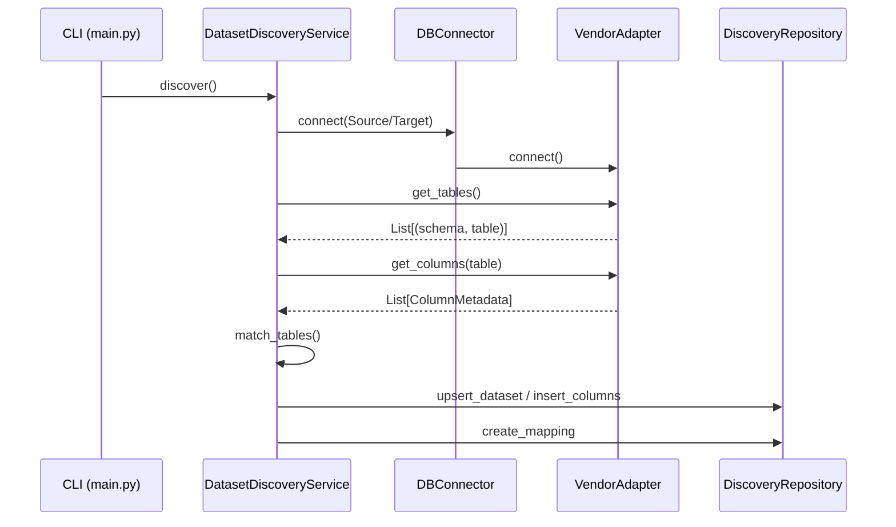

# Metadata Discovery Deep Dive

## 1. Discovery Entry Points

The metadata discovery process is orchestrated through several entry points, depending on the command and the specific discovery phase (schema vs. rules).

### Orchestration Flow
- **CLI (`app/main.py`):** The `discover` command triggers the `DatasetDiscoveryService.discover()` method.
- **`DatasetDiscoveryService` (`app/services/dataset_discovery_service_NOT_IN_USE.py`):** 
    1. Retrieves system configurations from the engine database.
    2. Initializes `DBConnector` for Source and Target databases.
    3. Fetches tables and columns from both systems.
    4. Performs heuristic table matching.
    5. Persists discovered mappings and columns into the `core` schema.
    6. Binds default rules to the mappings.
- **`DiscoveryService` (`app/discovery/discovery_service.py`):** Provides lower-level methods for listing tables, describing tables, and running auto-discovery for a specific system.
- **`AutoRuleDiscovery` (`app/discovery/auto_rule_discovery.py`):** A secondary discovery phase that scans *already persisted* metadata to infer additional validation rules (e.g., detecting FKs in the source system to bind `C03_REFERENTIAL`).

### Execution Sequence (Mermaid)


---

## 2. Database Adapters

The system uses the **Adapter Pattern** to abstract database-specific metadata extraction.

### Common Interface (`BaseAdapter`)
Defined in `app/db/adapters/base_adapter.py`, it enforces:
- `connect()`: Establish vendor-specific connection.
- `execute(query, params)`: Execute SQL.
- `get_tables()`: Return list of schemas and tables.
- `get_columns(schema, table)`: Return column names.
- `get_column_type(schema, table, column)`: Return data type.
- `get_foreign_keys()`: Return FK relationships (optional, defaults to empty list).

### Vendor Implementations
| Vendor | Driver | Metadata Source |
|---|---|---|
| **PostgreSQL** | `psycopg2` | `information_schema.tables/columns` |
| **Snowflake** | `snowflake-connector` | `information_schema` / `SHOW TABLES` |
| **SQL Server** | `pyodbc` | `INFORMATION_SCHEMA` + `sys.foreign_key_columns` |
| **Oracle** | `cx_Oracle` | `user_tables`, `user_tab_columns`, `all_cons_columns` |
| **MySQL** | `mysql-connector` | `SHOW TABLES`, `DESCRIBE`, `INFORMATION_SCHEMA.KEY_COLUMN_USAGE` |
| **BigQuery** | `google-cloud-bigquery` | `INFORMATION_SCHEMA.TABLES/COLUMNS` |
| **Databricks** | `databricks-sql-connector` | `SHOW TABLES`, `DESCRIBE` |

---

## 3. Metadata Retrieved & Catalog Queries

### Tables & Schemas
| Vendor | SQL Query / Command |
|---|---|
| Postgres | `SELECT table_name FROM information_schema.tables WHERE table_schema = %s` |
| SQL Server | `SELECT TABLE_SCHEMA, TABLE_NAME FROM INFORMATION_SCHEMA.TABLES` |
| Oracle | `SELECT table_name FROM user_tables` |
| Snowflake | `SHOW TABLES` |
| Databricks | `SHOW TABLES` |

### Columns & Data Types
| Vendor | SQL Query / Command |
|---|---|
| Postgres | `SELECT column_name, data_type, is_nullable FROM information_schema.columns` |
| MySQL | `DESCRIBE {table}` |
| Databricks | `DESCRIBE {schema}.{table}` |
| Oracle | `SELECT column_name, data_type FROM user_tab_columns` |

### Constraints (PK/FK)
- **Primary Keys:** Usually retrieved via `information_schema.table_constraints` joined with `key_column_usage`.
- **Foreign Keys:**
    - **Postgres:** Joins `table_constraints`, `key_column_usage`, and `constraint_column_usage`.
    - **SQL Server:** Queries `sys.foreign_key_columns` joined with `sys.tables`, `sys.schemas`, and `sys.columns`.
    - **Oracle:** Joins `all_cons_columns` and `all_constraints` (type='R').

---

## 4. Normalization & Persistence Layer

The system normalizes raw catalog output into a standard Python dictionary format before persistence.

### Normalization Example (Columns)
```python
{
    "column_name": row[0],
    "data_type": row[1],
    "is_nullable": row[2] == "YES",
    "is_primary_key": column_name in pk_columns,
    "is_foreign_key": column_name in fk_map,
    "references": fk_map.get(column_name)
}
```

### Persistence Tables (`core` schema)
- **`core.datasets`:** Stores the identity of discovered tables/views.
- **`core.dataset_columns`:** Stores column names, types, and inferred roles (PK, FK, etc.).
- **`core.dataset_mappings`:** Stores the links between source and target tables, including the arrays of column names.
- **`core.rule_dataset_mapping`:** Links validation rules to specific dataset mappings.

---

## 5. Metadata Workflow

1.  **Connection:** `DBConnector` uses `ConnectionFactory` to instantiate the correct adapter based on the `database_type` in `system_registry`.
2.  **Discovery:** The adapter executes catalog queries to fetch raw metadata.
3.  **Refinement:** `ConstraintLoader` or adapter-specific logic identifies PKs and FKs.
4.  **Storage:** `DiscoveryRepository` performs upserts into `core.datasets` and `core.dataset_columns`.
5.  **Matching:** `MappingEngine` reads from the `core` tables to generate mapping suggestions.
6.  **Binding:** `AutoRuleDiscovery` reads the columns and roles to automatically enable specific controls (e.g., if a column is a `NUMERIC_METRIC`, enable `C02_BALANCE_RECON`).

---

## 6. Changes Required & Recommendations

### Legacy vs. Modern Engine
- **Existing:** The Adapter pattern is well-structured and should be kept.
- **Changed:** Multiple redundant versions of `DiscoveryService` and `DBConnector` need unification.
- **New Requirement:** Support for **Composite Keys** is partially implemented but needs standardizing across all adapters.
- **New Requirement:** **Inference Engine** (for DBs without metadata-level FKs like BigQuery) should be moved to a shared intelligence layer.

### Design Recommendations
1.  **Standardized Metadata Models:** Replace dictionaries with Pydantic models for `TableMetadata` and `ColumnMetadata` to ensure strict typing during discovery.
2.  **Schema-Aware Adapters:** Ensure all discovery queries respect the `schemas` list provided in the configuration, rather than defaulting to `public`.
3.  **Unified SQL Compiler:** Expand `SQLCompiler` to handle *discovery* queries as well as metric queries, reducing the SQL duplication within adapters.
4.  **Asynchronous Discovery:** For large schemas, implement an async discovery pipeline to prevent CLI timeouts.
5.  **Metadata Versioning:** Add a `version` or `snapshot_id` to `core.datasets` to allow tracking of schema changes over time.
